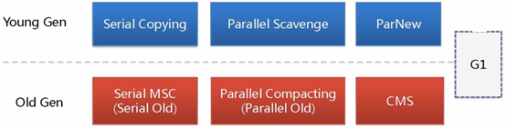

# JVM-整理总结20210412
- JVM
    - JVM结构图( **类加载器 运行时数据区 执行引擎 本地接口** )
        - JVM 结构 
        - Java8取消了之前的“永久代”，取而代之的是“元空间”——Metaspace，两者本质是一样的。“永久代”使用的是JVM的堆内存，而“元空间”是直接使用的本机物理内存。 
    - 概念说明
        - **类加载器**
            - ClassLoader 图示
                -  
            - Bootstrap ClassLoader 根类加载器
                - 由 JVM 自身实现
                - 负责加载 Java 的核心类
                - 不是 java.lang.ClassLoader 的子类
            - Extension ClassLoader 扩展类加载器
                - 扩展类加载器的加载路径是 JDK 目录下 jre/lib/ext
                - 扩展类加载器的父类加载器是根加载器
                - 因为根加载器并不是 Java 实现，所以扩展加载器的 #getParent () 方法返回 null
            - System ClassLoader  系统(应用)类加载器
                - 负责在 JVM 启动时加载来自 Java 命令的 -classpath 选项、java.class.path 系统属性或 CLASSPATH 环境变量所指定的 jar 包和类路径
                - 程序可以通过 #getSystemClassLoader () 来获取系统类加载器。系统加载器的加载路径是程序运行的当前路径
            - Java 虚拟机是如何判定两个 Java 类是相同的？
                - Java 虚拟机不仅要看类的 **全限定类名是否相同** ，还要看加载此类的 **类加载器是否一样** 。只有两者都相同的情况，才认为两个类是相同的。即便是同样的字节代码，被不同的类加载器加载之后所得到的类，也是不同的。
            - 双亲委派模型的工作过程？
                - 1.首先从当前 ClassLoader查询此类是否加载，如果已经加载则直接返回已经加载的类
                - 2.如果 ClassLoader 的缓存中没有找到被加载的类时，就委托父类加载器去加载，父类加载器采用同样的策略，首先查看自己的缓存，然后委托父类的父类去加载，一直到 Bootstrap ClassLoader
                - 3.当所有父类加载器都没有加载时，由当前的类加载器加载，并将其放入自己的缓存中，以便下次有加载请求时直接返回
            - 为什么优先使用父 ClassLoader 加载类 ( **共享-避免重复加载  隔离-避免动态替换** )
                - 1. **共享功能** ：可以避免重复加载，当父亲已经加载了该类的时候，子类不需要再次加载，一些 Framework 层级的类一旦被顶层的 ClassLoader 加载过就缓存在内存里面，以后任何地方用到都不需要重新加载。
                - 2. **隔离功能** ：主要是为了安全性，避免用户自己编写的类动态替换 Java 的一些核心类，比如 String ，同时也避免了重复加载，因为 JVM 中区分不同类，不仅仅是根据类名，相同的 class 文件被不同的 ClassLoader 加载就是不同的两个类，如果相互转型的话会抛java.lang.ClassCaseException
            - 什么是破坏双亲委托模型  ( **向前兼容  加载Service Provider Interface接口实现类  热部署** )
                - 破坏双亲委托模型，需要做的是， #loadClass (String name, boolean resolve) 方法中，不调用父 parentClassLoader 方法去加载类，那么就成功了。那么我们要做的仅仅是，错误的覆盖 ##loadClass(String name, boolean resolve) 方法，不去使用父 parent ClassLoader 方法去加载类即可
                - 双亲委派模型不是一个强制性的约束模型，而是一个建议型的类加载器实现方式。在Java的世界中大部分的类加载器都遵循者模型，但也有例外，到目前为止，双亲委派模型有过3次大规模的“被破坏”的情况
                    - 第一次( **向前兼容** )：在双亲委派模型出现之前—–即JDK1.2发布之前。
                        - 由于双亲委派模型是在JDK1.2之后才被引入的，而类加载器和抽象类java.lang.ClassLoader则是JDK1.0时候就已经存在，面对已经存在 的用户自定义类加载器的实现代码，Java设计者引入双亲委派模型时不得不做出一些妥协。为了向前兼容，JDK1.2之后的java.lang.ClassLoader添加了一个新的proceted方法findClass()，在此之前，用户去继承java.lang.ClassLoader的唯一目的就是重写loadClass()方法，因为虚拟在进行类加载的时候会调用加载器的私有方法loadClassInternal()，而这个方法的唯一逻辑就是去调用自己的loadClass()。JDK1.2之后已不再提倡用户再去覆盖loadClass()方法，应当把自己的类加载逻辑写到findClass()方法中，在loadClass()方法的逻辑里，如果父类加载器加载失败，则会调用自己的findClass()方法来完成加载，这样就可以保证新写出来的类加载器是符合双亲委派模型的。
                    - 第二次( **加载SPI接口实现类** )：是这个模型自身的缺陷导致的。我们说，双亲委派模型很好的解决了各个类加载器的基础类的统一问题（越基础的类由越上层的加载器进行加载），基础类之所以称为“基础”，是因为它们总是作为被用户代码调用的API， 但没有绝对，如果基础类调用会用户的代码怎么办
                        - 例如JNDI,JDBC,JCE,JAXB和JBI
                        - **JNDI服务** ，它的代码由启动类加载器去加载，但JNDI的目的就是对资源进行集中管理和查找，它需要调用独立厂商实现部署在应用程序的classpath下的JNDI接口提供者(SPI, Service Provider Interface)的代码，但启动类加载器不可能“认识”这些代码，该怎么办？为了解决这个困境，Java设计团队只好引入了一个不太优雅的设计：线程上下文件类加载器(Thread Context ClassLoader)。这个类加载器可以通过java.lang.Thread类的setContextClassLoader()方法进行设置，如果创建线程时还未设置，它将会从父线程中继承一个；如果在应用程序的全局范围内都没有设置过，那么这个类加载器默认就是应用程序类加载器。有了线程上下文类加载器，JNDI服务使用这个线程上下文类加载器去加载所需要的SPI代码，也就是父类加载器请求子类加载器去完成类加载动作，这种行为实际上就是打通了双亲委派模型的层次结构来逆向使用类加载器，已经违背了双亲委派模型，但这也是无可奈何的事情。
                        - **JDBC(Java Database Connectivity)** ，JDBC中Driver驱动本身只是一个接口，并没有具体的实现，具体的实现是由不同数据库类型去实现的。例如，MySQL的mysql-connector- *.jar中的Driver类具体实现的。 原生的JDBC中的类是放在rt.jar包的，是由启动类加载器进行类加载的，在JDBC中的Driver类中需要动态去加载不同数据库类型的Driver类，而mysql-connector-* .jar中的Driver类是用户自己写的代码，那启动类加载器肯定是不能进行加载的，既然是自己编写的代码，那就需要由应用程序启动类去进行类加载。于是乎，这个时候就引入线程上下文件类加载器(Thread Context ClassLoader)。有了这个东西之后，程序就可以把原本需要由启动类加载器进行加载的类，由应用程序类加载器去进行加载了。
                    - 第三次( **热部署** )：为了实现热插拔，热部署，模块化，意思是添加一个功能或减去一个功能不用重启，只需要把这模块连同类加载器一起换掉就实现了代码的热替换。
                        - Tomcat 为了实现隔离性没有遵守双亲委派， **每个webappClassLoader加载自己的目录下的class文件，不会传递给父类加载器。** 扩展出一个问题：如果tomcat 的 Common ClassLoader 想加载 WebApp ClassLoader 中的类，该怎么办？可以使用线程上下文类加载器实现，使用线程上下文加载器，可以让父类加载器请求子类加载器去完成类加载的动作。
                        - 如果Tomcat符合双亲委派,有两个功能做不到：1.如果Tomcat里有不同版本的而限定名相同的Class，那么加载其中一个另一个将不能加载，因为父加载器会优先返回已加载的类2. **JSP将不能热部署** ，因为JSP每次都是从.jsp文件翻译成Servlet子类，然后被JDK编译成class，由于旧的xx_jsp.class已经存在，新的编译后的xx_jsp.class将不可能被装载。
        - **方法区** -线程共享
            - 存储虚拟机加载的 **类信息、常量、静态变量** 、即时编译器编译后的代码
            - 虚拟机规范把方法区描述为堆的一个逻辑部分，但是它有一个别名叫做 Non-Heap(非堆)，目的是与 Java 堆区分开来
            - **运行时常量池** 是方法区的一部分，用于存放编译器生成的各种字面量和符号引用
        - **堆内存** -线程共享
            - **垃圾收集器** 管理的主要区域
            - 目前主要的垃圾回收算法都是 **分代收集算法** ，所以 Java 堆中还可以细分为：新生代和老年代；再细致一点的有 Eden 空间、From Survivor 空间、To Survivor 空间等，默认情况下新生代按照 8:1:1 的比例来分配。
            - 虚拟机规范的规定Java **堆可以处于物理上不连续的内存空间中** ，只要逻辑上是连续即可
        - **虚拟机栈** -线程私有-栈内存
            - 虚拟机栈描述的是 Java 方法执行的内存模型
            - 每个方法调用都意味着一个 **栈帧** 在虚拟机栈中入栈到出栈的过程
            - 每个方法在执行的时候，都会创建一个栈帧用于存储局部变量、操作数、动态链接、方法出口等信息
        - **本地方法栈** -线程私有
            - 和 Java 虚拟机栈的作用类似，区别是该区域为 JVM 提供使用 Native 方法的服务
        - **程序计数器-** 线程私有
            - 类似于操作系统里的 PC 计数器，可以看做是当前线程所执行的字节码的行号指示器
            - 如果线程正在执行的是一个 Java 方法，这个计数器记录的是正在执行的虚拟机 **字节码指令的地址** ；如果正在执行的是 Native 方法，这个计数器值则为空（Undefined）
            - 此内存区域是唯一一个在 Java 虚拟机规范中 **没有** 规定任何 **OutOfMemoryError 情况的区域**
    - 对象分配流程情况
        - 大部分正常对象都优先在新生代Eden区分配内存
        - 新生代Eden区对象快满了会触发Minor GC回收没人引用的对象
        - **大年龄:** 默认当对象年龄达到15岁会转移到老年代里去
            - JVM参数：-XX:MaxTenuringThreshold，默认值15
        - **大对象:** 可以不经过新生代Eden区就进入老年代
            - 参数：-XX:PretenureSizeThreshold可以把他的数值设置为字节数
            - 如果新生代里创建了一个大于这个大小的对象，就把这个大对象直接放到老年代。之所以这么做时为了避免新生代出现的那种大对象，多次躲过GC，导致其在两个Survivor区域里来回复制多次后才能进入老年代
        - **动态年龄判断** :同年龄对象大小占Survivor区内存50%以上,要直接升入老年代
            - 当前对象的Survivor区域里，一批对象（年龄可以不同）的总大小大于这块Survivor区域内存的50%，那么此时大于等于这批对象年龄的对象，就可以直接进入老年代
        - **超多存活对象:** 如果MinorGC后Survivor区放不下存活对象,把这些对象直接放入老年代
        - **老年代空间担保机制:** 任何一次MinorGC前,JVM会检查老年代可用空间是否大于新生代对象总大小
            - 在MinorGC之前JVM会先检查老年代最大可用的连续空间是否大于新生代对象总空间
            - **成立:** 那么MinorGC可以确保是安全的
            - **不成立:** 虚拟机会查看HandlePromotionFailure设置值是否允许担保失败
                - **允许:** 检查MinorGC后每次进入老年代对象的平均大小，如果大于进行一次MinorGC
                    - 情况一:剩余存活对象小于Survivor区大小，就存入Survivor区
                    - 情况二:剩余存活对象大于Survivor区小于老年代，就存入老年代
                    - 情况三:大于Survivor区大于老年代，触发FullGC后,若还是放不下抛出OOM
                - **不允许:** 进行一次FullGC,若还是放不下抛出OOM
        - 触发老年代垃圾回收的情况有哪些 2种
            - 在MinorGC之前发现可能MinorGC后进入老年代对象太多,提前触发FullGC
            - 如果老年代快满了会触发FullGC把老年代里没人引用的对象清理掉
    - **Garbage Collection** (垃圾回收)
        - 垃圾回收器图示
            -  
        - 垃圾回收的时候如何确定垃圾？什么是GC Roots？
            - 什么是垃圾 **内存中不再被使用的对象就是垃圾**
            - 如何判断一个对象可以被回收 ( **引用计数 可达性分析** )
                - 引用计数法
                    - 维护一个计数器，如果有对该对象的引用，计数器+1，反之-1。
                    - 缺点: 无法解决循环引用的问题。
                - 可达性分析算法
                    - 把 **GC Roots** 的对象作为起始点，从这些起点向下搜索走过的路径称为 **引用链** ，当一个对象到GC Roots没有任何引用链相连的时候，表示此对象可以被回收
                    - 哪些对象可以作为GC Roots
                        - 虚拟机栈（栈帧中的局部变量区）中的对象
                        - 本地方法栈中JNI（Native）方法引用的对象
                        - 方法区中常量引用的对象
                        - 方法区中的类静态属性引用的对象
                    - 可达的对象可以回收吗，强引用-软引用-弱引用-虚引用是什么
                        - Object类的整体架构
                            - Object-->Reference--> **Soft** / **Weak** / **PhantomRef   ReferenceQueue(引用队列)** 
                        - 强-软-弱-虚 引用的图示
                            -  
                        - 强引用
                            - 特点
                                - 典型编码Object obj = new Object()中的obj就是强引用。
                                - 通过关键字new创建的对象所关联的引用就是强引用。
                                - 当 **JVM内存空间不足** ，JVM宁愿 **抛出OutOfMemoryError运行时错误-OOM** ，使程序异常终止，也不会靠随意回收具有强引用的“存活”对象来解决内存不足的问题。
                                - 对于一个普通的对象，如果没有其他的引用关系，只要超过了引用的作用域或者显式地将相应（强）引用赋值为 null，就是可以被垃圾收集的了，具体回收时机还是要看垃圾收集策略。
                            - 图示
                                - 代码示例 
                        - 软引用
                            - 特点
                                - 软引用 **通过SoftReference类实现,** 软引用的生命周期比强引用短
                                - **只有当 JVM 认为内存不足时** ，才会去试图回收软引用指向的对象.即JVM 会确保在抛出 OutOfMemoryError 之前，清理软引用指向的对象。
                                - 软引用可以和一个 **引用队列（ReferenceQueue）** 联合使用，如果软引用所引用的对象被垃圾回收器回收，Java虚拟机就会把这个软引用加入到与之关联的引用队列中。我们可以调用ReferenceQueue的poll()方法来检查是否有它所关心的对象被回收。如果队列为空，将返回一个null,否则该方法返回队列中前面的一个Reference对象。
                            - 应用场景
                                - 软引用通常用来 **实现内存敏感的缓存** 。如果还有空闲内存，就可以暂时保留缓存，当内存不足时清理掉，这样就 **保证了使用缓存的同时，不会耗尽内存** 。
                            - 图示
                                - `设置 JVM 参数为 -Xms10m  -Xmx10m  -XX:+PrintGCDetails 
                                - 输出    发现当内存不够的时候就会被回收 
                        - 弱引用
                            - 特点
                                - 弱引用 **通过WeakReference类实现** ,弱引用的生命周期比软引用短。
                                - 在垃圾回收器线程扫描它所管辖的内存区域的过程中，一旦发现了具有弱引用的对象， **不管当前内存空间足够与否，都会回收它的内存** 。
                                - 由于垃圾回收器是一个优先级很低的线程，因此不一定会很快回收弱引用的对象。弱引用可以和一个 **引用队列（ReferenceQueue）** 联合使用，如果弱引用所引用的对象被垃圾回收，Java虚拟机就会把这个弱引用加入到与之关联的引用队列中。
                            - 应用场景
                                - 弱应用同样可用于内存敏感的缓存
                            - 代码示例
                                - WeakReference 弱引用
                                    - 需要用Object.Reference. **WeakReference** 来显示创建。无论内存够不够，GC的时候都回收，也可以用在高速缓存上 
                                    - 输出 
                                - WeakReference 弱引用 + 引用队列
                                    - 代码示例 
                                    - 输出  把该对象的包装类即 **weakReference** 放入到 **ReferenceQueue** 里面，我们可以从queue中获取到相应的对象信息，同时进行额外的处理。如反向操作，数据清理 
                        - 虚引用
                            - 特点
                                - 也叫幻象引用， **通过PhantomReference类来实现** 。无法通过虚引用访问对象的任何属性或函数。幻象引用仅仅是提供了一种确保对象被finalize以后，做某些事情的机制。
                                - 如果一个对象仅持有虚引用，那么它就和没有任何引用一样，在任何时候都可能被垃圾回收器回收。 **虚引用必须和引用队列（ReferenceQueue）联合使用** 。当垃圾回收器准备回收一个对象时，如果发现它还有虚引用，就会在回收对象的内存之前，把这个虚引用加入到与之关联的引用队列中。ReferenceQueue queue = new ReferenceQueue (); PhantomReference pr = new PhantomReference (object, queue);
                                - 程序可以通过判断引用队列中是否已经加入了虚引用，来了解被引用的对象是否将要被垃圾回收。如果程序发现某个虚引用已经被加入到引用队列，那么就可以在所引用的对象的内存被回收之前采取一些程序行动。
                                - **设置虚引用的唯一目的** ，就是在这个对象被回收时，收到一个 **通知** 以便进行后续操作，有点像Spring的后置通知
                            - 应用场景
                                - 可用来跟踪对象被垃圾回收器回收的活动，当一个虚引用关联的对象被垃圾收集器 **回收之前会收到一条系统通知**
                            - 代码示例
                                -  
        - GC垃圾回收算法和垃圾收集器的关系
            - GC垃圾回收算法
                - 引用计数
                - 复制回收
                    - 图示  
                - 标记清除
                    -  
                - 标记整理
                    -   
                - 分代收集
                    - 分代收集算法就是根据对象的年代，综合采用上述三种算法来收集
                    - **对于新生代** ：每次GC都有大量对象死去，存活的很少，常采用复制算法
                    - **对于老年代** ：常采用标记整理或者标记清除算法
            - 没有完美的收集器， **GC收集器是GC收集算法的实现** ,4种主要垃圾收集器
                - 串行垃圾回收器（Serial）
                    - 为单线程环境设计且只使用一个线程进行GC，会暂停所有用户线程
                    - 不适用于服务器环境。
                - 并行垃圾回收器（Parrallel） **Java8默认**
                    - 多个GC线程并行工作，此时用户线程是暂停的
                    - 适用于科学计算、大数据后台，交互性不敏感的场合。
                - 并发垃圾回收器（CMS）
                    - 用户线程和GC线程同时执行（不一定是并行，交替执行），不需要停顿用户线程
                    - 适用对响应时间有要求的场合,互联网公司常用
                - G1垃圾回收器
                    - 将堆内存分割成不同的区域，然后并发地进行垃圾回收。
        - 怎么查看服务器的默认GC收集器？生产上如何配置GC收集器？谈谈你的GC收集器的理解
            - 怎么查看默认的GC收集器
                - java -XX: **+PrintCommandLineFlags**
                    - Java8默认使用 -XX:+UseParallelGC
                    - 查询结果示例
                        - -XX:InitialHeapSize=132375936  -XX:MaxHeapSize=2118014976
                        - -XX: **+PrintCommandLineFlags** -XX: **+UseCompressedClassPointers** 
                        - -XX: **+UseCompressedOops** -XX: **-UseLargePagesIndividualAllocation** -XX: **+UseParallelGC**
            - 默认的GC收集器有哪些 7个
                - Serial、ParNew、Parrallel、ConcMarkSweep(CMS)、ParallelOld、G1
                - Java 8 以后基本不使用 Serial Old
                - GC收集器图示 
            - 7个垃圾收集器分析
                - 体系结构
                    - **Serial** - **ParallelScavenge** - **ParNew** 常用于回收新生代
                    - **SerialOld** - **ParallelOld** - **CMS** 常用于回收老年代
                    - G1收集器既可以回收新生代也可以回收老年代 
                - 配置说明
                    - 配置新生代收集器，老年代收集器会自动配置上 
                - Serial收集器
                    - 年代最久远，是 **Client VM** 模式下的默认 **新生代收集** 器， **使用复制算法**
                    - 优点：单个线程收集，没有线程切换开销，拥有最高的单线程GC效率
                    - 缺点：收集的时候会暂停用户线程
                    - 使用-XX : +UseSerialGC可以显式开启，开启后 **默认使用Serial+SerialOld的组合** 
                - ParNew收集器
                    - 是Serial的多线程版本,是 **Server VM** 模式下的默认 **新生代收集器** ， **使用复制算法**
                    - 使用-XX:+UseParNewGC可以显式开启，开启后默认 **使用ParNew+SerialOld的组合**
                    - 由于 **SerialOld** 已经过时，所以建议配合CMS使用 
                - ParallelScavenge收集器
                    - ParNew收集器仅在新生代使用多线程收集,老年代默认是SerialOld,是单线程收集
                    - Parallel Scavenge在新-老两代都采用多线程收集
                    - 是吞吐量优先收集器，可以通过自适应调节保证最大吞吐量, **采用复制算法**
                    - 使用-XX:+UseParallelGC可以开启， 同时也会使用ParallelOld收集老年代。
                - SerialOld收集器
                    - Serial的老年代版本， **采用标整算法**
                    - JDK1.5之前跟Parallel Scavenge配合使用，现在已经不用,仅作为CMS的后备收集器
                - ParallelOld收集器
                    - Parallel的老年代版本，JDK1.6之前新生代用Parallel而老年代用SerialOld，只能保证新生代的吞吐量。JDK8后老年代改用ParallelOld。
                    - 使用-XX:+UseParallelOldGC可以开启， 同时也会使用Parallel收集新生代
                - CMS收集器
                    - 描述
                        - 并发标记清除收集器，是一种以获得最短GC停顿为目标的收集器。
                        - 适用在互联网系统的服务器上,尤其重视服务器的响应速度,停顿时间最短。
                        - 是G1收集器出来之前的首选收集器, **使用标清算法** 。在GC的时候，会与用户线程并发执行不会停顿用户线程。但是在标记的时候仍然会STW。
                        - 使用-XX: +UseConcMarkSweepGC开启。开启过后，新生代默认使用ParNew，同时老年代使用SerialOld作为备用
                    - 流程说明
                        - **初始标记** ：只是标记一下GC Roots能直接关联的对象，速度很快，需要STW
                        - **并发标记** ：主要标记过程，标记全部对象，和用户线程一起工作，不需要STW
                        - **重新标记** ：修正在并发标记阶段出现的变动，需要STW
                        - **并发清除** ：和用户线程一起，清除垃圾，不需要STW 
                    - 优点
                        - 停顿时间少，响应速度快，用户体验好
                    - 缺点
                        - 对CPU资源非常敏感：由于需要并发工作，多少会占用系统线程资源。
                        - 无法处理浮动垃圾：标记垃圾时用户进程仍然在运行，无法有效处理新产生的垃圾
                        - 产生内存碎片：使用了标记清理算法
                - G1收集器
                    - 描述
                        - G1收集器与之前垃圾收集器的一个显著区别就是
                        - 之前收集器都有三个区域，新、老两代和元空间,G1收集器只有G1区和元空间
                        - G1区不像之前的收集器，分为新-老两代，而是一个一个Region，每个Region既可能包含新生代，也可能包含老年代。
                        - G1收集器既可以提高吞吐量，又可以减少GC时间。最重要的是 **STW可控** ，增加了预测机制， **让用户指定停顿时间** 。
                        - 使用-XX:+UseG1GC开启，还有-XX:G1HeapRegionSize=n、-XX:MaxGCPauseMillis=n等参数可调
                    - 特点
                        - **并行和并发** ：充分利用多核、多线程CPU，尽量缩短STW
                        - **分代收集** ：虽然还保留着新-老两代的概念，但物理上不再隔离，融合在Region中
                        - **空间整合** ：G1整体上看是标整算法，在局部看又是复制算法，不会产生内存碎片
                        - **可预测停顿** ：用户可以指定一个GC停顿时间，G1收集器会尽量满足
                    - 流程说明  (与CMS类似)
                        - 初始标记
                        - 并发标记
                        - 最终标记
                        - 筛选回收 
                    - 底层原理
                        - Region 区域化垃圾收集器：最大好处是化整为零，避免全内存扫描，只需要按照区域来进行扫描即可
                        - Region图示
                            - G1的内存结构和传统的内存空间划分有比较的不同。G1将内存划分成了多个大小相等的Region（默认是512K），Region逻辑上连续，物理内存地址不连续。同时每个Region被标记成E、S、O、H，分别表示Eden、Survivor、Old、Humongous。其中E、S属于年轻代，O与H属于老年代 
                            - H表示Humongous。从字面上就可以理解表示大的对象（下面简称H对象）。当分配的对象大于等于Region大小的一半的时候就会被认为是巨型对象。H对象默认分配在老年代，可以防止GC的时候大对象的内存拷贝。通过如果发现堆内存容不下H对象的时候，会触发一次GC操作。 
                    - 常用配置（了解）
                        - -XX:UseG1GC
                        - -XX:G1HeapRegionSize=n
                        - -XX:MaxGCPauseMillis：最大GC停顿时间，是个软目标，尽量达到。
                        - -XX:InitiatingHeapOccupancyPercent:堆占用了多少执行GC，默认45%
                        - -XX:ConcGCThreads：并发GC使用的线程数
                        - -XX:G1ReservePercent：设置为空闲空间的预留内存比
                    - 和CMS对比的优势
                        - 指定停顿时间和无内存碎片
                - 部分参数说明
                    - DefNew:Default New Gen
                    - Tenured:Old
                    - ParNew:Parallel New Gen
                    - PSYoungGen:Parallel Scavenge
                    - ParOldGen:Parallel Old Gen
                - Server/Client模式分别是什么意思
                    - 最主要的差别在于：-Server模式启动时，速度较慢，但是一旦运行起来后，性能将会有很大的提升。
                    - 当虚拟机运行在-client模式的时候，使用的是一个代号为C1的轻量级编译器, 而-server模式启动的虚拟机采用相对重量级，代号为C2的编译器，C2比C1编译器编译的相对彻底，服务起来之后,性能更高。
                    - 所以通常用于做服务器的时候我们用服务端模式，如果你的电脑只是运行一下java程序，就客户端模式就可以了。当然这些都是我们做程序优化程序才需要这些东西的，普通人并不关注这些专业的东西了。其实服务器模式即使编译更彻底，然后垃圾回收优化更好，这当然吃的内存要多点相对于客户端模式。
                - 新生代的 算法-收集器
                    - 串行 GC (Serial/ Serital Copying)
                    - 并行 GC (ParNew)
                    - 并行回收 GC (Parallel/ Parallel Scanvenge)
                - 老年代 算法-收集器
                    - 串行 GC (Serial Old/ Serial MSC)
                    - 并行 GC (Parallel Old/ Parallel MSC)
                    - 并发标记清除 GC (CMS)
                        - 是一种以获取最短回收停顿时间为目标的收集器，适合应用在互联网站或者 B/S 系统的服务器上，这个类应用尤其重视服务器的响应速度，希望系统停顿时间最短。
                        - CMS 非常适合堆内存大、CPU 核数多的服务器端应用，也是 G1 出现之前大型应用首选收集器。
                        - 并发停顿比较少，并发指的是与用户线程一起执行。
                        - 过程
                            - **初始标记** （initail mark）：只是标记一下 GC Roots 能直接关联的对象，速度很快，需要暂停所有的工作线程
                            - **并发标记** （concurrent mark 和用户线程一起）：进行 GC Roots 的跟踪过程，和用户线程一起工作，不需要暂停工作线程。
                            - **重新标记** （remark）：为了修正在并发标记期间，因用户程序继续运行而导致标记产生变动的那一部分对象的标记记录，仍然需要暂停所有的工作线程。
                            - **并发清除** （concurrent sweep 和用户线程一起）：清除 GC 不可达对象，和用户线程一起工作，不需要暂停工作线程，基于标记结果，直接清除。由于耗时最长的并发标记和并发清除过程中，垃圾收集线程和用户线程可以一起并发工作，所以总体来看 CMS 收集器的内存回收和用户线程是一起并发地执行。
                        - 优缺点
                            - 优点：并发收集停顿低
                            - 缺点：并发执行对 CPU 资源压力大，采用的标记清除算法会导致大量碎片
                        - 由于并发进行， CMS 在收集与应用线程会同时增加对堆内存的占用，也就是说，CMS 必须要在老年代堆用尽之前完成垃圾回收，否者 CMS 回收失败，将触发担保机制，串行老年代收集器将会以 STW 的方式进行一次 GC，从而造成较大的停顿时间。
                        - 标记清除算法无法整理空间碎片，老年代空间会随着应用时长被逐渐耗尽，最后将不得不通过担保机制对堆内存进行压缩。CMS 也提供了参数  XX:CMSFullGCsBeForeCompaction (默认0，即每次都进行内存整理) 来指定多少次 CMS 收集之后，进行一次压缩
            - 如何选择垃圾收集器
                - 单 CPU 或者小内存，单机程序：-XX:UseSerialGC
                - 多 CPU 需要最大吞吐量，如后台计算型应用：-XX:UseParallelGC 或者 -XX:UseParallelOldGC
                - 多 CPU 追求低停顿时间，需要快速响应，如互联网应用：-XX:+UseConcMarkSweepGC
        - 什么不建议在程序中显式的声明 System.gc( )
            - 因为显式声明是做堆内存全扫描，也就是 Full GC ， 是需要停止所有的活动的 (Stop The World Collection) ，对应用很大可能存在影响。
            - 另外调用 System.gc() 方法后，不会立即执行 Full GC ，而是虚拟机自己决定的。
        - 如果一个对象的引用被设置为 null , GC 会立即释放该对象的内存么?
            - 不会, 这个对象将会在下一次 GC 循环中被回收。
    - JVM调优和参数配置？如何查看JVM系统默认值
        - JVM的参数类型（三种）
            - 标配参数
                - -version
                - -help
                - -showversion
            - X参数（了解）
                - -Xint
                    - 解释执行模式
                - -Xcomp
                    - 编译模式 (第一次使用就编译成本地代码)
                - -Xmixed
                    - **默认开启**
                - 操作图示
                    -  
            - XX参数
                - 布尔类型
                    - -XX: + (表示开启)
                    - -XX: - (表示关闭)
                    - 参数示例
                        - -XX: +PrintGCDetails：打印 GC 收集细节
                        - -XX: -PrintGCDetails：不打印 GC 收集细节
                        - -XX: +UseSerialGC：    使用了串行收集器
                        - -XX: -UseSerialGC：     不使用了串行收集器
                - KV设值类型
                    - -XX: 属性key = 值value
                    - 参数示例
                        - -XX: MetaspaceSize = 128m  //设置元空间大小
                        - -XX: MaxTenuringThreshold = 15   //设置晋升老年代年龄
                - 如何查看当前程序参数,  jps 与 jinfo 使用
                    - 先用 **jps -l** 查看java进程，选择某个进程号
                        - 17888 org.jetbrains.jps.cmdline.Launcher 
                        - 53610 org.jetbrains.idea.maven.server.RemoteMavenServer 
                        - 18052 Demo.demo1
                    - **info -flag PrintGCDetails pid**
                    - **jinfo -flags pid**
                    - **java -XX:PrintFlagsFinal**
                - 面试题（坑题）
                    - 两个经典参数：-Xms -Xmx
                    - 既不是布尔型，又不是KV型。而且只有一个X。怎么解释？
                        - -Xms 等价于Xx:InitialHeapSize。
                        - -Xmx 等价于Xx:MaxHeapSize
        - 查看JVM默认值
            - java -XX:+PrintFlagsInitial 查看JVM根据系统设定的初始默认值
            - java -XX:+PrintFlagsFinal  查看更改后的JVM参数
            - java -XX: +PrintFlagsFinal -Xss128k javaClass 运行java命令的同时打印出参数
            - java -XX:+PrintCommandLineFlags  查看常见参数-如垃圾回收器
    - 4C8G JVM参数模板
        - 意义
            - 这个非常有用，因为并不是每个人都比较精通JVM核心原理和性能优化，所以如果有一套为团队或者公司定制一套基本的JVM参数模板，基本可以保证JVM性能不会太差，避免许多初中级工程师直接使用默认的JVM参数，并不能满足生产需要。
        - 模板内容
            - -Xms4096M -Xmx4096M -Xmn3072M -Xss1M -XX:MetaspaceSize=256m -XX:MaxMetaspaceSize=256m -XX:SurvivorRatio=8 -XX:+UseParNewGC -XX:+UseConcMarkSweepGC -XX:MaxTenuringThreshold=10 -XX:PretenureSizeThreshold=2M -XX:CMSInitiatingOccupancyFaction=92 -XX:+UseCMSCompactAtFullCollection -XX:CMSFullGCsBeforeCompaction=0 -XX:+CMSParallelInitialMarkEnabled -XX:+CMSScavengeBeforeRemark -XX:+DisableExplicitGC -XX:+PrintGCDetails  -XX:+PrintGCTimeStamps -Xloggc:./gclog/gc.log -XX:+HeapDumpOnOutOfMemoryError -XX:HeapDumpPath=/usr/local/app/oom
    - 用过的JVM常用基本配置参数有哪些？
        - -Xms  初始内存大小
            - 默认为物理内存的1/64
            - 等价于-XX:InitialHeapSzie
        - -Xmx   最大分配内存
            - 默认为物理内存的1/4
            - 等价于-XX:MaxHeapSzie
        - -Xss   单个线程栈的大小
            - 默认为512~1024K
            - 等价于-XX:ThresholdStackSize
        - -Xmn  新生代大小，一般不调
            - **JVM内存大小**
        - -XX : MetaspaceSize   设置元空间大小
            - **元空间并不在虚拟中，而是使用本地内存**
            - 元空间默认比较小，我们可以调大一点
        - **+** **开启**
            - GC日志信息 
            - FullGC日志信息 
        - -XX : SurvivorRatio  新生代Eden与两个Survivor的比例
            - 默认 -XX:SurvivorRatio=8，Eden : S0 : S1 = 8 : 1 : 1
        - -XX : NewRatio   新生代和老年代的比例
            - 默认 -XX:NewRatio=2 新生代占1，老年代占2，年轻代占整个堆的 1/3
        - -XX : MaxTenuringThreshold   设置进入老年代的年龄
            - 默认是15次。如果改成0，那么就不在新生代的S区分配，直接进入老年代。
    - 谈谈你对OutOfMemoryError的理解
        - **OutOfMemoryError (OOME)**
            -  
        - **StackOverflowError**
            - 堆栈满时会抛出该错误
            - 是 java.lang.Throwable → java.lang.Error → java.lang.VirtualMachineError下的错误
            - 案例: 无限递归会导致StackOverflowError
                -  
        - **Java heap space**
            - 堆栈满会抛出该错误
            - 案例: new 一个很大的对象
                - 代码示例 
        - **GC overhead limit exceeded**
            - 原因: 执行垃圾收集的时间比例太大， 有效的运算量太小
            - 默认如果GC花费的时间超过&nbsp;98%， 并且GC回收的内存少于&nbsp;2%， JVM就会抛出这个错误。
            - 案例: 执行了多次Full GC,但是内存回收很少
                - 实例代码 
                - 输出  错误提示 
        - **GC Direct buffer memory**
            - **当堆外内存（也即本地物理内存）不够时，就会抛出这个异常**
            - 案例: 通过ByteBuffer.allocateDirect 直接分配缓存资源到堆外内存
                - **MaxDirectMemorySize=5m** 
                - 输出  错误提示 
        - **unable to create new native thread**
            - 在高并发应用场景时，如果创建超过了系统默认的最大线程数，就会抛出该异常。
            - Linux单个进程默认不能超过1024个线程。解决方法要么降低程序线程数，要么修改系统最大线程数vim /etc/security/limits.d/90-nproc.conf
            - 案例: 循环创建线程
        - **Metaspace**
            - 元空间满了就会抛出这个异常
            - **元空间(Metaspace)代替了永久代** **元空间并不在虚拟机中的内存中而是使用本地内存**
            - 元空间存放的信息
                - 虚拟机加载的类信息
                - 常量池
                - 静态变量
                - 即时编译后的代码
    - 生产环境服务器变慢，诊断思路和性能评估谈谈？
        - java -server -Xms xxx -jar
        - 整机：top
            - 主要查看%CPU \ %MEM，还有load average。load average后面的三个数字，表示系统1分钟、5分钟、15分钟的平均负载值。如果三者平均值高于0.6，则负载比较高了。当然，用uptime也可以查看。
        - CPU：vmstat
            - 查看进程、内存、I/O等多个系统运行状态。2表示每两秒采样一次，3表示一共采样3次。procs的r表示运行和等待CPU时间片的进程数，原则上1核CPU不要超过2。b是等待资源的进程数，比如磁盘I/O、网络I/O等 
        - 内存：free  
            - 查看内存信息
        - 硬盘：df
            - 查看磁盘信息
        - 磁盘IO：iostat
            - 查看磁盘I/O信息。比如有时候MySQL在查表的时候，会占用大量磁盘I/O，体现在该指令的%util字段很大。对于死循环的程序，CPU占用固然很高，但是磁盘I/O不高
        - 网络IO：ifstat
            - 查看网络I/O信息，需要安装ifstat
    - 假如生产环境CPU占用过高，谈谈分析思路和定位
        - 1. 先用top命令找出CPU占比最高的 **进程**
        - 2. 然后用ps -mp pid -o THREAD, tid, time，得到该进程里面占用最高的 **线程**
            - -m 显示所有的线程
            - -p 进程使用cpu的时间
            - -o 该参数后是用户自定义格式
        - 3.将十进制的线程号线程的 id **转成16进制**
        - 4.用 jstack pid | grep tid 定位到具体 **哪一行代码** 导致了占用过高
    - 对于JDK自带的JVM监控和性能分析工具用过哪些？一般怎么用的？
        - jps  Java版的ps -ef查看所有JVM进程
        - jstack  查看JVM中运行线程的状态，比较重要。可以定位CPU占用过高位置定位死锁位置
        - jinfo 查看JVM的运行环境参数，比如默认的JVM参数等
        - jmap  JVM内存映像工具
        - jstat 统计信息监视工具