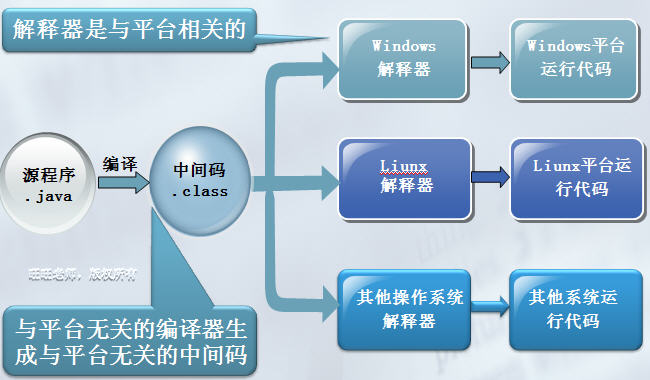
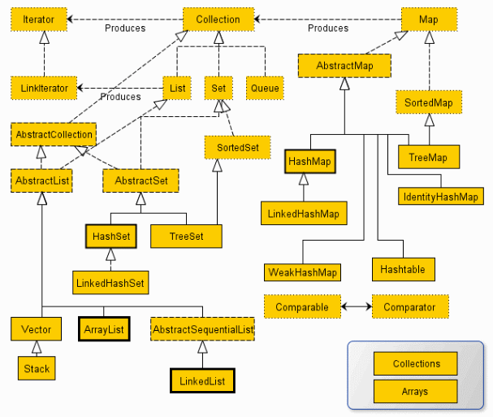

# Java基础面试题-20210608
- 基础
    - **面向对象**
        - **基于类的面向对象**
        - **封装** **继承** **多态** **抽象**
            - 封装
                - 给对象提供了隐藏内部特性和行为的能力
                - 对象提供一些能被其他对象访问的方法来改变它内部的数据
                - **default** **public** **private&nbsp;** **protected&nbsp;**
                - 好处
                    - 通过隐藏对象的属性来保护对象内部的状态
                    - 提高了代码的可用性和可维护性，因为对象的行为可以被单独的改变或者是扩展
                    - 禁止对象之间的不良交互提高模块化
            - 继承
                - 给对象提供了从基类获取字段和方法的能力
                - 继承提高了了代码的重用性，可以在不修改类的情况下给现存的类添加新特性
            - 多态
                - 是编程语言给不同的底层数据类型做相同的接口展示的一种能力
                - 一个多态类型上的操作，可以应用到其它类型的值上面
            - 抽象
                - 是把想法从具体的实例中分离出来的步骤
                - 要根据他们的功能而不是实现细节来创建类
                - 主要目的是把类的行为和实现细节分离开
        - **面向过程**
            - 面向过程
                - **优点：**
                - **缺点：没有** **易维护** **易复用** **易扩展**
            - 面向对象
                - **优点**
                - **缺点**
        - **重载**
            - 重写&nbsp;override
                - **都相同**
                - 子类方法不能缩小父类方法的访问权限
                - 子类方法不能抛出比父类方法更多的异常(但子类方法可以不抛出异常)
                - 存在于父类和子类之间。
                - 如果方法被定义为&nbsp;final&nbsp;则不能被重写。
            - 重载&nbsp;overload 
                - **至少有一个不相同**
                - 不能重载只有返回值不同的方法名
                - 存在于父类和子类、同类中
        - **构造方法**
            - 构造方法
                - **Java 编译器会为这个类创建一个默认的构造方法**
            - 构造方法重载
                - **唯一的参数列表**
            - 拷贝构造方法
                - Java 不支持像 C++ 中那样的拷贝构造方法，这个不同点是因为如果你不自己写构造方法的情况下，Java 不会创建默认的拷贝构造方法。
    - **JRE**
        - 图示  JDK 包含 JRE,  JRE 包含 JVM
            -  
        - **Java开发工具包,** **Java运行时环境,** **Java 虚拟机**
        - **平台无关的编程语言**
            - 我们把CPU处理器与操作系统的整体叫平台,每种cpu都有其特定的指令集。开发程序，首先要知道该程序在什么CPU上运行,也就是要知道CPU所使用的指令集
            - 使用特定编译器编译的程序只能在对应的平台运行，也可以说编译器是与平台相关的，编译后的文件也是与平台相关的。我们说的语言跨平台是编译后的文件跨平台，而不是源程序跨平台，如果是源程序，任何一门语言都是跨平台的语言了。
            - 语言跨平台原理：“不能编译成机器语言，因为那样就与平台相关了，编译为中间语言，再由解释器二次编译，解释执行” 
        - **新特性**
            - JDK1.5新特性
                - **拆箱**
                - 2.枚举
                - 3.静态导入，如：import staticjava.lang.System.out
                - 4.可变参数（Varargs）
                - 5.内省（Introspector），主要用于操作JavaBean中的属性，通过getXxx/setXxx。一般的做法是通过类Introspector来获取某个对象的BeanInfo信息，然后通过BeanInfo来获取属性的描述器（PropertyDescriptor），通过这个属性描述器就可以获取某个属性对应的getter/setter方法，然后我们就可以通过反射机制来调用这些方法。
                - **泛型(Generic)**
                - 7.For-Each循环
                - **注解**
                - 9.协变返回类型：实际返回类型可以是要求的返回类型的一个子类型
            - JDK1.6新特性
                - **AWT** **Desktop** **SystemTray**
                - **JAXB2**
                - **StAX**
                - 4.使用Compiler API，动态编译Java源文件，如JSP编译引擎就是动态的，所以修改后无需重启服务器。
                - **.轻量级Http Server API**
                - 6.插入式注解处理API(PluggableAnnotation Processing API)
                - **Console类**
                - **.对脚本语言的支持**
                - **Derby**
            - JDK1.7新特性
                - **Java集合（Collections）的增强** **[]** **{}** **[]**
                    -  
                - **Switch**
                - 3.数值可加下划线用作分隔符（编译时自动被忽略）
                - **支持二进制数字**
                - **可变参数方法**
                - **泛型类**
                - **Boolean类型反转**
                - **char类型**
                - **安全的加减乘除**
                - **Map集合支持并发请求**
            - JDK1.8新特性
                - **接口的默认方法**
                - **2.Lambda 表达式**
                    - 例图 
                    - 对于函数体只有一行代码的，你可以去掉大括号{}以及return关键字  
                - **.函数式接口**
                - **&nbsp;::** **传递方法** **构造函数引用**
                - **多重注解**
                - **增加** **函数式接口**
            - jdk1.9新特性
                - **平台级模块系统**
                    - 当启动一个模块化应用时JVM 会验证是否所有的模块都能使用，这基于 requires 语句比脆弱的类路径迈进了一大步。模块允许你更好地强制结构化封装你的应用并明确依赖。
                - **Linking**
                    - 当你使用具有显式依赖关系的模块和模块化的 JDK 时，新的可能性出现了。你的应用程序模块现在将声明其对其他应用程序模块的依赖以及对其所使用的 JDK 模块的依赖。为什么不使用这些信息创建一个最小的运行时环境，其中只包含运行应用程序所需的那些模块呢？ 这可以通过 Java 9 中的新的 jlink 工具实现。你可以创建针对应用程序进行优化的最小运行时映像而不需要使用完全加载 JDK 安装版本。
                - **交互式 Java REPL**
                    - 许多语言已经具有交互式编程环境，Java 现在加入了这个俱乐部。您可以从控制台启动 jshell ，并直接启动输入和执行 Java 代码。 jshell 的即时反馈使它成为探索 API 和尝试语言特性的好工具。
                - **Javadoc**
                    - Javadoc 现在支持在 API 文档中的进行搜索。另外，Javadoc 的输出现在符合兼容 HTML5 标准。此外，你会注意到，每个 Javadoc 页面都包含有关 JDK 模块类或接口来源的信息。
                - 5.集合工厂方法
                    - 通常，您希望在代码中创建一个集合（例如，List 或 Set ），并直接用一些元素填充它。 实例化集合，几个 “add” 调用，使得代码重复。 Java 9，添加了几种集合工厂方法：
                        -  
                - 6.改进的 Stream API
                    - 长期以来，Stream API 都是 Java 标准库最好的改进之一。通过这套 API 可以在集合上建立用于转换的申明管道。在 Java 9 中它会变得更好。Stream 接口中添加了 4 个新的方法：dropWhile, takeWhile, ofNullable。还有个 iterate 方法的新重载方法，可以让你提供一个 Predicate (判断条件)来指定什么时候结束迭代： 
                - 7.私有接口方法
                    - 使用 Java 9，您可以向接口添加私有辅助方法来解决此问题 
                - 8.HTTP/2
                    - Java 9 中有新的方式来处理 HTTP 调用。这个迟到的特性用于代替老旧的 HttpURLConnection API，并提供对 WebSocket 和 HTTP/2 的支持。注意：新的 HttpClient API 在 Java 9 中以所谓的孵化器模块交付。也就是说，这套 API 不能保证 100% 完成。不过你可以在 Java 9 中开始使用这套 API： 
        - **&nbsp;C++ 的区别**
            - 都是面向对象的语言，都支持封装、继承和多态。
            - Java 不提供指针来直接访问内存，程序内存更加安全。
            - Java 的类是单继承的，C++ 支持多重继承； Java 的类不可以多继承但是接口可以多继承
            - **Java 有自动内存管理机制，不需要程序员手动释放无用内存**
    - **基本数据类型**
        - 表格图示
            - **boolean**
            - **byte**
            - **char**
            - **short**
            - **int**
            - **long**
            - **float**
            - **double** 
        - **自动拆装箱**
            - 是基本数据类型和包装类型之间的转换
            - **为什么要转换**
                - 如果你在 Java5 下进行过编程的话，不能直接地向集合( Collection )中放入原始类型值，因为集合只接收对象.这种情况下你的做法是，将这些原始类型的值转换成对象，然后将这些转换的对象放入集合中。使用 Integer、Double、Boolean 等这些类，我们可以将原始类型值转换成对应的对象，但是从某些程度可能使得代码不是那么简洁精炼。
                - 为了让代码简练，Java5 引入了具有在原始类型和对象类型自动转换的装箱和拆箱机制
                - 但是自动装箱和拆箱并非完美，在使用时需要有一些注意事项，如果没有搞明白自动装箱和拆箱，可能会引起难以察觉的 Bug
            - **&nbsp;int 和 Integer&nbsp;**
                - int&nbsp;是基本数据类型
                - **包装类**
            - **包装类**
                - 一是为了在各种类型间转化，通过各种方法的调用。否则 你无法直接通过变量转化
                - 比如，现在int要转为String. 主要用途是用在各种数据类型的转化 
    - **引用传递**
        - **值传递**
        - **引用传递**
        - 一般认为，Java 内的传递都是值传递，Java 中实例对象的传递是引用传递
    - **StringBuilder**
        - 简述
            - **String&nbsp;**
                - 每次对 String 类型进行改变的时候，都会生成一个新的 String 对象，然后将指针指向新的 String 对象
            - **StringBuffer/StringBuilder**
            - StringBuilder 是 Java 5 中引入的，和 StringBuffer 的方法完全相同，区别在于它是在单线程环境下使用的，因为它的所有方面都没有被&nbsp;synchronized&nbsp;修饰，因此它的效率比 StringBuffer 高
            - **性能比较** **>&nbsp;** **&nbsp;>&nbsp;**
            - **使用场景**
            - **操作少量的数据**
            - **单线程**
            - **多线程**
                - 实际场景下，基本不太会出现多线程操作同一个 StringBuffer 对象
        - String 为什么是不可变的
            - 使用了&nbsp;final&nbsp;关键字字符数组保存字符串,所以 String 对象是不可变的。代码如下： 
            - &nbsp;StringBuilder -StringBuffer 两种对象都是可变的,因为都继承自 AbstractStringBuilder 类，在 AbstractStringBuilder 中也是使用字符数组保存字符串&nbsp;char[] value&nbsp;，没有用&nbsp;final&nbsp;关键字修饰。代码如下： 
        - String s = new String("xyz")&nbsp;会创建几个对象
            - 首先在 String 池内找，若找到&nbsp;"xyz"&nbsp;字符串不创建&nbsp;"xyz"&nbsp;对应的 String 对象，否则创建一个对象
            - 然后遇到&nbsp;new&nbsp;关键字，在内存上创建 String 对象，并将其返回给&nbsp;s&nbsp;创建了一个对象
            - 所以总共是 1 个或者 2 个对象
    - **equals()**
        - 值类型（int,char,long,boolean&nbsp;）
            - 用 == 判断相等性
        - 对象引用
            - 用 == 判断引用所指的对象是否是同一个
            - equals 方法是 Object 的成员函数，在比较两个对象的时候，是看他们是否指向同一个地址。但是我们的需求是对象的某个属性相同，就相等了，用于判断对象的等价性
            - 例如 String 类，两个引用所指向的 String 都是&nbsp;"abc"&nbsp;，但可能出现他们实际对应的对象并不是同一个（和 JVM 实现方式有关），因此用 == 判断他们可能不相等，但用 equals 方法判断一定是相等的
        - **hashCode**
            - **哈希碰撞**
            - 所以说，equals 和 hashCode 的关系会是：
            - equals 不相等，hashCode 可能相等。
            - equals 相等，请重写 hashCode 方法，保证 hashCode 相等。
        - **finalize**
            - **final**
                - final&nbsp;是修饰符关键字
                - 如果一个类被声明为&nbsp;final&nbsp;，意味着它不能再派生出新的子类，不能作为父类被继承。因此一个类不能既被声明为&nbsp;abstract&nbsp;的，又被声明为&nbsp;final&nbsp;
                - 将变量或方法声明为 final ，可以保证它们在使用中不被改变。被声明为 final 的变量必须在声明时给定初值，而在以后的引用中只能读取，不可修改。被声明为 final 的方法也同样只能使用，不能重写。
                - 另外，在早期的 Java 实现版本中，会将&nbsp;final&nbsp;方法转为内嵌调用。但是如果方法过于庞大，可能看不到内嵌调用带来的任何性能提升（现在的 Java 版本已经不需要使用&nbsp;final&nbsp;方法进行这些优化了）。类中所有的private&nbsp;方法都隐式地指定为&nbsp;final&nbsp;
            - **finally**
                - 在异常处理时提供&nbsp;finally&nbsp;块来执行任何清除操作。如果抛出一个异常，那么相匹配的&nbsp;catch&nbsp;子句就会执行，然后控制就会进入&nbsp;finally&nbsp;块（如果有的话）
                - 在以下 4 种特殊情况下，finally块不会被执行：
                    - 在 finally 语句块中发生了异常。
                    - 在前面的代码中用了 System.exit() 退出程序。
                    - 程序所在的线程死亡。
                    - 关闭 CPU 。
            - **finalize**
                - finalize&nbsp;是方法名。
                - Java 允许使用&nbsp;finalize()&nbsp;方法，在垃圾收集器将对象从内存中清除出去之前做必要的清理工作。这个方法是由垃圾收集器在确定这个对象没有被引用时对这个对象调用的
                - 它是在 Object 类中定义的，因此所有的类都继承了它
                - 子类覆盖&nbsp;finalize()&nbsp;方法，以整理系统资源或者执行其他清理工作
                - finalize()&nbsp;方法，是在垃圾收集器删除对象之前对这个对象调用的
            - String 类能被继承吗，为什么？
                - 不能，因为 String 是 final 修饰
    - **抽象类**
        - 抽象是对类的抽象是一种模板设计，接口是行为的抽象是一种行为的规范
            - Java 提供和支持创建抽象类和接口。它们的不同点在于：接口中所有的方法隐含的都是抽象的，而抽象类则可以同时包含抽象和非抽象的方法
            - 类可以实现很多个接口，但是只能继承一个抽象类。类可以不实现抽象类和接口声明的所有方法，当然，在这种情况下，类也必须得声明成是抽象的
            - 抽象类可以在不提供接口方法实现的情况下实现接口。
            - Java 接口中声明的变量默认都是 final 的。抽象类可以包含非 final 的变量。
            - Java 接口中的成员函数默认是 public 的。抽象类的成员函数可以是 private，protected 或者是 public 。
            - 接口是绝对抽象的，不可以被实例化。抽象类也不可以被实例化，但是，如果它包含 #main(String[] args) 方法的话是可以被调用的。
        - **组合**
            - 继承：指的是一个类（称为子类、子接口）继承另外的一个类（称为父类、父接口）的功能，并可以增加它自己的新功能的能力，继承是类与类或者接口与接口之间最常见的关系。在 Java 中，此类关系通过关键字 extends 明确标识，在设计时一般没有争议性。
            - 组合：组合是关联关系的一种特例，他体现的是整体与部分、拥有的关系，即 has-a 的关系，此时整体与部分之间是可分离的，他们可以具有各自的生命周期，部分可以属于多个整体对象，也可以为多个整体对象共享。
                - 比如，计算机与 CPU 、公司与员工的关系等。
                - 表现在代码层面，和关联关系是一致的，只能从语义级别来区分。
    - **实例化顺序**
        - 父类静态变量
        - 父类静态代码块
        - 子类静态变量、
        - 子类静态代码块
        - 父类非静态变量（父类实例成员变量）
        - 父类构造函数
        - 子类非静态变量（子类实例成员变量）
        - 子类构造函数
    - **内部类**
        - 简单的说，就是在一个类、接口或者方法的内部创建另一个类
        - **作用**
            - 内部类提供了更好的封装，除了该外围类，其他类都不能访问
        - **匿名内部类**
            - 可以继承其他类或实现其他接口，常用在在 Java 集合的流式操作中
        - **外部类**
            - 一个内部类对象可以访问创建它的外部类对象的成员，包括私有成员
    - **Java IO**
        - **面向字节(Byte)** **面向字符(Character)** [java.io]("http://java.io") 
    - **序列化**
        - **处理对象流的机制** 
            - 可以对流化后的对象进行读写操作，也可将流化后的对象传输于网络之间
            - 序列化是为了解决在对 对象流进行读写操作时所引发的问题
            - 反序列化则是和序列化相反的过程
            - 我不能将序列化局限在 Java 对象转换成二进制数组，例如将一个 Java 对象转换成 JSON 字符串，或者 XML 字符串，这也可以理解为是序列化
        - **实现**
            - 将需要被序列化的类，实现 Serializable 接口，该接口没有需要实现的方法，implements Serializable&nbsp;只是为了标注该对象是可被序列化的
            - 然后使用一个输出流(如：FileOutputStream)来构造一个 ObjectOutputStream(对象流)对象
            - 最后使用 ObjectOutputStream 对象的&nbsp;writeObject(Object obj)&nbsp;方法就可以将参数为&nbsp;obj&nbsp;的对象写出(即保存其状态)
        - **不想进行序列化**
            - **transient&nbsp;**
            - transient&nbsp;只能修饰变量，不能修饰类和方法
    - **对象克隆**
        - 实现 Cloneable 接口并重写 Object 类中的&nbsp;clone()&nbsp;方法。可以实现浅克隆也可以实现深克隆
        - 实现 Serializable接口通过对象的序列化和反序列化实现克隆,可以实现真正的深克隆
        - 实际场景下，我们使用的对象克隆比较少，更多是对象之间的属性克隆。例如说，将 DO 的属性复制到 DTO 中，又或者将 DTO 的属性复制到 VO 中。此时，我们一般使用 BeanUtils 工具类。
        -  [https://www.cnblogs.com/tison/p/7840647.html]("https://www.cnblogs.com/tison/p/7840647.html")
    - **exception** **RuntimeException**
        - **类关系图** **Throwable类** **throw** **catch**
            -  
        - **不必处理**
            - 例如：内存资源不足等。
            - 对于这种错误，程序基本无能为力，除了退出运行外别无选择，是由 Java 虚拟机抛出的
        - Exception表示需要捕捉或者需要程序进行处理的异常，它处理的是因为程序设计的瑕疵而引起的问题或者在外的输入等引起的一般性问题，是程序必须处理的
        - Exception 又分为运行时异常，受检查异常
            - RuntimeException(运行时异常)，表示无法让程序恢复的异常，导致的原因通常是因为执行了错误的操作，建议终止逻辑，因此，编译器不检查这些异常
            - CheckedException(受检查异常)，是表示程序可以处理的异常，也即表示程序可以修复（由程序自己接受异常并且做出处理），所以称之为受检查异常
        - **使用注意事项**
            - 不要将异常处理用于正常的控制流,良好的 API 不应该强迫为了正常的控制流使用异常
            - 对可以恢复的情况使用受检异常，对编程错误使用运行时异常
            - 避免不必要的使用受检异常（可以通过一些状态检测手段来避免异常的发生）
            - 优先使用标准的异常
            - 每个方法抛出的异常都要有文档
            - 保持异常的原子性
            - 不要在&nbsp;catch&nbsp;中忽略掉异常的处理
        - **常用方法**
            - getMessage()&nbsp;方法：返回异常发生时的详细信息
            - getCause()&nbsp;方法：获得导致当前 Throwable 异常的 Throwable 异常
            - getStackTrace()&nbsp;方法：获得 Throwable 对象封装的异常信息
            - printStackTrace()&nbsp;方法：在控制台上打印。
        - **运行时异常**
            - NullPointerException
            - IndexOutOfBoundsException
            - ClassCastException
            - ArrayStoreException
            - BufferOverflowException
        - **throws&nbsp;**
            - throw&nbsp;用于在程序中显式地抛出一个异常
            - throws&nbsp;用于指出在该方法中没有处理的异常,每个方法必须显式指明哪些异常没有处理，以便该方法的调用者可以预防可能发生的异常。最后，多个异常用逗号分隔
        - **finally&nbsp;语句块**
            - 不管程序是否发生了异常, finally 语句块都会被执行，甚至当没有catch 声明但抛出了一个异常时, finally 语句块也会被执行。
            - finally 语句块通常用于释放资源, 如 I/O 缓冲区, 数据库连接等等
    - **反射**
        - Java 反射机制主要提供了以下功能
            - 在运行时构造一个类的对象
            - 判断一个类所具有的成员变量和方法
            - 调用一个对象的方法
            - 生成动态代理
        - **ClassLoader**
            - Class.forName(...)&nbsp;方法，除了将类的&nbsp;.class&nbsp;文件加载到JVM 中之外，还会对类进行解释，执行类中的&nbsp;static&nbsp;块
            - ClassLoader 只干一件事情，就是将&nbsp;.class&nbsp;文件加载到 JVM 中，不会执行&nbsp;static&nbsp;中的内容，只有在 newInstance 才会去执行&nbsp;static&nbsp;块
    - **断言(assert)**
        - **调试方式**
        - 断言用于保证程序最基本、关键的正确性。断言检查通常在开发和测试时开启。为了保证程序的执行效率，在软件发布后断言检查通常是关闭的
        - 断言是一个包含布尔表达式的语句，在执行这个语句时假定该表达式为true；如果表达式的值为&nbsp;false&nbsp;，那么系统会报告一个AssertionError 错误
        - 实际场景下，我们会在 Spring 的源码中看到，它自己封装了 Assert 类，实现更方便的断言功能，并且，在生产环境下也启用
    - **对象创建**
        - 使用 new 关键字创建对象。
        - 使用 Class 类的 newInstance 方法(反射机制)。
        - 使用 Constructor 类的 newInstance 方法(反射机制)。
        - 使用 clone 方法创建对象。
        - 使用(反)序列化机制创建对象
- 集合
    - **优点**
        - 使用核心集合类降低开发成本，而非实现我们自己的集合类。
        - 随着使用经过严格测试的集合框架类，代码质量会得到提高。
        - 通过使用 JDK 附带的集合类，可以降低代码维护成本。
        - 复用性和可操作性
        - **泛型**
            - Java5 引入了泛型，所有的集合接口和实现都大量地使用它。泛型允许我们为集合提供一个可以容纳的对象类型。因此，如果你添加其它类型的任何元素，它会在编译时报错。这避免了在运行时出现 ClassCastException，因为你将会在编译时得到报错信息。
            - 泛型也使得代码整洁，我们不需要使用显式转换和&nbsp;instanceOf&nbsp;操作符。它也给运行时带来好处，因为不会产生类型检查的字节码指令
    - **基础接口**
        - 集合类结构图示
            -  
        - **Map接口**
            - 尽管 Map 接口和它的实现也是集合框架的一部分，但 Map 不是集合，集合也不是 Map。因此Map 继承 Collection 毫无意义，反之亦然。
        - **Collections&nbsp;**
            - Collection 是集合类的上级接口，继承与他的接口主要有 Set 和List
            - Collections 是针对集合类的一个工具类，它提供一系列静态方法实现对各种集合的搜索、排序、线程安全化等操作
        - **数据结构**
            - **List**
                - **ArrayList&nbsp;**
                - **Vector&nbsp;**
                - **LinkedList&nbsp;**
            - **Map**
                - **HashMap**
                    - JDK8 之前，HashMap 由数组+链表组成的，数组是HashMap的主体，链表则是主要为了解决哈希冲突而存在的（“拉链法”解决冲突）。
                    - JDK8 以后，在解决哈希冲突时有了较大的变化，当链表长度大于阈值（默认为 8 ）时，将链表转化为红黑树，以减少搜索时间。
                - **LinkedHashMap**
                    - LinkedHashMap 继承自 HashMap，所以它的底层仍然是基于拉链式散列结构即由数组和链表或红黑树组成。另外，LinkedHashMap 在上面结构的基础上，增加了一条双向链表，使得上面的结构可以保持键值对的插入顺序。同时通过对链表进行相应的操作，实现了访问顺序相关逻辑。
                - **Hashtable&nbsp;**
                - **TreeMap&nbsp;**
            - **Set**
                - **HashSet&nbsp;**
                - **LinkedHashSet&nbsp;**
                - **TreeSet&nbsp;**
    - **迭代器(Iterator)**
        - Iterator 接口，提供了很多对集合元素进行迭代的方法。每一个集合类都包含了可以返回迭代器实例的迭代方法。
        - **ListIterator**
            - Iterator 可用来遍历 Set 和 List 集合，但是 ListIterator 只能用来遍历 List
            - Iterator 对集合只能是前向遍历，ListIterator 既可以前向也可以后向
            - ListIterator 实现了 Iterator 接口，并包含其他的功能。比如：增加元素，替换元素，获取前一个和后一个元素的索引等等
        - **Enumeration**
            - Enumeration 跟 Iterator 相比较快两倍，而且占用更少的内存
            - Iterator 相对于 Enumeration 更安全，因为其他线程不能修改当前迭代器遍历的集合对象。同时，Iterators 允许调用者从底层集合中移除元素，这些 Enumerations 都没法完成
        - **具体实现**
            - **都有它自己的 Iterator 实现内部类**
            - 这就允许集合类去选择迭代器是 fail-fast 还是 fail-safe 的。比如，ArrayList 迭代器是 fail-fast 的，而 CopyOnWriteArrayList 迭代器是 fail-safe 的
        - **快速失败(fail-fas)t**
            - 差别在于 ConcurrentModification 异常
            - 快速失败：当你在迭代一个集合的时候，如果有另一个线程正在修改你正在访问的那个集合时，就会抛出一个 ConcurrentModification 异常。 在&nbsp;java.util&nbsp;包下的都是快速失败
            - 安全失败：你在迭代的时候会去底层集合做一个拷贝，所以在修改上层集合的时候不会受影响，不会抛出 ConcurrentModification 异常。在&nbsp;java.util.concurrent&nbsp;包下的全是安全失败
        - **删除 List**
            - 方式一，使用 Iterator 顺序向下，如果找到元素，则使用 remove 方法进行移除
            - 方式二，倒序遍历 List ，如果找到元素，则使用 remove 方法进行移除
    - **Comparator**
        - Comparable 接口，在&nbsp;java.lang&nbsp;包下，用于当前对象和其它对象的比较，所以它有一个&nbsp;compareTo(Object obj)&nbsp;方法用来排序，该方法只有一个参数
        - Comparator 接口，在&nbsp;java.util&nbsp;包下，用于传入的两个对象的比较，所以它有一个&nbsp;compare(Object obj1, Object obj2)&nbsp;方法用来排序，该方法有两个参数
    - **对比**
        - **Set**
            - **相同点**
            - **List 特点**
            - **Set 特点**
            - **Set 中的位置** **hashcode 决定** **List 支持&nbsp;for&nbsp;循环** **Set 只能用迭代**
        - **Map**
            - List 是对象集合，允许对象重复。
            - Map 是键值对的集合，不允许 key 重复
        - **Array**
            - **ArrayList 只能容纳对象**
            - Array 是指定大小的，而 ArrayList 大小是固定的，可自动扩容
            - Array 没有提供 ArrayList 那么多功能，比如 addAll、removeAll 和 iterator 等
            - **使用说明:** **①** **②** **③** **[][]**
        - **LinkedList**
            - ArrayList 分析
                - 优点：实现了基于动态数组的数据结构，因为地址连续一旦数据存储好了，查询操作效率会比较高（在内存里是连续存放的）
                - 缺点：因为地址连续，ArrayList 要移动数据，所以插入和删除操作效率比较低
            - LinkedList 分析
                - 优点：是基于链表的数据结构，地址是任意的，所以在开辟内存空间的时候不需要等一个连续的地址。对于新增和删除操作 add 和 remove ，LinedList 比较占优势。LinkedList 适用于要头尾操作或插入指定位置的场景
                - 缺点：因为 LinkedList 要移动指针，所以查询操作性能比较低
            - 适用场景分析
                - **随机访问**
                - **多次增加删除修改**
            - **注意 :** **扩容**
            - **如何扩容**
                - 动态扩容详解
                    -  [https://www.cnblogs.com/kuoAT/p/6771653.html]("https://www.cnblogs.com/kuoAT/p/6771653.html")
                - 如果通过无参构造的话，初始数组容量为 0 ，当真正对数组进行添加时，才真正分配容量。每次按照&nbsp;1.5&nbsp;倍（位运算）的比率通过 copeOf 的方式扩容
                - 在 JKD6 中实现是，如果通过无参构造的话，初始数组容量为10，每次通过 copeOf 的方式扩容后容量为原来的&nbsp;1.5&nbsp;倍
            - **加入 1 万条数据**
                - ArrayList 的默认初始容量为 10 ，要插入大量数据的时候需要不断扩容，而扩容是非常影响性能的。因此，现在明确了 10 万条数据了，我们可以直接在初始化的时候就设置 ArrayList 的容量.这样就可以提高效率了
        - **Vector**
            - 共同点 : 都是用数组实现的, 采用的线性连续空间存储元素
            - **线程安全** **效率**
            - 两个类的增加元素的方式不同
            - **增长因子**
        - **Hashtable**
            - Hashtable 继承 Dictionary ，HashMap 继承的是 Java2 出现的 Map 接口
            - HashMap 允许空键值，而 Hashtable 不允许
            - HashTable 是同步的，而 HashMap 是非同步的，效率上比 HashTable 要高。也因此，HashMap 更适合于单线程环境，而 HashTable 适合于多线程环境
            - HashMap 的迭代器(Iterator)是 fail-fast 迭代器，HashTable的 enumerator 迭代器不是
            - HashTable 中数组默认大小是 11 ，扩容方法是&nbsp;old * 2 + 1&nbsp;，HashMap 默认大小是 16 ，扩容每次为 2 的指数大小。
            - **提示 :**
            - HashTable 是遗留类，内部实现很多没优化有冗余
            - 在多线程环境下现在有同步的 ConcurrentHashMap 替代,没有必要为多线程而用 Hashtable 
        - **HashMap**
            - **共同点**
            - Set 是线性结构，值不能重复。HashSet 是 Set 的 hash 实现，HashSet 中值不能重复是用 HashMap 的 key 来实现的
            - Map 是键值对映射，可以空键空值。HashMap 是 Map 的 hash 实现，key 的唯一性是通过 key 值 hashcode 的唯一来确定，value 值是则是链表结构. 因为不同的 key 值，可能有相同的 hashcode ，所以 value 值需要是链表结构
        - **TreeSet**
            - **无序**
            - **有序**
            - **选择**
            - HashMap  : 在 Map 中插入、删除和定位元素这类操作
            - TreeMap : 需要对一个有序的 key 集合进行遍历
        - **ConcurrentHashMap**
            - ConcurrentHashMap 是线程安全的 HashMap 的实现
            - **ConcurrentHashMap** **CAS 算法**
            - HashMap 的键值对允许有&nbsp;null&nbsp;，但是 ConCurrentHashMap 都不允许
        - **Queue**
            - java.util.Queue&nbsp;是一个接口，它的实现类在Java并发包中
                - 队列允许先进先出（FIFO）检索元素，但并非总是这样
                - Deque 接口允许从两端检索元素
            - 栈与队列很相似，但它允许对元素进行后进先出（LIFO）进行检索
                - Stack 是一个扩展自 Vector 的类，而 Queue 是一个接口
    - **原理**
        - HashMap 的工作原理是什么
            - HaspMap图解
                -  
            - HaspMap操作
                - 我们使用&nbsp;put(key, value)&nbsp;方法来存储对象到 HashMap 中，使用&nbsp;get(key)&nbsp;方法从 HashMap 中获取对象。当我们给#put(key, value)&nbsp;方法传递键和值时，我们先对键调用&nbsp;hashCode()&nbsp;方法，返回的 hashCode 用于找到 bucket 位置来储存 Entry 对象
            - **hashCode 相同**
                - 因为 hashcode 相同，所以它们的 bucket 位置相同，“碰撞”会发生
                - 因为 HashMap 使用链表存储对象，这个 Entry会存储在链表中
            - **默认容量**
                - 默认容量都是 16 ，负载因子是 0.75 
                - 就是当 HashMap 填充了 75% 的 busket 时就会扩容
                - 最小的可能性是（16 * 0.75 = 12），一般为原内存的 2 倍
            - **长度**
                - 为了能让 HashMap 存取高效，尽量较少碰撞，也就是要尽量把数据分配均匀，每个链表的红黑树长度大致相同。这个实现就是把数据存到哪个链表的红黑树中的算法
        - HashSet 的工作原理是什么
            - 源码分析
                - HashSet 是构建在 HashMap 之上的 Set hashing 实现类。让我们直接撸下源码 
                - map 属性，当我们创建一个 HashMap 对象时，其内部也会创建一个 map 对象。后续 HashSet 所有的操作，实际都是基于这个 map 之上的封装。
                - PRESENT 静态属性，所有 map 中 KEY 对应的值，都是它，避免重复创建。
                - 再来看一眼 add方法 
            - HashSet 如何检查重复
                - 当你把对象加入 HashSet 时，HashSet会先计算对象的hashcode值来判断对象加入的位置，同时也会与其他加入的对象的hashcode值作比较
                - 如果没有相符的 hashcode ，HashSet会假设对象没有重复出现
                - 但是如果发现有相同 hashcode 值的对象，这时会调用 equals 方法来检查 hashcode 相等的对象是否真的相同
                - 如果两者相同，HashSet 就不会让加入操作成功
                - 如果两者不同，HashSet 就会让加入操作成功
        - EnumSet 是什么
            - java.util.EnumSet&nbsp;，是使用枚举类型的集合实现
            - 当集合创建时，枚举集合中的所有元素必须来自单个指定的枚举类型，可以是显示的或隐示的。EnumSet 是不同步的，不允许值为&nbsp;null&nbsp;的元素
        - TODO TreeMap 原理
            - Java 中的 TreeMap 是使用红黑树实现的
        - Java Priority Queue 是什么
            - PriorityQueue 是一个基于优先级堆的无界队列，它的元素都以他们的自然顺序有序排列
                - 在它创建的时候，我们可以提供一个比较器 Comparator 来负责PriorityQueue 中元素的排序
                - PriorityQueue 不允许  null元素，不允许不提供自然排序的对象，也不允许没有任何关联 Comparator 的对象。
                - PriorityQueue 不是线程安全的，在执行入队和出队操作它需要&nbsp;O(log(n))&nbsp;的时间复杂度。
            - **remove**
                - poll 方法，在获取元素失败的时候会返回空
                - remove() 方法，失败的时候会抛出异常
            - **PriorityQueue**
                - riorityQueue 保证最高或者最低优先级的的元素总是在队列头部，LinkedHashMap 维持的顺序是元素插入的顺序。
                - 当遍历一个 PriorityQueue 时，没有任何顺序保证，但是 LinkedHashMap 课保证遍历顺序是元素插入的顺序