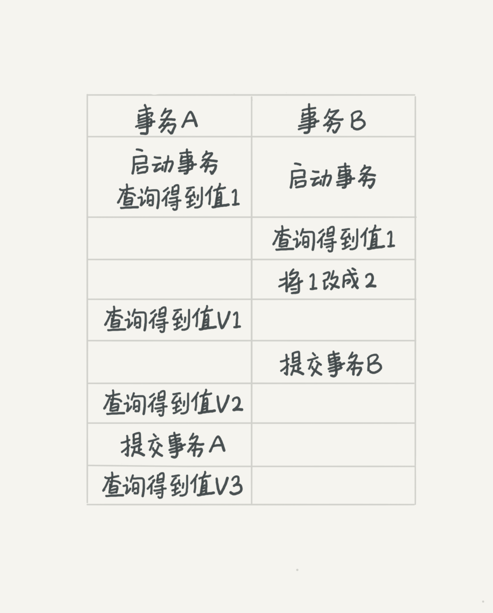
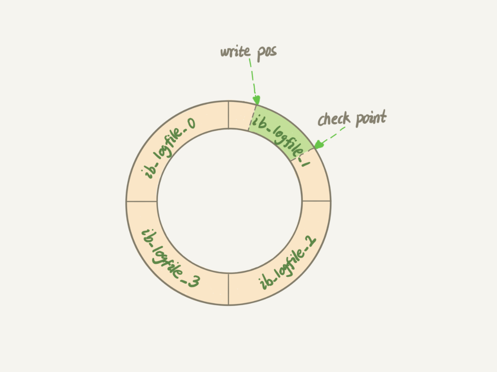

# MySQL-整理总结20230727
- Mysql
    - 架构
        - 逻辑图示
            - 图示1 
            - 图示2 
        - 连接层
        - > 线程池 授权验证
            - 主要完成连接处理、授权认证及相关安全方案
            - 引入线程池为通过认证安全连接的客户端提供线程
            - 实现基于SSL的安全连接
        - 服务层
        - > 连接 缓存 分析 优化 执行
            - 模块
                - 连接器 与客户端 **建立连接** - **获取权限** - **维持** 和 **管理连接**
                    - 连接命令:  "mysql   -h$ip    -P$port    -u$user   -p"
                        - mysql -h 域名 -P 端口 -u 账号 -p 密码
                    - show processlist 命令查看当前连接状态
                        - 连接图示 
                    - wait_timeout 属性控制连接时长 超出断开 默认8小时
                - 查询缓存 **8.0版本已删除**
                    - 查询请求会先看查询缓存 是否执行过语句
                    - 执行过的语句及其结果 以KV形式直接缓存在内存中
                    - Key 是查询语句 Value 是查询的结果 如果缓存存在key 就会被直接返回Value
                    - Key 不在缓存中 就继续后面阶段 执行完成后结果会被存入查询缓存中
                    - **大多数情况不建议用查询缓存  失效频繁**
                        - 只要有对表的更新 这个表上所有的查询缓存都会被清空
                        - MySQL提供了“按需使用”的方式
                        - 默认SQL都不使用查询缓存: query_cache_type:DEMAND
                        - 显式指定使用查询缓存: select SQL_CACHE * from table;
                - 分析器 **词法分析-语法分析**
                    - **词法分析** 从字符串中识别命令 如把select关键字识别出
                    - **语法分析** 根据词法分析结果 判断是否满足MySQL语法规则
                - 优化器 决定 **使用哪个索引**  **各表的连接顺序**
                    - 优化器 查询命令示例
                        - select * from t1 join t2 using(ID)  where t1.c=10 and t2.d=20;
                        - 可以先从表 t1 取c=10 记录的ID值，再根据ID关联表t2，再判断 t2 d 值
                        - 也可先从表 t2 取d=20 记录的ID值，再根据ID值关联t1，再判断t1 c 值
                        - 两种执行结果一样 但效率不同 优化器就是决定用哪一个方案
                - 执行器 **判断权限 根据引擎调用接口**
            - 功能
                - 存储过程
                - 触发器
                - 视图
        - 存储引擎层
        - > 数据存储提取
            - **插件式** 架构模式 支持多个存储引擎
                - InnoDB
                - MyISAM
                - MEMORY
                - NDB
                - Memory
                - Archive
                - Federated
                - Maria
            - 
        - 考察: 一条查询语句的具体流程
            - 流程图 
            - 流程
                - 客户端请求
                - 连接器（验证用户身份，给予权限）
                - 查询缓存（存在缓存则直接返回，不存在则执行后续操作）
                - 分析器（对SQL进行词法分析和语法分析操作）
                - 优化器（主要对执行的sql优化选择最优的执行方案方法）
                - 执行器（执行时会先看用户是否有执行权限，有才去使用这个引擎提供的接口）
                - 去引擎层获取数据返回（如果开启查询缓存则会缓存查询结果）
    - 数据类型
        - 整数类型
            - bit
            - bool
            - tinyint
            - smallint
            - mediumint
            - int
            - bigint
        - 浮点数类型
            - float
            - double
            - decimal
        - 字符串类型
            - char
            - varchar
            - tiniytext
            - text
            - mediumtext
            - longtext
            - tinyblob
            - blob
            - mediumblob
            - longblob
        - 日期类型
            - Date
            - DateTime
            - TimeStamp
            - Time
            - Year
        - 其他数据类型
            - BINARY
            - VARBINARY
            - ENUM
            - SET
            - Geometry
            - Point
            - MultiPoint
            - LineString
            - MultiLineString
            - Polygon
            - GeometryCollection
        - 考察
            - varchar 与 char 的区别？varchar(50) 中的 50 代表的涵义
                - 1. **char** 是一种 **固定长度** 的类型 **，varchar** 是一种 **可变长度** 的类型
                - 2. varchar(50) 中 50 的涵义最多存放 50 个字符。 **varchar(50) 和 (200) 存储 hello 所占空间一样** ，但后者在排序时会消耗更多内存，因为 ORDER BY col 采用 fixed_length 计算 col 长度(memory引擎也一样)
            - int(11) 中的 11 代表什么涵义
                - **int(11) 中的 11 ，不影响字段存储的范围，只影响展示效果。**
            - 金额相关的数据选择什么数据类型
                - **方式一  使用 int 或者 bigint 类型。如果需要存储到分的维度，需要 *100 进行放大**
                - **方式二  使用 decimal 类型，避免精度丢失。如果使用 Java 语言时，需要使用 BigDecimal 进行对应。**
            - 一张表有 ID 自增主键 insert  17 条记录后，删除了第 15,16,17 条记录，MySQL 重启，再 insert 一条记录，这条记录的 ID 是 18 还是 15
                - 一般我们创建的表的类型是 InnoDB ，新增一条记录（不重启 MySQL 的情况下），这条记录的 ID 是18 。如果重启 MySQL 这条记录的 ID 是 15 。因为 InnoDB 表只把自增主键的最大 ID 记录到内存中，所以重启数据库或者对表 OPTIMIZE 操作，都会使最大 ID 丢失
                - 如果使用表的类型是 MyISAM ，那么这条记录的 ID 就是 18 。因为 MyISAM 表会把自增主键的最大 ID 记录到数据文件里面，重启 MYSQL 后，自增主键的最大 ID 也不会丢失
            - 为什么 SELECT COUNT(*) FROM table 在 InnoDB 比 MyISAM 慢
                - 对于 SELECT COUNT(*) FROM table 语句，在没有 WHERE 条件的情况下，InnoDB 比 MyISAM 可能会慢很多，尤其在大表的情况下。因为 InnoDB 是去实时统计结果会全表扫描；而 MyISAM 内部维持了一个计数器预存了结果直接返回即可
            - BLOB和TEXT有什么区别？
                - BLOB是一个二进制对象可以容纳可变数量的数据。有四种类型的BLOB：TINYBLOB、BLOB、MEDIUMBLO和 LONGBLOB
                - TEXT是一个不区分大小写的BLOB。四种TEXT类型：TINYTEXT、TEXT、MEDIUMTEXT 和 LONGTEXT。
                - BLOB 保存二进制数据，TEXT 保存字符数据。
    - 范式与反范式
        - 第一范式( 1NF )
            - 强调属性的 **原子性约束** ，要求属性具有原子性， **不可再分解**
            - 举个例子，活动表（活动编码，活动名称，活动地址），假设这个场景中，活动地址可以细分为国家、省份、城市、市区、位置，那么就没有达到第一范式
        - 第二范式( 2NF )
            - 强调记录的 **唯一性约束** ，表必须有一个 **主键** ，并且没有包含在主键中的列必须完全依赖于主键，而不能只依赖于主键的一部分
            - 举个例子，版本表（版本编码，版本名称，产品编码，产品名称），其中主键是（版本编码，产品编码），这个场景中，数据库设计并不符合第二范式，因为产品名称只依赖于产品编码。存在部分依赖。所以，为了使其满足第二范式，可以改造成两个表：版本表（版本编码，产品编码）和产品表（产品编码，产品名称）
        - 第三范式( 3NF )
            - 强调 **属性冗余性的约束** ，即非主键列必须 **直接依赖于主键** 。
            - 举个例子，订单表（订单编码，顾客编码，顾客名称），其中主键是（订单编码），这个场景中，顾客编码、顾客名称都完全依赖于主键，因此符合第二范式，但是顾客名称依赖于顾客编码，从而间接依赖于主键，所以不能满足第三范式。为了使其满足第三范式，可以拆分两个表：订单表（订单编码，顾客编码）和顾客表（顾客编码，顾客名称），拆分后的数据库设计，就可以完全满足第三范式的要求了。
            - 值得注意的是，第二范式的侧重点是非主键列是否完全依赖于主键，还是依赖于主键的一部分。第三范式的侧重点是非主键列是直接依赖于主键，还是直接依赖于非主键列。
        - 反三范式
            - 为提高性能,增加冗余字段
            - 范式可以 **避免数据冗余** ， **减少数据库的空间** ， **减轻维护数据完整性的麻烦.** 但是通过数据库范式化设计将 **导致数据库业务涉及的表变多** ，并且可能需要将涉及的业务表进行 **多表连接查询导致性能变差** ， **且不利于分库分表** 。因此出于性能优先的考量，可能在数据库的结构中需要使用反模式的设计，即空间换取时间， **采取数据冗余的方式避免表之间的关联查询** 。至于数据一致性问题，因为难以满足数据强一致性，一般情况下，使存储数据尽可能达到用户一致，保证系统经过一段较短的时间的自我恢复和修正，数据最终达到一致。
    - 事务处理
        - 原理( **commit 临时日志** )
            - 描述
                - 事务开启之后, 所有的操作都会 **临时保存** 到事务日志中, 事务日志只有在得到 **commit命令** 才会同步到数据表中，其他 任何情况都会 **清空事务日志** (rollback，断开连接)
            - 步骤
                - 1) 客户端 **连接** 数据库服务器， **创建** 连接时创建此用户 **临时日志文件**
                - 2) **开启事务** 以后，所有的操作都会先 **写入** 到临时日志文件中
                - 3) 所有的 **查询** 操作从表中查询，但会经过日志文件 **加工** 后才 **返回**
                - 4) 如果事务提交 **commit** 则将日志文件中的数据 **写到表中** ，rollback否则 **清空日志文件**
            - 图示
                -  
        - 特性( **ACID** )
            - 原子性(Atomicity)
                - 不要能拆分，整个事务是一个整体，要么全部成功要么全部失败
            - 一致性(Consistency)
                - 事务开启前和事务结束后，对数据库影响状态要一致
            - 隔离性(Isolation)
                - 数据库允许多个并发事务同时对其数据进行读写和修改的能力，隔离性可以防止多个事务并发执行时由于交叉执行而导致数据的不一致
                - 隔离分为不同级别: 读未提交（Read uncommitted） 读提交（read committed） 可重复读（repeatable read） 串行化（Serializable）
            - 持久性(Durability)
                - 只要事务提交对数据库的影响是持久的
        - 隔离( **脏读 不可重复读 幻读** )
            - 对应事务隔离级别 两事务同时执行示意图
                -  
            - 读未提交: **脏读** 一个事务还没提交时它的变更就能被别的事务看到
                - 事务 B 虽然没有提交，但是结果已被 A 看到。因此V1 V2 V3 都是2
            - 读已提交: **不可重复读** Oracle SqlServer 一个事务提交之后它做的变更才会被其他事务看到
                - V1是1，事务 B 的更新在提交后才能被 A 看到。所以V2 V3 的值是 2
            - 可重复读: **幻读** MySQL 一个事务执行中看到的数据，总是跟启动时看到的数据一致
                - V1 V2是1  V3是2 遵循的是事务在执行期间看到的数据前后必须是一致的
            - **串行化** : 同一行记录 写加“写锁” 读加“读锁” 前一个事务执行完成才能继续执行
                - 事务B执行“将 1 改成 2”的时会被锁住,直到事务 A 提交后，事务 B 才继续执行
                - 所以从 A 的角度看 V1 V2 值是1 V3 的值是 2
        - **实现(MVCC)** 解决并行事务可重复读 **秒级创建快照**
            - Multiversion Concurrency Control 多版本并发控制
            - 多事务处理结果图示
                - K初始值是1 A得到K=1  B得到K=3 
            - 多版本记录结果图示
                - 虚线框里是同一行数据的 4 个版本  V123物理上不存在 由3个虚线箭头是undo log推出 
            - row trx_id事务数组
                - 数据版本可见性规则图示
                    - InnoDB为每个事务构造了一个数组 视图数组把所有的 row trx_id 分成不同情况 
                - **绿色** -已提交的事务或是当前事务自己生成的，这个数据是可见的
                - **红色** -这个版本由将来启动的事务生成，数据是 **不可见** 的
                - **黄色** -row trx_id 在数组中 这个版本是由还没提交的事务生成 数据 **不可见**
                - **黄色** -row trx_id 不在数组中 这个版本是已经提交了的事务生成的 数据 **可见**
            - 查询案例分析图示
                - 事务A 得到K=1 
            - 更新案例分析图示1 **更新数据是先读后写 只能读当前的值 称为-当前读 current read**
                - 事务B更新当前值k=2 查询k=3 
            - 更新案例分析图示2
                - 事务B必须等C释放锁才能继续当前读 A查k=2 B查k=3  
    - 索引
        - 描述 一种 **数据结构**
            - MYSQL官方定义：索引（Index）是帮助MySQL高效获取数据的 **数据结构**
            - 索引的目的在于 **提高查询效率** ，可以类比字典、 火车站的车次表、图书的目录等
            - 简单理解为“排好序的快速查找的数据结构”。数据本身之外数据库还维护着一个满足特定查找算法的数据结构，这些数据结构以某种方式指向数据，这样就可以在这些数据结构上实现高级查找算法。这种数据结构就是索引
            - 索引本身很大不可能全部存储在内存中，一般以 **索引文件** 的形式存储在磁盘上
            - 常说的索引没有特别指明的就是B+树（多路搜索树）。其中聚集索引 次要索引 覆盖索引 复合索引 前缀索引 唯一索引默认都是使用B+树索引
            - 图例说明
                - 下图是一种可能的索引方式示例 
                - 左边的数据表，一共有两列七条记录，最左边的是数据记录的物理地址。
                - 为了加快Col2的查找，可以维护一个右边所示的二叉查找树，每个节点分别包含 **索引键值** ，和一个 **指向对应数据记录物理地址** 的指针，这样就可以运用二叉查找在一定的复杂度内获取到对应的数据，从而快速检索出符合条件的记录。
        - 类型  主键索引-普通索引 **回表** 覆盖索引 索引下推
            - 主键查询示例
                - select * from T where ID=500 主键查询方式只需要搜索 ID 这棵 B+ 树
            - 普通索引查询示例
                - select * from T where k=5 普通索引查询方式需要先搜索 k 索引树，得到 ID 的值为 500，再到 ID 索引树搜索一次 **这个过程称为回表**
            - 回表流程示例 **回到主键索引树搜索的过程称为回表**
                - select * from T where k between 3 and 5 需要执行几次树的搜索操作会扫描多少行
                - 1 在 k 索引树上找到 k=3 的记录，取得 ID = 300；
                - 2 再到 ID 索引树查到 ID=300 对应的 R3；
                - 3 在 k 索引树取下一个值 k=5，取得 ID=500；
                - 4 再回到 ID 索引树查到 ID=500 对应的 R4；
                - 5 在 k 索引树取下一个值 k=6，不满足条件，循环结束 
            - 覆盖索引 **减少树的搜索次数 是常用性能优化手段**
                - 索引已经“覆盖了”查询需求，可以直接提供查询结果不需要回表 称为覆盖索引
            - 索引下推 **减少回表次数** 5.6引入
                - 在索引遍历过程中，对包含的字段先做判断直接过滤不满足条件的记录 减少回表次数
                - 流程示例SQL select * from user where name like '张 %' and age=10 ;
                - 有无索引下推流程图 虚线箭头表示回表一次
                    - 无索引下推执行流程 需要回表4次 
                    - 索引下推执行流程 只需要回表2次 
        - 失效分析
            - 全值匹配
            - 最佳左前匹配法则
            - 不在索引做任何操作
            - 尽量使用覆盖索引
            - (!= 或 <>)无法使用索引会导致全表扫描
            - is null, is not null 无法使用索引
            - like以通配符开头索引失效,变全表扫描
            - 字符串不加单引号索引失效
            - 少用or,连接时索引会失效
        - 维护 插入新值 **页分裂**
            - 所在数据页已满，根据 B+ 树的算法需要申请新的数据页，挪动部分数据过去的过程称为页分裂
            - 在这种情况下性能会受影响
            - 从性能和存储空间方面考量 **自增主键** 往往是更合理的选择
                - **主键长度越小  普通索引的叶子节点就越小  普通索引占用的空间也就越小**
        - 考察
            - 创建索引有哪些缺点
                - 创建索引 维护索引要耗费时间，时间随着数据量的增加而增加
                - 索引需要占物理空间
                - 当对表的数据进行增删改，索引也要动态的维护，降低了数据的维护速度
            - 数据库索引的原理，为什么要用 B+树，为什么不用二叉树
                - 当从算法逻辑上讲，二叉树的查找速度和比较次数是最小
                - 由于数据库索引是存储在磁盘上的，必须考虑磁盘IO问题，磁盘IO是较耗时的操作
                - 当数据量较大的时候，索引大小可能有几个G是不可能全部加载到内存中
                - 做法是逐一加载每一个磁盘页，这里的磁盘页对应着索引树的节点
                - 索引树的高度（层级）就是需要的磁盘IO次数
                - 在相同数据量的情况下，B+树的高度是小于二叉树的，数据量越大差距越明显
            - 聚簇索引和非聚簇索引的区别
                - 聚簇索引（InnoDB特有，Myisam没有）
                - > 即索引结构和数据结构一起存放的索引，找到索引也就找到了数据。
                    - 聚簇索引具有唯一性：将数据跟索引结构放到一块，因此一个表仅有一个聚簇索引。
                    - 误区：把主键自动设置为聚簇索引
                        - **聚簇索引默认是主键** ，如果表中没有定义主键，InnoDB会选择一个 **唯一的非空索引** 代替。如果没有这样的索引，InnoDB会 **隐式定义一个主键** 来昨晚聚簇索引。如果已经设置了主键为聚簇索引，必须先删除主键，然后添加想要的聚簇索引，最后恢复设置主键即可。
                    - 优点
                        - 聚簇索引的查询速度非常的快，因为整个B+树本身就是一颗多叉平衡树，叶子节点也都是有序的，定位到索引的节点，就相当于定位到了数据。
                    - 缺点
                        - 依赖于有序的数据，不是有序的数据插入或查找的速度比较慢；
                        - 更新代价大；
                - 非聚簇索引
                - > 即索引结构和数据分开存放的索引，叶子节点存的是键值和数据所在物理地址。
                    - 优点
                        - 更新代价比聚簇索引小；
                    - 缺点
                        - 
                - 聚簇索引与非聚簇索引 检索过程对比
                    - 案例数据表 
                    - 检索过程图 
                    - 聚簇索引
                        - InnoDB使用的是聚簇索引，将 **主键组织到一颗B+树** 中，而 **行数据存储在叶子节点** 上，若使用“where id=7” 这样的条件查找主键，则按B+树的检索算法即可查找到对应的节点，直接获得行数据。
                        - 若对Name列进行条件搜索，则需要两个步骤：1、 **在辅助索引B+树中检索Name** ，到达其他 **叶子节点获取对应的主键** 。2、 **使用主键在主索引B+树再执行一次B+树检索操作** ，最终到达叶子节点即可获得整行数据。
                    - 非聚簇索引
                        - MyISAM使用的是非聚簇索引， **非聚簇索引的两颗B+树看上去没什么不同** ，节点的结构完全一致， **只是存储的内容不同** ；
                        - 主键索引B+树的节点存储了主键，辅助索引B+树存储了辅助键；
                        - **表数据存储在独立的地方** ，这 **两颗B+树的叶子节点都使用一个地址指向真正的表数据** ，对于表数据来说，这两个键没有任何差别；
                        - 由于索引树是独立的， **通过辅助键检索无需访问主键的索引树** 。
                - 使用场景 
            - 为什么推荐使用整型自增主键而不是选择UUID
                - UUID是字符串，比整型消耗更多的存储空间；
                - 在B+树中进行查找时需要跟经过节点值比较大小，整型数据的比较运算比字符串更快速
                - 自增的整型索引在磁盘中会连续存储，在读取一页数据时也是连续；UUID是随机产生的，读取的上下两行数据存储是分散的，不适合执行按范围条件（如：where id>5 and id<10）查询语句
                - 在插入或删除数据时，整型自增主键会在叶子结点的末尾建立新的叶子节点，不会破坏左侧子树的结构；UUID主键很容易出现这样的情况：B+树为了维持自身的特性，有可能会进行结构的重构，消耗更多的时间。
            - 为什么InnoDB非主键索引结构叶子节点存储的是主键值
                - **保证数据一致性** 和 **节省存储空间。** 可以这么理解：商城系统订单表会存储一个用户ID作为关联外键，而不推荐存储完整的用户信息，因为当我们用户表中的信息（真实名称、手机号、收货地址···）修改后，不需要再次维护订单表的用户数据，同时也节省了存储空间。
            - 为什么Mysql索引要用B+树不是B树
                - 用B+树不用B树考虑的是IO对性能的影响，B树的每个节点都存储数据，而B+树只有叶子节点才存储数据，所以查找相同数据量的情况下，B树的高度更高，IO更频繁。
                - 数据库索引是存储在磁盘上的，当数据量大时，就不能把整个索引全部加载到内存了，只能逐一加载每一个磁盘页（对应索引树的节点）。其中在MySQL底层对B+树进行进一步优化：在叶子节点中是双向链表，且在链表的头结点和尾节点也是循环指向的。
            - 为何不采用Hash方式
                - 因为Hash索引底层是哈希表，哈希表是一种以key-value存储数据的结构，多个数据在存储关系上是完全没有任何顺序关系的；
                - 所以对于区间查询是无法直接通过索引查询需要全表扫描
                - 哈希索引只适用于等值查询的场景
                - B+ Tree是一种多路平衡查询树，节点是天然有序的（左子节点小于父节点、父节点小于右子节点），所以对于范围查询的时候不需要做全表扫描。
                - 哈希索引不支持多列联合索引的最左匹配规则，如果有大量重复键值得情况下，哈希索引的效率会很低，存在哈希碰撞问题
            - 哪些情况需要创建索引
                - 主键自动建立唯一索引
                - 频繁作为查询条件的字段
                - 查询中与其他表关联的字段，外键关系建立索引
                - 单键/组合索引的选择问题，高并发下倾向创建组合索引
                - 查询中排序的字段，排序字段通过索引访问大幅度提高排序速度
                - 查询中统计或分组字段
            - 哪些情况不需要创建索引
                - 表记录太少
                - 经常增删改的表
                - 数据重复且分布均匀的表字段
                - 频繁更新的字段不适合创建索引（会加重IO负担）
                - where 条件里用不到的字段不创建索引
            - 建索引要遵循哪些原则
                - 选择唯一性索引
                    - 如果值是唯一的，那使用唯一索引可以快速确定某条记录；
                - 为经常需要排序、分组和联合操纵的字段建索引
                    - 经常需要Order by、Group by、Distinct、Union等操作的字段，排序操作会浪费很多时间。如果为其建立索引，可以有效地避免排序操作；
                - 为常作为查询条件的字段建索引
                    - 如果某个字段经常用来做查询条件，那么该字段的查询速度会影响整个表的查询速度。因此为这样的字段建立索引，可以提高整个表的查询速度；
                - 限制索引的数目
                    - 每个索引都需要占用磁盘空间，索引越多，需要的磁盘空间就越大；修改表时，对索引的重构和更新很麻烦，越多的索引，会使更新表变得很浪费时间；
                - 尽量使用数据量少的索引
                    - 对char(10)类型的检索 会比 char(100)类型的检索 快很多；
                - 长字符尽量使用前缀索引
                    - 如果索引字段的值很长，例如：text 和 blog类型的字段，进行全文检索会很浪费时间。如果只检索字段的前面的若干个字符，这样可以提高检索速度；
                - 删除不再使用或者很少使用的索引
                    - dba定期清理不再使用或很少使用的索引，从而避免这些索引对更新操作的影响；
                - 最左前缀匹配原则
                    - mysql 会一直向右匹配直到遇到范围查询（>、<、between、like）就停止匹配，比如：a=1 and b=2 and c>3 and d=4，如果建立索引（a, b, c, d）顺序的索引，d是用不到索引的；建立（a, b, d, c）顺序的索引则都可以用到，a,b,d的顺序可以任意调整；
                - = 和 in 可以乱序
                    - 比如：a=1 and b=2 and c=3 建（a,b,c）索引可以任意顺序，mysql查询优化器会帮你优化成索引可以识别的形式；
                - 尽量选择区分度高的列作为索引
                    - 区分度公式：count(distinct col) / count(*) ，表示字段不重复的比例，比例越大需要扫描的记录数越少，唯一键的区分度为1；
                - 索引列不能参与计算，保持列“干净”
                    - 例如：from_unixtime(create_time) = '2021-04-30' 不能使用索引，因为b+树中存的都是数据表中的字段值；所以应改写成：create_time = unix_timestamp('2021-04-30')；
                - 尽量的扩展索引，不要新建索引
                    - 例如：已有 a 的索引，现在要加 （a, b）的索引，那么只需修改原来的索引即可
    - 锁
        - **MVCC** 解决并行事务可重复读 **秒级创建快照**
            - Multiversion Concurrency Control 多版本并发控制
            - 多事务处理结果图示
                - K初始值是1 A得到K=1  B得到K=3 
            - 多版本记录结果图示
                - 虚线框里是同一行数据的 4 个版本  V123物理上不存在 由3个虚线箭头是undo log推出 
            - row trx_id事务数组
                - 数据版本可见性规则图示
                    - InnoDB为每个事务构造了一个数组 视图数组把所有的 row trx_id 分成不同情况 
                - **绿色** -已提交的事务或是当前事务自己生成的，这个数据是可见的
                - **红色** -这个版本由将来启动的事务生成，数据是 **不可见** 的
                - **黄色** -row trx_id 在数组中 这个版本是由还没提交的事务生成 数据 **不可见**
                - **黄色** -row trx_id 不在数组中 这个版本是已经提交了的事务生成的 数据 **可见**
            - 查询案例分析图示
                - 事务A 得到K=1 
            - 更新案例分析图示1 **更新数据是先读后写 只能读当前的值 称为-当前读 current read**
                - 事务B更新当前值k=2 查询k=3 
            - 更新案例分析图示2
                - 事务B必须等C释放锁才能继续当前读 A查k=2 B查k=3  
        - InnoDB的三种行锁 (记录 间隙 临键)
            - 记录锁（Record Locks）
            - > 解决丢失更新问题-对索引项加锁，锁定符合条件的行,其他事务不能修改和删除加锁项
                - SELECT * FROM table WHERE id = 1 FOR UPDATE ;
                - > 在id=1的记录上加记录锁，以阻止其他事务插入，更新，删除 这一行。
                - UPDATE SET age = 50 WHERE id = 1 ; -- id 列为主键或唯一索引列
                - > 通过主键索引 与 唯一索引 对数据进行UPDATE操作时，也会对该行数据加记录锁。
            - 间隙锁（Gap Locks）解决丢失更新问题
            - > 解决幻读问题-给符合条件 **键值在条件范围内但并不存在的记录** 加 **间隙锁**
                - 当使用范围条件而不是相等条件检索数据并请求共享或排他锁时，InnoDB会给符合条件的已有数据记录的索引项加记录锁。 **对于键值在条件范围内但并不存在的记录** 加 **间隙锁**
                - 间隙锁 **基于非唯一索引** 使用间隙锁 **锁住的是一个区间，而不仅仅是这个区间中的每一条数据**
                - SELECT * FROM table WHERE id BETWEN 1 AND 10 FOR UPDATE ;
                - > 即所有在（1，10）区间内的记录行都会被锁住，所有id 为 2、3、4、5、6、7、8、9 的数据行的插入会被阻塞，但是 1 和 10 两条记录行并不会被锁住。
                - Gap锁的目的，是为了防止同一事务的两次当前读出现幻读的情况
            - 临键锁（Next-key Locks）
            - > 解决幻读问题-记录锁与间隙锁的组合，封锁范围包括索引记录 索引区间
                - 如果把事务隔离级别降为RC临键锁会失效
                - 可以理解为一种特殊的 **间隙锁** ，通过临键锁可以解决幻读的问题。每个数据行上的非唯一索引列上都会存在一把临键锁，当某个事务持有该数据的临键锁时，会锁住一段 **左开右闭** 区间的数据。
                - InnoDB中 **行级锁是基于索引实现** 的， **临键锁只与非唯一索引列有关，在唯一索引列（包括主键列）上不存在临键锁**
        - 乐观/悲观 (可用于解决丢失更新问题。)
            - 乐观锁-访问和处理数据过程中不加锁，只在更新数据时再根据版本号或时间戳判断是否有冲突，有则处理，无则提交事务。
            - 悲观锁-访问和处理数据前就加排它锁，在整个数据处理过程中锁定数据，事务提交或回滚后才释放锁。悲观锁是由数据库自己实现的，要用的时候直接调用数据库的相关语句即可
        - 全局锁 全库逻辑备份 FTWRL
            - 使用场景做 **全库逻辑备份**
            - MySQL提供了一个加全局读锁的方法，命令是 Flush tables with read lock ( **FTWRL** )
            - 以下语句会阻塞： **数据更新语句-** 增删改 **数据定义语句** -建表-改表结构 **更新类事务提交语句**
            - 全库备份不加锁 异常情况举例
                - 假设备份期间，有用户购买课程，业务逻辑里就要扣掉余额，然后往已购课程里面加上
                - 如果时间顺序上先备份账户余额表 (u_account)，然后备份用户课程表 (u_course)
                - 可能存在账户余额没扣，但是用户课程表里面已经多了一门课情况 
            - 全库备份 mysqldump工具 single-transaction参数 推荐
                - 为什么还需要FTWRL **只适用于所有的表使用事务引擎的库**
            - 全库只读 为什么不使用 set global readonly=true
                - readonly 的值会被用来做其他逻辑，比如用来判断一个库是主库还是备库
                - 异常处理机制上有差异 执行 FTWRL 命令后发生异常那么会自动释放全局锁，整个库回到可以正常更新状态。而将整个库设置为 readonly 后如果客户端发生异常，则数据库就会一直保持 readonly 状态
        - 表级锁 表锁 元数据锁
            - 表锁
                - **与 FTWRL 类似  语法: lock tables … read/write**
                - 可以用 unlock tables 主动释放锁，也可以在客户端断开时自动释放
            - 云数据锁 meta data lock MDL
                - 为保证读写的正确性 不需要显式使用 在访问一个表时会自动加上
        - 行锁 引擎实现
            - 在 InnoDB 事务中行锁在 **需要时才加上** ，但要等到事 **务结束才释放** 这是 **两阶段锁协议**
            - 如果事务中需要 **锁多行** 要把最 **可能造成锁冲突** 影响并发度的 **锁往后放**
        - 死锁 分析处置
            - 死锁产生
                - **两个或多个事务在同一资源上互相占用，并请求锁定占用的资源，从而导致恶性循环**
                - 当事务试图以不同的顺序锁定资源时，就可能产生死锁。多个事务同时锁定同一个资源时也可能回发生死锁
                - 锁的行为和顺序和存储引擎相关。以同样的顺序执行语句，有些存储引擎会产生死锁
                - 死锁有两个原因：真正数据冲突；存储引擎的实现方式；
            - 检测死锁
                - 数据库系统实现了各种死锁检测和死锁超时的机制，InnoDB存储引擎能检测到死锁的循环依赖并立即返回一个错误。
            - 死锁恢复
                - 死锁发生后，只有部分或完全回滚其中一个事务，才能打破死锁。InnoDB目前处理死锁的方法是： **将持有最少行级排它锁的事务进行回滚** 。
            - 外部锁的死锁检测
                - 发生死锁后，InnoDB一般都能自动检测到，并使一个事务释放锁并回退，另一个事务获得锁，继续完成事务。但在涉及外部锁或涉及表锁的情况下，InnoDB并不能完全自动检测到死锁，这需要通过 **设置锁等待超时参数innodb_lock_wait_timeout来解决** 。
            - 死锁影响性能
                - **死锁会影响性能而不是产生严重错误** ，因为InnoDB会自动检测并处理死锁。在高并发系统上，当许多线程等待同一个锁时，死锁检测可能导致速度变慢。有时当发生死锁时， **禁用死锁检测（innodb_deadlock_detect配置选项）可能会更有效** ，这时可以 **依赖 innodb_lock_wait_timeout 设置进行事务回滚** 。
            - MyISAM避免死锁
                - 在自动加锁的情况下，MyISAM总是 **一次获得SQL语句所需要的全部锁** ，所以 **MyISAM表不会出现死锁** 。
            - InnoDB避免死锁
                - 使用 select ... for update 语句获取必要的锁；
                - > 为了在单个InnoDB表上执行多个并发写入操作时避免死锁，可以在事务开始时，通过为预期要修改的每行使用 select ... for update 获取必要的锁。
                - 直接申请足够级别的锁；
                - > 在事务中，如果要更新记录，应该直接申请足够级别的锁，即排它锁。而不应该先申请共享锁、更新时再申请排它锁。因为当再申请排它锁时，其他事务可能已经获得了相同记录的共享锁，从而造成锁冲突或死锁。 通过 **SELECT ... LOCK IN SHARE MODE** 获取行的读锁后，如果当前事务再需要对该记录进行更新操作，则很有可能造成死锁。
                - 约定多个表的访问顺序；
                - > 如果事务需要修改或锁定多个表，则应在每个事务中以相同的顺序使用加锁语句。在应用中，如果不同的程序胡并发存取多个表，应尽量约定以相同的顺序来访问表，这样可以大大降低产生死锁的机会。
                - 改变事务隔离级别
        - 考察
            - select for update有什么含义，会锁表还是锁行
                - for update **仅适用于InnoDB** ，且 **必须在事务块（begin/commit）中才能生效** 。
                - 在进行事务操作时，通过 for update 语句，MySQL会对查询结果集中每行数据都添加排他锁（包含 行锁、表锁），其他线程对该记录的更新与删除操作都会阻塞。
                - 只有通过索引条件检索数据，InnoDB才使用行级锁。否则InnoDB将使用表锁。
    - 日志
        - **Write-Ahead Logging 先写日志再写磁盘**
        - redo log 重做日志
            - **InnoDB引擎特有** 用于实现 **crash-safe**
            - **物理日志** 记录在某个数据页上做了什么修改
            - **循环写** 空间固定会用完
                - redo log 配置为一组 4 个文件时如图示 
        - bin log 归档日志
            - 所有引擎都可使用 由 **Server层实现**
            - **逻辑日志** 记录原始逻辑 如一行字段加 1
            - **追加写** 写到一定大小后会切换到下一个 不会覆盖
        - undo log 回滚日志
        - update 语句时的内部流程 update T set c=c+1 where ID=2;
            - 文字描述
                - **执行器先找引擎取 ID=2** 这一行。ID 是主键，引擎直接用树搜索找到这一行。如果 ID=2 这一行所在的数据页本来就在内存中，就直接 **返回给执行器** ；否则从磁盘读入内存，然后再返回。
                - **执行器拿到引擎给的行数据** ，把这个值加上 1，比如原来是 N，现在就是 N+1， **得到新的一行数据** ，再调用引擎接口 **写入这行新数据** 。
                - **引擎将这行新数据更新到内存中** ，同时将这个更新 **操作记录到 redo log 里** ，此时 redo log 处于 **prepare 状态** 。然后 **告知执行器执行完成** 了，随时 **可以提交事务** 。
                - 执行器生成这个操作的 binlog，并 **把 binlog 写入磁盘** 。
                - 执行器 **调用引擎的提交事务接口** ，引擎把刚刚写入的 **redo log 改成提交（commit）状态** ，更新完成。
            - 流程图示
                - 浅色框是在InnoDB内部执行，深色框是在执行器中执行 
        - 两阶段提交 redo状态-prepare commit
            - 保证 **数据库状态** 和 **用日志恢复出的库状态** 一致
            - 不使用两阶段提交 异常情况举例
                - **先写 redo log 后写 binlog**
                    - 假设在 redo log 写完，binlog 还没有写完的时候，MySQL 进程异常重启。由于我们前面说过的，redo log 写完之后，系统即使崩溃，仍然能够把数据恢复回来，所以恢复后这一行 c 的值是 1。
                    - 但是由于 binlog 没写完就 crash 了，这时候 binlog 里面就没有记录这个语句。因此，之后备份日志的时候，存起来的 binlog 里面就没有这条语句。
                    - 然后你会发现，如果需要用这个 binlog 来恢复临时库的话，由于这个语句的 binlog 丢失，这个临时库就会少了这一次更新，恢复出来的这一行 c 的值就是 0，与原库的值不同。
                - **先写 binlog 后写 redo log**
                    - 如果在 binlog 写完之后 crash，由于 redo log 还没写，崩溃恢复以后这个事务无效，所以这一行 c 的值是 0。但是 binlog 里面已经记录了“把 c 从 0 改成 1”这个日志。所以，在之后用 binlog 来恢复的时候就多了一个事务出来，恢复出来的这一行 c 的值就是 1，与原库的值不同。
    - 分库 表 区
        - MySQL分库
            - 为什么分库
                - 数据库集群环境后，都是多台slave，基本满足了读取操作；但是写入或大数据、频繁的写入操作，对master性能影响就比较大，这个时候单库并不能解决大规模并发写入的问题，需要考虑分库
            - 分库是什么
                - 一个库里表太多了，导致了海量数据，系统性能下降，把原本存储于一个库的表拆分存储到多个库上，通常是将表按照功能模块、关系密切程度划分出来，部署到不同的库上。
                - 优点
                    - 减少增量数据写入时的锁，对查询的影响；
                    - 由于单表数量下降，常见的查询操作由于减少了需要扫描的记录，使得单表单词查询所需的检索行数变少，减少磁盘IO，延时变短；
            - 分库分表后的难题
                - 分布式事务的问题，数据完整性和一致性的问题；
                - 数据操作维度问题：用户、交易、订单各个不同的维度；
                - 跨库联合查询的问题，可能需要两次查询跨节点的count、order by、 group by 以及聚合函数问题。可能需要分别在各个节点上得到结果后，在应用程序端进行合并处理，增加额外的数据管理负担；
        - MySQL分表
            - 垂直拆分
                - 垂直分表，通常是按照业务功能的使用频次，把主要的、热门的字段放在一起作为主表。把不常用的，按照各自的业务属性进行聚集，拆分到不同的次要表中。主表和次要表的关系一般都是一对一的。
            - 水平拆分（数据分片）
                - 单表的容量不超过500W，否则建议水平拆分。是把一个表复制成同样表结构的不同表，然后把数据按照一定的规则划分，分别存储到这些表中，从而保证单表的容量不会太大，提升性能；当然这些结构一样的表，可以放在一个或多个数据库中。
                - 水平分割的几种方法
                    - 使用MD5哈希
                    - > 对UID进行md5加密，然后取前几位，然后将不同的UID哈希到不同的用户表（user_xx）中。
                    - 按时间划分
                    - > 例如：article_202101，article_202102。
                    - 按热度划分
                    - > 高点击率的词条生成各自的一张表，低热度的词条都放在一张大表里，待低热度的词条达到一定的热度后，再把低热度的表单拆分成一张表。
                    - 按ID值划分
                    - > 例如：第一个表 user_0000 存放id为1-100万的用户，第二个表 user_0001存放第二个100万的用户，随着用户增加，直接添加表即可。
        - MySQL分区
            - 是什么
                - 一般情况下，创建的表对应一组存储文件，使用MyISAM存储引擎时是一个 .MYI 和 .MYD 文件，使用InnoDB存储引擎时是一个 .ibd 和 .frm （表结构）文件。
                - 当数据量较大时（千万条级别以上），MySQL性能会开始下降，这时就需要将数据分散到多组存储文件，保证单个文件的执行效率。
            - 能做什么
                - 逻辑数据分割；
                - 提高单一文件的写和读应用速度；
                - 提高分区范围读查询的速度；
                - 分割数据能够有多个不同的物理文件路径；
                - 高效的保存历史数据；
            - 怎么操作
                - 查看当前数据库是否支持分区
                    - SHOW VARIABLES LIKE '%partition%';  -- 5.6及之前版本
                    - show plugins;   -- 5.6版本
                - 分区类型
                    - Range 分区
                    - > 基于属于一个给定连续区间的列值，把多行分配给分区。就是某个库一段连续的数据，例如：按时间范围来。MySQL将会根据指定的拆分策略，把数据放在不同的表文件上。
                    - List 分区
                    - > 类似按Range分区，每个分区必须明确定义。它们主要的区别在于List分区中每个分区的定义和选择是基于某列的值从属于一个值列表集中的一个值，而Range分区是从属于一个连续区间值的集合。
                    - Hash 分区
                    - > 基于用户定义的表达式的返回值来进行选择的分区，该表达式使用将要插入到表中的这些行的列值进行计算。好处在于可以平均分配每个库的数据量和请求压力；坏处在于扩容比较麻烦，需要数据迁移。
                    - Key 分区
                    - > 类似hash分区，区别在于key分区只支持计算一列或多列，而且MySQL服务器提供其自身的哈希函数，必须有一列或多列包含整数值。
        - 考察
            - 为什么大部分互联网选择自己分库分表，而不选择分区表呢？
                - 分区表，分区键设计不太灵活，如果不走分区键，很容易出现全表锁；
                - 一旦数据并发量上来，如果在分区表实施关联，就是一个灾难；
                - 自己分库分表，自己掌控业务场景和访问模式，可控。分区表不太可控；
            - 随着业务的发展，数据量越来越多，高并发读写操作超过单个数据库服务器的处理能力怎么办？
                - 采用 **数据分片** ，数据分片指按照某个维度，将存放在单一数据库中的数据分散地存放至多个数据库或表中。
                - 数据分片的有效手段就是对关系型数据库进行分库和分表。
                - 区别于分区的是，分区一般都是放在单机里，用的比较多的是时间范围分区，方便归档。分库分表需要代码实现，分区则是MySQL内部实现。分库分表和分区并不冲突，可以结合使用。
    - 主从复制
        - 复制的基本原理
            - slave 会从 master 读取binlog 来进行数据同步；
            - 三个步骤
                - 1. master 将改变记录到二进制日志（binary log）。这些记录过程叫做：二进制日志事件（binary log events）;
                - salve 将 master 的binary log events 拷贝到它的中继器日志（relay log）;
                - slave 重做中继日志中的事件，将改变应用到自己的数据库中。MySQL复制是异步且串行化的。
                - 原理图 
        - 复制的基本原则
            - 每个slave 只有一个master；
            - 每个 slave 只能有一个唯一的服务器ID；
            - 每个 master 可以有多个slave；
        - 复制的方式
            - 全量方式
                - master提交事务前，先写日志，日志同步给从节点，所有从节点都接收成功，则可以提交事务，完成主从同步
            - 部分方式
                - master提交事务前，先写日志，日志只要被其中一个从节点接收成功，则可以提交事务，完成主从同步；
        - 复制的问题 **延时**