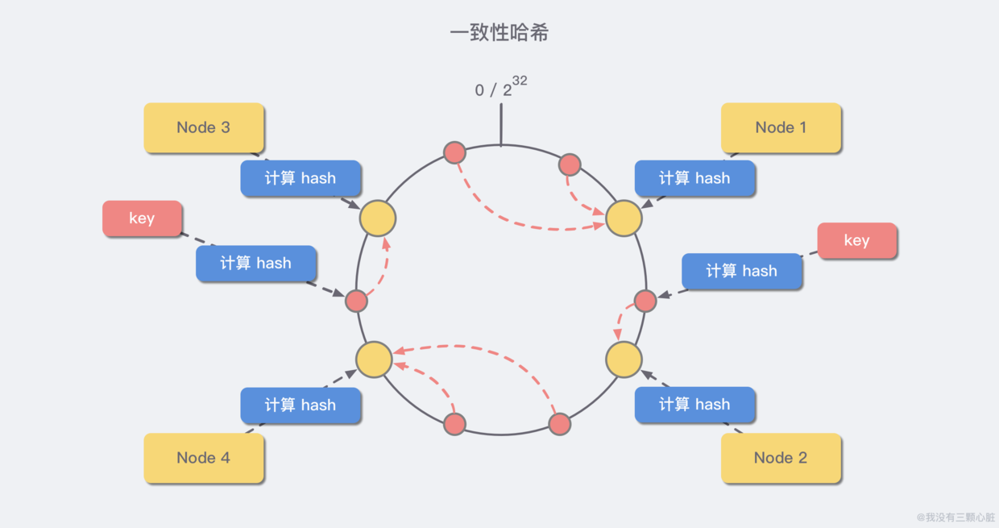
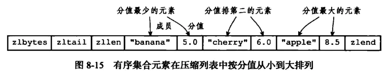

# Redis-整理总结20230829
- Redis
    - 简介概览
        - 概览图示(缓存 分布式锁 消息队列)
            - 知识全局图 
            - 问题画像图 
            - 
        - 支持 事务 持久化 Lua脚本 多种集群方案
        - 完全基于 **内存** ，绝大部分请求是内存操作非常快
        - 使用 **多路I/O复用** 模型
        - 采用 **单线程** 避免上下文切换  不用考虑各种锁问题
    - 数据类型
        - 数据类型概览 
            - 应用场景：简单的键值对缓存；
            - 优点
                - 获取字符串长度为O(1)级别的操作；
                - 杜绝 **缓存区溢出/内存泄露** 的问题；
                - 保证二进制安全；
        - 数据类型与底层数据结构对应关系 
    - 单线程理解( **网络IO**  **键值对读写** )
        - Redis单线程主要指： 网络 IO 和键值对读写是由一个线程来完成的，这也是对外服务的主流程
        - Redis其他功能：持久化、异步删除、集群数据同步等 其实是由额外的线程执行
        - 执行命令阶段，由于Redis是单线程来处理命令的，所有到达服务端的命令都不会立刻执行，而是进入一个队列中，然后逐个执行，并且多个客户端发送的命令执行顺序是不确定的，但可以确定的是不会有两条命令被同时执行，不会产生并发问题。
        - Redis基于Reactor模式开发了自己的网络事件处理模型（文件事件处理器），由于 **文件处理器是单线程方式运行的** ，所以说Redis是单线程模型。文件事件处理器使用I/O多路复用程序来同时监听多个套接字，并根据套接字目前执行的任务来为套接字关联不同的事件处理器。
        - IO多路复用技术让Redis不需要额外创建多余的线程来监听客户端的大量连接，降低了资源的消耗。
        - 文件事件处理器（File Event Handler）主要包括4部分
            - 多个socket
            - > 客户端连接
            - IO多路复用程序
            - > 支持多个客户端连接的关键
            - 文件事件分派器
            - > 将socket关联到相应的事件处理器
            - 事件处理器
            - > 连接应答处理器、命令请求处理器、命令回复处理器
        - Reactor模式
            - Reactor模式（反应器模式）是一种处理一个或多个客户端 **并发交付服务请求** 的事件设计模式。当请求抵达后，服务处理程序使用IO多路复用策略，然后同步地派发这些请求至相关的请求处理程序。
    - 单线程为什么快( **多路复用机制**  **高效数据结构-** 哈希表 跳表)
        - 使用 **Linux中 IO多路复用机制** 是指一个线程处理多个 IO 流，就是常听到的 select/epoll 机制
        - 该机制允许内核中 **同时存在多个监听套接字和已连接套接字**
        - 数据结构简单，对数据操作也简单，Redis中的数据结构是专门进行设计的
        - 大部分请求是内存操作，高效数据结构查找和操作的时间复杂度都是O(1)
        - 采用单线程，避免了不必要的上下文切换，不存在线程切换消耗CPU，不用考虑锁问题
    - 数据备份与恢复( **AOF日志 RDB快照** )
        - **AOF** -写后记录日志(主线程执行)
            - AOF概览图示( **一个拷贝 两个日志** )
                - 重写时主线程拷贝到子线程、主线程更新AOF子线程更新AOF重写 
            - 命令执行后记录 **不会阻塞当前写操作**
            - 执行成功才会记录 **避免记录错误命令**
            - 问题1:记录日志可能会给下个操作带来阻塞风险- **写回策略**
                - **Always同步写回** ：每个写命令执行完，立马同步地将日志写回磁盘
                - **Everysec每秒写回** ：每个写命令执行完，只是先把日志写到 AOF 文件的内存缓冲区，每隔一秒把缓冲区中的内容写入磁盘
                - **No操作系统控制写回** ：每个写命令执行完，只是先把日志写到 AOF 文件的内存缓冲区，由操作系统决定何时将缓冲区内容写回磁盘
                - 图示对比 
            - 问题2:AOF文件过大将会带来性能问题- **重写机制(后台线程执行)**
                - 由后台线程 bgrewriteaof完成，避免阻塞主线程
                - 重写机制：Redis 根据数据库现状创建一个新的AOF文件
                - 读取数据库中的所有键值对然后对每一个键值对用一条命令记录它的写入
                - 图示说明 
        - RDB-save命令阻塞主线程 **bgsave命令** 创建子线程执行
            - 内存全量快照
            - 问题1:快照生成中的数据更新问题- **写时复制(Copy-On-Write)**
                - Redis借助操作系统提供的写时复制在执行快照的同时正常处理写操作
                - 主线程更新数据的同时生成数据副本由子线程把副本写入RDB 
            - 问题2:快照生成中宕机,快照频率处理- **混合使用AOF与RDB**
                - **在两次快照间使用日志记录所有命令操作**
                - **优势:** 快照减少执行频率,日志仅记录两次快照间的操作
                - 快照避免丢失数据也避免高频开销，日志避免过大也避免重写开销
                - 图示说明 
        - 备份数据-操作
            - SAVE 命令：创建当前数据库的备份，该命令将在redis安装目录中创建dump.rdb文件
            - BGSAVE命令：创建当前数据库的备份，在后台执行
        - 恢复数据-操作
            - 将备份文件（dump.rdb）移动到redis安装目录并启动服务即可
            - 获取redis目录可以使用config 命令：config get dir
    - 主从库( **读写分离** )
        - 图示 主库(读写操作) 从库只读并接收主库同步过来的数据
            - 当发生写操作的时自动将数据同步到从库，一个主库可以有多个从库一个从库只能有一个主库 
        - 主从复制 **同步流程**
            - 当一个从库启动时会向主库发送psync命令
            - 主库接收命令后开启线程在后台生成快照，并记录生成期间接收到的操作命令
            - 当快照完成后将快照文件和操作命令发送给从库
            - 从库接收到后清空现有数据并加载快照文件 执行操作命令 
    - 高可用( **哨兵机制-监控 选主 通知** )
        - 哨兵机制图示
            -  
        - **监控** (哨兵发现主库对PING命令响应超时了，那么就会先把它标记为“主观下线 
        - **选主** (哨兵对从库筛选并打分,将分最高的从库选为新主库) 
        - 
    - Redis集群数据分区方案
        - 哈希取余分区
            - **分区思路** ：计算key的hash值，然后对节点数量进行取余，从而决定数据映射到哪个节点上；
            - **问题** ： **新增或删减节点时** ，节点数量发生变化，系统中所有的数据都要 **重新计算映射关系** ，引发大规模数据迁移。
        - 一致性哈希分区
            - 原理图 
            - 将整个哈希值空间组织成一个虚拟的圆环，范围是[0, 2^32) ，对于每一个数据，根据key计算hash值，确定数据在环上的位置，然后从此位置沿顺时针行走，找到第一台服务器就是其应该映射的服务器。
            - 与哈希取余分区相比，一致性哈希分区将 **增减节点的影响限制在相邻节点** 。以上图为例，如果在node1和node2之间增加node5，则只有node2中的一部分数据会迁移到node5；如果去掉node2，则原node2中的数据只会迁移到node4中，只有node4会受影响。
            - **问题** ：当 **节点数量较少** 时，增加或删减节点， **对单个节点的影响可能很大** ，造成 **数据倾斜或节点雪崩** 。以上图为例，如果去掉node2，node4中的数据由总数据的1/4左右变为1/2左右，与其他节点相比负载过高。如果node4崩溃，接下来node3的压力会更大，大概率也会接着崩溃。。。
        - 带虚拟节点的一致性哈希分区
            - 上图好理解！ 
            - 该方案在 **一致性哈希分区的基础上** ，引入了 **虚拟节点** 的概念。为了避免出现数据倾斜或节点雪崩问题，一致性Hash算法引入了虚拟节点的机制，也就是每个机器节点会进行多次哈希，最终每个机器节点在哈希环上会有多个虚拟节点存在，所有虚拟节点均匀地分布在环上，这样就可以避免数据倾斜和节点雪崩。
            - Redis集群使用的就是该方案，其中的虚拟节点称为 **槽（slot）** 。槽是介于数据和实际节点之间的虚拟概念，每个实际节点包含一定数量的槽，每个槽包含的哈希值在一定范围内的数据。
            - 在使用了槽的一致性哈希分区中， **槽是数据管理和迁移的基本单位** 。 **槽解耦了数据和实际节点之间的关系** ，增加或删除节点对系统的影响很小。
    - Redis的Hash结构
        - 与Java的HashMap类似，都是通过“ **数组+链表** ”的链地址法来解决部分 **哈希冲突**
        - 字典结构的内部包含两个Hashtable，通常情况下只有一个Hashtable是有值的，在字典扩容缩容时，需要分配新的Hashtable，然后进行 **渐进式搬迁**
        - 渐进式rehash会在rehash的同时，保留新旧两个hash结构，查询时会同时查询两个hash结构，然后在后续的定时任务以及hash操作指令中，循序渐进的把旧字典的内容迁移到新字典中，当搬迁完成，就会使用新的hash结构；
    - Redis的ZSet底层用的什么数据结构
        - 底层有两种编码方式(ziplist-压缩链表 skiplist跳表 )
        - 什么时候使用 **ziplist** ，什么时候使用 **skiplist**
            - 当zset满足以下两个条件时，使用ziplist
                - 保存的元素少于128个；
                - 保存的所有元素大小都小于64字节；
            - 不满足以上两个条件时，使用skiplist
            - 数值是可以通过 redis.conf 的 zset-max-ziplist-entries 和 zset-max-ziplist-value 修改
        - **ziplist-压缩链表**
            - ziplist编码的有序集合对象使用压缩列表作为底层实现
            - 每个集合元素使用两个紧挨在一起的压缩列表节点来保存
            - 第一个节点保存元素的成员，第二个节点保存元素的分值
            - 压缩列表内的集合元素按分值从小到大的顺序进行排列，小的放置在靠近表头的位置，大的放置在靠近表尾的位置
            - 上图说明  
        - **skiplist-跳表**
            - skiplist编码的有序集合对象使用zset结构作为底层实现；
            - 一个zset结构同时包含一个字典和一个跳表；
            - 字典的键保存元素的值，字典的值则保存元素的分值；
            - 跳跃表节点的object属性保存元素的成员，score属性保存元素的分值；
            - 这两种数据结构会 **通过指针来共享相同成员和分值** ，所以不会产生重复的成员和分值，造成内存浪费；
            - 有序集合单独使用字典或跳跃表其中一种就可以实现，为什么skiplist要用两种组合？
                - 单独使用字典，虽然能以O(1)的时间复杂度查找成员的分值，但是因为字典是以无序的方式来保存集合元素的，所以 **每次进行范围操作的时候都要进行排序** ；
                - 单独使用跳跃表，虽然能执行范围操作，但是 **查找操作复杂度为O(logN)** ;
                - 所以使用两种数据结构的组合实现高效的查询和范围操作；
    - Redis为什么使用跳表而不是用红黑树
        - 在做范围查找的时候，平衡树比skiplist操作要复杂
        - 平衡树的插入和删除操作可能引发子树的调整
        - skiplist的插入和删除只需要修改相邻节点的指针
        - 从内存占用上来说skiplist比平衡树更灵活
        - 查询单个key，skiplist和平衡树的时间复杂度都是O(log n)大体相当
        - 从算法实现的角度上比较，skiplist比平衡树要简单得多
    - 为什么Redis集群的最大槽数是16384个
        - CRC16算法产生的hash值有16bit，可以产生2^16=65536个值 64k
        - 对于客户端请求的key，根据公式 HASH_SLOT = CRC16(key) mod 16384 ，计算出数据应该映射到哪个哈希槽；Redis集群包含了 16384个哈希槽，每个key经过计算后会落在一个具体的槽位上，而槽位具体在哪个机器上是用户自己根据自己机器的情况配置的，机器硬盘小的可以分配少一点槽位，硬盘大的可以分配多一些
        - Redis节点之间通信，发生心跳包时需要把所有的槽放到这个心跳包里，以便让节点知道当前集群信息，在发送心跳包使用char进行bitmap压缩后是2k；（使用2k空间创建了16k的槽数）
        - 如果是65535个槽位，压缩后是8k，也就是说心跳包至少需要8k的大小，需要消耗更多的网络宽带
        - 一般情况下，Redis集群不会有超过1000个master节点，16k的槽位是比较合适的；如果节点超过1000，会造成网络拥堵； 
    - 如何解决 **缓存穿透  雪崩 击穿**
        - **穿透** 在缓存和数据库都没有找到符合条件的数据
            - 缓存无效key：如果缓存和数据库都找不到某个key数据，那么设置key对应的缓存值为空
            - 布隆过滤器：对请求进行过滤判断一个给定的数据是否存在于海量数据中
        - **雪崩** 缓存在同一时间大面积的失效或是缓存系统故障，导致请求直接到数据库
            - 合理设置缓存过期时间；key分类，缓存不同的周期；热点数据缓存时间长一些
            - redis 做高可用集群，避免单机出现问题导致缓存系统无法使用
            - 限流降级避免同时处理大量的请求
            - 构建多级缓存，增加本地缓存，降低请求直达存储层的概率
        - **击穿** 热点key失效的瞬间，持续大并发请求就直接到达数据库
            - 对于非常热的key，设置较长的过期时间或者不设置过期时间
            - 多个热点key的过期时间尽量错开，设置不同的过期时间
            - 使用互斥锁（单机使用synchronized或者lock来处理，分布式使用分布式锁），第一个线程查库得到数据做缓存，后面的线程从缓存取数据；
    - 如何保证缓存与数据库双写时数据一致性
        - 先读缓存没有命中，就读数据库取出数据后放入缓存，然后返回响应。存在缓存与数据库数据不一致的情况
        - 如果要求缓存与数据库的数据强一致性的话，可以把 **读请求和写请求串行化** ，串到一个队列里去，串行化可以保证数据一致性，但会导致系统的吞吐量大幅度降低
        - 最经典的缓存+数据库读写的模式
            - 读的时候先读缓存，缓存没命中就读数据库，取出数据后放入缓存 返回响应
            - 更新的时候，先更新数据库然后删除缓存
    - 如何解决Redis的并发竞争Key问题
        - 并发竞争key：是指多个redis的client同时 set key引起的并发问题
        - Redis是单线程的多个客户端连接不存在竞争关系
        - 使用 **jedis** 等客户端对redis进行并发访问时会出现问题，如 多个子系统去set一个key
        - 方案一：分布式锁
            - Redis实现 **setnx()** 函数
                - 利用setnx()设置key值并获取锁，如果返回1表示设置成功获得锁；如果返回0表明该锁已经被其他客户端取得；这时可以先返回、进行重试、等待锁超时
            - Zookeeper实现分布式锁原理（公平锁）
                - Zookeeper的每一个节点，都是一个天然的顺序发号器
                    - 在每一个节点下面创建临时顺序节点类型，新的子节点后面，会加上一个次序编号，而这个生成的次序编号是递增的（加1）；
                    - 上图好理解！ 
                - Zookeeper节点的递增有序性，可以确保锁的公平
                    - 一个Zookeeper分布式锁，首先需要创建一个父节点，尽量是持久节点（Persistent），然后每个要获得锁的线程，都在这个节点下创建临时顺序节点；
                    - 为确保公平，规定：编号最小的那个节点表示获得了锁。所以，每个线程在尝试占用锁之前，首先判断自己的排号是不是当前最小，如果是，则获取锁；
                - Zookeeper的节点监听机制，可以保障占有锁的传递有序且高效
                    - 每个线程抢占锁之前，先尝试创建自己的ZNode，释放锁的时候，删除创建的ZNode；
                    - 创建成功后，如果不是排号最小的节点，就处于等待通知的状态，只需等前一个ZNode的删除通知。
                    - 前一个ZNode删除的时候，会触发Znode事件，当前节点能监听到删除事件，就是轮到自己占有锁的时候。1-->2-->3-->....
                    - 另外，Zookeeper的内部优越的机制，能保证由于网络异常或其他原因，集群中占有锁的客户端失联时，锁能够被有效释放。一旦占用ZNode锁的客户端与Zookeeper集群服务器失去联系，这个临时ZNode也将自动删除。排在它后面的那个节点也能收到删除事件，从而获得锁。正是因为这个原因，在创建取号节点的时候，尽量创建临时ZNode节点；
            - 公平锁、非公平锁、可重入锁
                - 公平锁（有序排队取锁）
                    - **定义** ：多个线程按照申请锁的顺序去获得锁，线程会直接进入队列去排队，永远都是队列的第一位才能得到锁。
                    - **优点** ：所有的线程都能得到资源，不会饿死在队列中；
                    - **缺点** ：吞吐量会下降很多，队列里面除了第一个线程，其他线程都会阻塞，CPU唤醒阻塞线程的开销会很大；
                - 非公平锁（尝试插队取锁）
                    - **定义** ：多个线程去获取锁的时候，会直接去尝试获取，获取不到，再去进入等待队列，如果能获取到，就直接获取到锁；
                    - **优点** ：可以减少CPU唤醒线程的开销，整体的吞吐效率会高点，CPU也不必去唤醒所有线程，会减少唤起线程的数量；
                    - **缺点** ：可能导致队列中的线程一直或者长时间获取不到锁，导致饿死；
                - 可重入锁
                    - 也叫递归锁，指同一个线程内，外层函数获得锁之后，内层递归函数仍然可以获取该锁；也就是 同一个线程再次进入同步代码时，可以使用自己已获取到的锁。
                    - 作用：防止在同一线程中，多次获取锁而导致死锁；
                        - 不可重入导致死锁示例
                        - > 在LoggingWidget类中doSomething方法时，通过锁进入临界区，并在临界区中调用了父类的该方法，而父类的方法要获取到同一个锁，被阻塞，导致死锁发生。 
                    - 常见的可重入锁
                        - Synchronized
                        - ReetrantLock
        - 方案二：消息队列
            - 在高并发的情况下，通过消息中间件把并行读写进行串行化
            - 把redis set操作放在队列中，使其串行化必须一个一个执行
    - Redis集群如何判断是否有某个节点挂掉
        - 理论上集群中的每个节点至少有一个从节点slave
        - 每一个节点都存有这个集群所有主节点及从节点的信息
        - 节点之间通过互相ping-pong判断是否节点可以连接上
        - 如果有一半以上的节点去ping一个节点的时候没有回应，集群就认为这个节点宕机了，然后去连接它的备用节点
    - Redis集群进入 **fail状态** 的必要条件
        - 某个主节点和其所有从节点全部挂掉，集群就进入fail状态
        - 如果集群超过半数以上master挂掉，无论是否有slave集群进入fail状态
        - 如果集群任意master挂掉，且当前master没有slave节点，集群进入fail状态
    - Redis过期策略( **定期删除 惰性删除** )
        - 为什么不用定时删除策略
            - 定时删除 用一个定时器来负责监视key过期则自动删除；虽然内存及时释放但是十分消耗CPU资源；在大并发请求下CPU要将时间应用在处理请求而不是删除key，因此没有采用这一策略
        - 定期删除策略
            - Redis 会将设置了过期时间的key放入到一个独立的字典中， **默认每 100ms** 进行一次过期扫描
                - 1、随机抽取 20个 key；
                - 2、删除这 20个key中过期的key；
                - 3、如果过期的key比例超过 1/4，就重复步骤1，继续删除；
            - 为什么不扫描所有key
                - Redis是单线程，全量key扫描可能会导致服务卡死
                - 为了防止每次扫描过期的 key 比例都超过 1/4，导致不停循环卡死线程，Redis为每次扫描添加了上限时间， **默认是 25ms** ；
                - 如果客户端将超时时间设置的比较短，例如 10ms，那么就可能会出现大量的连接因为超时而关闭，业务端会出现很多异常
                - 如果同一时间出现大面积key过期，redis循环多次扫描过期词典，直到扫描时间上限或者过期的key比例小于 1/4，这会导致卡顿，在高并发的情况下，可能会导致缓存雪崩
                - 如果有大批量的 key 过期，要给过期时间设置一个随机范围，而不宜全部在同一时间过期，分散过期处理的压力
        - 惰性删除策略
            - redis获取某个key的时候，会先判断该key是否已过期，如果已过期则删除，返回不存在；如果未过期则返回数据
            - 优点：节约CPU性能在必须删除时才删除； 缺点：内存压力大出现长期占有内存的过期数据
        - 从库的过期策略
            - 从库不会进行过期扫描，从库对过期的处理是被动的
            - 主库在 key 到期时会在AOF文件里增加一条 del 指令，同步到所有的从库，从库通过执行这条 del 指令来删除过期的 key
            - 因为指令同步是异步进行的，所以主库过期key 的del指令没有及时同步到从库的话，会出现主从的数据不一致，主库没有的数据在从库里还存在
    - Redis内存淘汰机制
        - 内存策略配置
            - maxmemory  最大可使用内存
                - 占用物理内存的比例，默认值为0，表示不限制。生产环境中根据需求设定，通常设置在50%以上
            - maxmemory-samples 每次选取待删除数据的个数
                - 选取数据时并不会全库扫描，导致严重的性能消耗，降低读写性能。因此采用随机获取数据的方式作为待检测删除数据；
            - maxmemory-policy 删除策略
                - 达到最大内存后的，对被挑选出来的数据进行删除的策略
        - 内存淘汰机制主要有以下8种
            - 检测易失数据（设置了过期时间的数据集server.db[i].expires ）
                - ① volatile-lru (Least Recently Used)：挑选最近最少使用（最长时间未被使用）的数据淘汰；
                - ② volatile-lfu (Least Frequently Used)：挑选最近使用次数最少（一定时期内被访问次数最少）的数据淘汰；
                - ③ volatile-ttl (Time To Live)：挑选将要过期的数据淘汰；
                - ④ volatile-random：任意选择数据淘汰；
            - 检测全库数据（所有数据集server.db[i].dict ）
                - ⑤ allkeys-lru：挑选最近最少使用的数据淘汰；
                - ⑥ allkeys-lfu：挑选最近使用次数最少的数据淘汰；
                - ⑦ allkeys-random：任意选择数据淘汰；
            - 放弃数据驱逐
                - ⑧ no-enviction：禁止驱逐数据（redis4.0中默认策略）会引发错误OOM