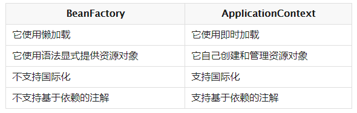
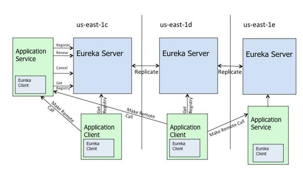
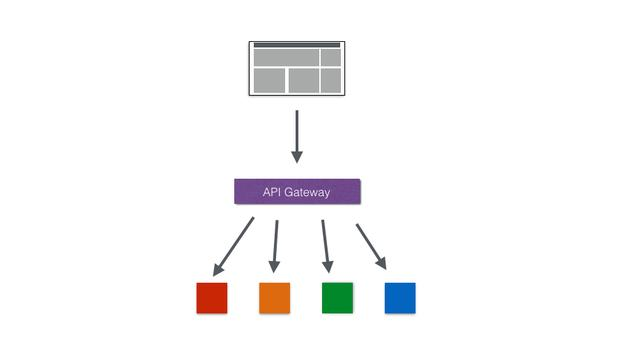

# Spring-整理总结20210511
- SpringFramework
    - 概念
        - 简介
            - 使现有技术更容易使用
            - 轻量级、非入侵框架
            - 控制翻转IOC 面向切面编程AOP
            - 支持事务的处理 对框架整合的支持
            - 七大模块 Core AOP  ORM  DAO Web  Context WebMvc
            - 构建一切-协调一切-连接一切
            - SpringBoot快速开发脚手架
                - 约定大于配置
                - 基于此可以快速开发单个微服务
            - SpringCloud基于SpringBoot实现
            - ICO 控制反转思想
                - 不用管理对象的创建，降低了系统的耦合
                - 通过描述XML或注解，第三方去生产/获取特定对象的方式
                - 在Spring中实现控制反转的是IOC容器，方法是依赖注入
            - DI  依赖注入(Bean对象的创建依赖容器 Bean对象的所有属性由容器注入)
                - 构造器注入
                - Set方式注入(主要)
                - 扩展方式注入
            - Bean的自动装配
                - XML 代码 隐式(注解自动装配)
    - Spring 框架中都用到了哪些设计模式
        - 代理模式 — 在 AOP 和 remoting 中被用的比较多。
        - 单例模式 — 在 Spring 配置文件中定义的 Bean 默认为单例模式。
        - 模板方法 — 用来解决代码重复的问题。比如 RestTemplate、JmsTemplate、JdbcTemplate 。
        - 前端控制器 — Spring提供了 DispatcherServlet 来对请求进行分发。
        - 依赖注入 — 贯穿于 BeanFactory / ApplicationContext 接口的核心理念。
        - 工厂模式 — BeanFactory 用来创建对象的实例。
    - Spring 有哪些配置方式
        - XML 配置文件。
            - Bean 所需的依赖项和服务在 XML 格式的配置文件中指定。这些配置文件通常包含许多 bean 定义和特定于应用程序的配置选项。它们通常以 bean 标签开头。例如：  
        - 注解配置
            - 您可以通过在相关的类，方法或字段声明上使用注解，将 Bean 配置为组件类本身，而不是使用 XML 来描述 Bean 装配。默认情况下，Spring 容器中未打开注解装配。因此，您需要在使用它之前在 Spring 配置文件中启用它。例如： 
        - Java Config 配置
            - @Bean @Configuration
            - @Bean 注解扮演与 &lt;bean /&gt; 元素相同的角色。
            - @Configuration 
    - Spring 支持几种 BeanScope
        - **Singleton**
        - **Prototype**
        - **Request**
        - **Session**
        - **Application**
        - **注意:** **Global-session**
    - IOC 相关
        - 什么是依赖注入 (Dependency Injection DI)
            - 在依赖注入中，你不必主动、手动创建对象，但必须描述如何创建它们。
            - 你不是直接在代码中将组件和服务连接在一起，而是描述配置文件中哪些组件需要哪些服务。
            - 然后，再由 IoC 容器将它们装配在一起。
        - 依赖注入的方式  可以注入的数据类型
            - **构造函数注入** **setter 注入---注解注入**
            - 使用构造函数和 setter 注入方式 对比
                -  
            - 注入类型:基本类型和String\其它Bean类型\复杂Bean类型
        - Spring 中有几种 IoC 容器
            - BeanFactory
                - 由spring-beans&nbsp;项目提供
                - 会在客户端要求时实例化 Bean 对象
            - ApplicationContext·
                - 由spring-context&nbsp;项目提供
                - 会在客户端初始化时实例化 Bean 对象
                - 扩展了 BeanFactory 接口，在 BeanFactory 基础上提供一些额外功能
            - BeanFactory(低级容器)  ApplicationContext(高级容器) 
        - IoC 的一些好处
            - 它将最小化应用程序中的代码量。
            - 它以最小的影响和最少的侵入机制促进松耦合。
            - 它支持即时的实例化和延迟加载 Bean 对象。
            - 它将使您的应用程序易于测试，因为它不需要单元测试用例中的任何单例或 JNDI 查找机制。
        - Spring IoC 的实现机制
            - Spring 中的 IoC 的实现原理，就是工厂模式加反射机制
        - @Component @Controller @Repository @Service
            - 作用:把当前类对象存入Spring容器中 
            - 属性:value用于指定Bean的id.默认是当前类名且首字母小写
            - Component&nbsp;：其它层
            - Controller&nbsp;：表现层
            - Service&nbsp;：业务层
            - Repository&nbsp;：持久层
        - @Autowired
            - 以更准确地控制应该在何处以及如何进行自动装配
        - @Qualifier
            - @Qualifier @Autowired
            - 例如，应用中有两个类型为 Employee 的 Bean ID 为&nbsp;"emp1"&nbsp;和&nbsp;"emp2"&nbsp;，此处，我们希望 EmployeeAccount Bean 注入&nbsp;"emp1"&nbsp;对应的 Bean 对象。代码如下: 
    - AOP相关
        - 描述
            - **面向切面编程,** **提供了与 OOP 不同的抽象软件结构的视角**
            - 在 OOP 中，以类( Class )作为基本单元
            - 在 AOP 中，以切面( Aspect )作为基本单元。
        - 分析
            - 作用:  在程序运行期间，不修改源码对已有方法进行增强
            - 实现方式: 动态代理
            - 优点 : 减少重复代码-提高开发效率-维护方便
        - 基本概念
            - 什么是 JoinPoint 连接点
                - 所谓连接点是指那些被拦截到的点
                - **指的是方法**
            - 什么是 PointCut&nbsp; 切入点
                - 所谓切入点是指我们要对哪些 Joinpoint 进行拦截的定义
                - 在 Spring 中, 所有的方法都可以认为是 JoinPoint
                - 但是我们并不希望在所有的方法上都添加 Advice
                - PointCut 的作用，就是提供一组规则来匹配 JoinPoint 给满足规则的 JoinPoint 添加 Advice
            - 什么是 Advice 通知/增强
                - 所谓通知是指拦截到 Joinpoint 之后所要做的事情就是通知
                - 通知的类型：前置通知,后置通知,异常通知,最终通知,环绕通知
            - Introduction 引介
                - 引介是一种特殊的通知在不修改类代码的前提下, Introduction 可以在运行期为类动态地添加一些方法或 Field
            - Target 目标对象
                - 代理的目标对象
            - Weaving 织入
                - 是指把增强应用到目标对象来创建新的代理对象的过程。
                - spring 采用动态代理织入，而 AspectJ 采用编译期织入和类装载期织入
            - Proxy 代理
                - 一个类被 AOP 织入增强后，就产生一个结果代理类
            - Aspect 切面
                - 是切入点和通知（引介）的结合
                - @Aspect 
        - AOP 的两种实现方式
            - 静态代理
                - 使用 AOP 框架提供的命令进行编译，从而在编译阶段就可生成 AOP 代理类，因此也称为编译时增强。
                - 编译时编织（特殊编译器实现）
                - 类加载时编织（特殊的类加载器实现
            - 动态代理
                - 在运行时在内存中“临时”生成 AOP 动态代理类，因此也被称为运行时增强。
                - 基于接口的动态代理
                    - 提供者：JDK 官方的 Proxy 类。
                    - 要求：被代理类最少实现一个接口。
                - 基于子类的动态代理
                    - 提供者：第三方的 CGLib，如果报 asmxxxx 异常，需要导入 asm.jar。
                    - 要求：被代理类不能用 final 修饰的类（最终类）。
        - Spring AOP and AspectJ AOP 有什么区别
            - 代理方式不同
                - Spring AOP 基于动态代理方式实现。
                - AspectJ AOP 基于静态代理方式实现。
            - PointCut 支持力度不同
                - Spring AOP 仅支持方法级别的 PointCut 。
                - AspectJ AOP 提供了完全的 AOP 支持，它还支持属性级别的 PointCut
    - 事务相关
        - Spring 支持的事务管理类型
            - 声明式事务
                - 通过使用注解或基于 XML 的配置事务，从而事务管理与业务代码分离。
            - 编程式事务
                - 通过编码的方式实现事务管理，需要在代码中显式的调用事务的获得、提交、回滚。它为您提供极大的灵活性，但维护起来非常困难。
        - @Transactional
            - @Transactional 
            - @Transactional 可以作用于接口、接口方法、类以及类方法上。当作用于类上时，该类的所有 public 方法将都具有该类型的事务属性，同时，我们也可以在方法级别使用该标注来覆盖类级别的定义。
            - 虽然 @Transactional 注解可以作用于接口、接口方法、类以及类方法上，但是 Spring 建议不要在接口或者接口方法上使用该注解，因为这只有在使用基于接口的代理时它才会生效。另外， @Transactional 注解应该只被应用到 public 方法上，这是由 Spring AOP 的本质决定的。如果你在 protected、private 或者默认可见性的方法上使用 @Transactional 注解，这将被忽略，也不会抛出任何异常。这一点，非常需要注意。
        - 什么是事务的隔离级别分成哪些隔离级别
            - 在 TransactionDefinition 接口中，定义了“四种”的隔离级别枚举 
        - 什么是事务的传播级别分成哪些传播级别
            - 在 TransactionDefinition 接口中，定义了三类七种传播级别 
        - 什么是事务的超时属性
            - 所谓事务超时，就是指一个事务所允许执行的最长时间，如果超过该时间限制但事务还没有完成，则自动回滚事务。
            - 在 TransactionDefinition 中以 int 的值来表示超时时间，其单位是秒
        - Spring 事务有什么优点
            - 通过 PlatformTransactionManager 为不同的数据层持久框架提供统一的 API ，无需关心到底是原生 JDBC、Spring JDBC、JPA、Hibernate 还是 MyBatis 。
            - 通过使用声明式事务，使业务代码和事务管理的逻辑分离，更加清晰。
            - 主流是 注解&nbsp;+ 声明式事务
    - Spring 数据数据访问层有哪些异常
        - 通过使用 Spring 数据数据访问层，它统一了各个数据持久层框架的不同异常，统一进行提供&nbsp;org.springframework.dao.DataAccessException&nbsp;异常及其子类。如下图所示 
- SpringMVC
    - **注解**
        -  **&nbsp;**
            - 它将一个类 标记为 Spring Web MVC&nbsp;控制器&nbsp;Controller&nbsp;
        -  **&nbsp;** 
            - @RestController @Controller @ResponseBody注解
        -  **&nbsp;**
            - @RequestMapping&nbsp;注解，用于将特定 HTTP 请求方法映射到将处理相应请求的控制器中的特定类/方法。此注释可应用于两个级别：
            - 类级别：映射请求的 URL。
            - 方法级别：映射 URL 以及 HTTP 请求方法。
        -  **&nbsp;**  
            - @RequestMapping&nbsp;可注解在类和方法上；@GetMapping&nbsp;仅可注册在方法上。
            - @RequestMapping&nbsp;可进行 GET、POST、PUT、DELETE 等请求方法；@GetMapping&nbsp;是&nbsp;@RequestMapping&nbsp;的 GET 请求方法的特例，目的是为了提高清晰度。
        - 返回 JSON 格式使用什么注解
            - **&nbsp;**  **&nbsp;**  **&nbsp;** **&nbsp;**  **&nbsp;**
            - 当然，还是需要配合相应的支持 JSON 格式化的 HttpMessageConverter 实现类
            - 例如，Spring MVC 默认使用 MappingJackson2HttpMessageConverter 。
    - **框架**
        - Spring Web MVC 框架提供”模型-视图-控制器”( Model-View-Controller )架构和随时可用的组件，用于开发灵活且松散耦合的 Web 应用程序
        - MVC 模式有助于分离应用程序的不同方面，如输入逻辑，业务逻辑和 UI 逻辑，同时在所有这些元素之间提供松散耦合
    - **Struts2**
        - 入口不同
            - Spring MVC 的入门是一个 Servlet 控制器。
            - Struts2 入门是一个 Filter 过滤器。
        - 配置映射不同，
            - Spring MVC 是基于方法开发，传递参数是通过方法形参，一般设置为单例。
            - Struts2 是基于类开发，传递参数是通过类的属性，只能设计为多例。
        - 视图不同
            - Spring MVC 通过参数解析器是将 Request 对象内容进行解析成方法形参，将响应数据和页面封装成 ModelAndView 对象，最后又将模型数据通过 Request 对象传输到页面。其中，如果视图使用 JSP 时，默认使用 JSTL 。
            - Struts2 采用值栈存储请求和响应的数据，通过 OGNL 存取数据。
    - **核心组件**
        - 一共有九大核心组件
        - MultipartResolver
        - LocaleResolver
        - ThemeResolver
        - HandlerMapping
        - HandlerAdapter
        - HandlerExceptionResolver
        - RequestToViewNameTranslator
        - ViewResolver
        - FlashMapManager
    - **工作流程**
        - 前端控制器工作流程图示
            -  
        - ① 发送请求
            - 用户向服务器发送 HTTP 请求，请求被 Spring MVC 的调度控制器 DispatcherServlet 捕获。
        - ② 映射处理器
            - DispatcherServlet 根据请求 URL ，调用 HandlerMapping 获得该 Handler 配置的所有相关的对象（包括 Handler 对象以及 Handler 对象对应的拦截器），最后以 HandlerExecutionChain 对象的形式返回。 
        - ③ 处理器适配
            - DispatcherServlet 根据获得的 Handler，选择一个合适的HandlerAdapter 。
            - 提取请求 Request 中的模型数据，填充 Handler 入参，开始执行Handler（Controller)。
        - ⑤ 解析视图
            - 根据返回的 ModelAndView ，选择一个适合的 ViewResolver（必须是已经注册到 Spring 容器中的 ViewResolver)，解析出 View 对象，然后返回给 DispatcherServlet
        - ⑥ ⑦ 渲染视图 + 响应请求
            - ViewResolver 结合 Model 和 View，来渲染视图，并写回给用户( 浏览器 )。
        - **注意:Spring MVC 的流程一定是这样吗,   不一定**
        - **前后端已经进行分离**
        - @ResponseBody
        - 但是 HTTP 是不支持返回 Java POJO 对象的，所以需要将结果使用&nbsp;HttpMessageConverter&nbsp;进行转换后，才能返回。例如说，大家所熟悉的&nbsp;FastJsonHttpMessageConverter&nbsp;，将 POJO 转换成 JSON 字符串返回
    - **WebApplicationContext**
        - WebApplicationContext 是实现ApplicationContext接口的子类，专门为 WEB 应用准备的。
        - 它允许从相对于 Web 根目录的路径中加载配置文件，完成初始化 Spring MVC 组件的工作
        - 从 WebApplicationContext 中，可以获取 ServletContext 引用，整个 Web 应用上下文对象将作为属性放置在 ServletContext 中，以便 Web 应用环境可以访问 Spring 上下文
    - **异常处理**
        - Spring MVC 提供了异常解析器 HandlerExceptionResolver 接口，将处理器(&nbsp;handler&nbsp;)执行时发生的异常，解析( 转换 )成对应的 ModelAndView 结果
    - **拦截器**
        - org.springframework.web.servlet.HandlerInterceptor&nbsp;，拦截器接口
            -  
        - 一共有三个方法，分别为
            - #
            - #
            - #
                - 例如，页面渲染后。
                - 当然，要注意无论调用 Controller 方法是否成功，都会执行。
        - Spring MVC 的拦截器可以做哪些事情
            - 记录访问日志。
            - 记录异常日志。
            - 需要登陆的请求操作，拦截未登陆的用户
- SpringBoot
    - **是什么**
        - Spring Boot&nbsp;是 Spring 的子项目，正如其名字，提供 Spring 的引导(&nbsp;Boot&nbsp;)的功能
        - Spring Boot 提供了各种 Starter 启动器，提供标准化的默认配置
            - spring-boot-starter-web&nbsp;启动器，可以快速配置 Spring MVC  + 内嵌的 Tomcat 
            - mybatis-spring-boot-starter 启动器，可以快速配置 MyBatis
            - incubator-dubbo-spring-boot-project&nbsp;启动器，可以快速配置 Dubbo 
            - rocketmq-spring-boot-starter&nbsp;启动器，可以快速配置 RocketMQ
            - spring-boot-starter-data-jpa ：提供 Spring JPA + Hibernate 。
            - spring-boot-starter-data-redis&nbsp;：提供 Redis 
    - **核心功能**
        - 独立运行 Spring 项目
            - 可以以 jar 包形式独立运行，运行一个 SpringBoot 项目只需要通过&nbsp;java -jar xx.jar&nbsp;来运行
        - 内嵌 Servlet 容器
            - Spring Boot 可以选择内嵌Tomcat,Jetty 或者Undertow,这样我们无须以 war 包形式部署项目
        - 提供 Starter 简化 Maven 配置
            - Spring 提供了一系列的 starter pom 来简化 Maven 的依赖加载
            - 例如，当你使用了 spring-boot-starter-web ，会自动加入如下依赖：
                -  
        - 自动配置 Spring Bean
            - Spring Boot 检测到特定类的存在，就会针对这个应用做一定的配置，进行自动配置 Bean ，这样会极大地减少我们要使用的配置。
            - Spring Boot 只考虑大多数的开发场景，并不是所有的场景，若在实际开发中我们需要配置Bean ，而 Spring Boot 没有提供支持，则可以自定义自动配置进行解决。
        - 准生产的应用监控
            - Spring Boot 提供基于 HTTP、JMX、SSH 对运行时的项目进行监控。
        - 无代码生成和 XML 配置
            - @Condition
    - **优点**
        - 使【部署】变简单
        - 使【监控】变简单
        - 使【配置】变简单
        - 使【编码】变简单
    - **重新加载**
        - **spring-boot-devtools&nbsp;**
        - JRebel&nbsp;插件，需要付费
    - **配置文件**
        - .yml/.yaml&nbsp;格式 分层配置数据
        - .properties&nbsp;格式
        - bootstrap.yml 与 application.yml 对比
            - 【特点】因为 bootstrap 由父 ApplicationContext 加载，比 application 优先加载。
            - 【特点】因为 bootstrap 优先于 application 加载，所以不会被它覆盖。
            - 【用途】使用配置中心 Spring Cloud Config 时，需要在 bootstrap 中配置配置中心的地址，从而实现父 ApplicationContext 加载时，从配置中心拉取相应的配置到应用中。
    - 谈谈Spring Boot 的核心注解
        - @SpringBootApplication
        - **Configuration&nbsp;**
            - 来自&nbsp;spring-context&nbsp;项目，用于 JavaConfig ，不是 Spring Boot 新带来的
        - ComponentScan&nbsp;注解，扫描指定包下的 Bean 们
            - 来自&nbsp;spring-context&nbsp;项目，用于 JavaConfig ，不是 Spring Boot 新带来的
        - **EnableAutoConfiguration&nbsp;**
            - 来自&nbsp;spring-boot-autoconfigure&nbsp;项目，是 Spring Boot 新带来的
    - 什么是 Spring Boot 自动配置
        - SpringBoot 在启动时扫描项目所依赖的 jar 包，寻找包含spring.factories&nbsp;文件的 jar 包
        - 根据&nbsp;spring.factories&nbsp;配置加载 AutoConfigure 类
        - @Conditional
    - 有哪几种读取配置的方式
        - @Value 注解，读取配置到属性。最最最常用。
        - @ConfigurationProperties&nbsp;注解，读取配置到类上。
        - @PropertySource
    - 如何集成相关JAR
        - 如何集成 Spring Boot 和 Spring MVC&nbsp;
            - 引入 spring-boot-starter-web 的依赖。
            - 实现 WebMvcConfigurer 接口，可添加自定义的 Spring MVC 配置
        - 如何集成 Spring Boot 和 RabbitMQ 
            - **&nbsp;spring-boot-starter-amqp&nbsp;**
            - 在 application 配置文件中，加入 RabbitMQ 相关的少量配置
        - 如何集成 Spring Boot 和 Spring Security 
            - 目前比较主流的安全框架有两个：Spring Security---Apache Shiro
            - **spring-boot-starter-security**
            - 继承 WebSecurityConfigurerAdapter ，添加自定义的安全配置
        - 如何集成 Spring Boot 和 JPA 
            - **spring-boot-starter-data-jpa**
            - 在 application 配置文件中，加入 JPA 相关的少量配置。数据库的配置也要添加进去
        - 如何集成 Spring Boot 和 MyBatis 
            - **&nbsp;mybatis-spring-boot-starter&nbsp;**
            - 在 application 配置文件中，加入 MyBatis 相关的配置。当然数据库的配置也要添加进去
        - 如何集成 Spring Boot 和 Kafka 
            - 引入&nbsp;spring-kafka&nbsp;的依赖
            - 在 application 配置文件中，加入 Kafka 相关的少量配置
    - 如何自动装配？
        - Spring Boot启动的时候会通过@EnableAutoConfiguration注解找到META-INF/spring.factories配置文件中的所有自动配置类，并对其进行加载，而这些自动配置类都是以AutoConfiguration结尾来命名的，它实际上就是一个JavaConfig形式的Spring容器配置类，它能通过以Properties结尾命名的类中取得在全局配置文件中配置的属性如：server.port，而XxxxProperties类是通过@ConfigurationProperties注解与全局配置文件中对应的属性进行绑定的。
- SpringCloud
    - 什么是 Spring Cloud
        - Spring Cloud 是构建在 Spring Boot 基础之上，用于快速构建分布式系统的通用模式的工具集
        - 用于构建微服务的技术栈
    - 核心功能是什么
        - Spring Cloud 可以说是目前微服务架构的最好的选择，涵盖了基本我们需要的所有组件，所以也被称为全家桶。Spring Cloud 主要提供了如下核心的功能
        - Distributed/versioned configuration 分布式/版本化的配置管理
        - Service registration and discovery 服务注册与服务发现
        - Routing 路由
        - Service-to-service calls 端到端的调用
        - Load balancing 负载均衡
        - Circuit Breakers 断路器
        - Global locks 全局锁
        - Leadership election and cluster state 选举与集群状态管理
        - Distributed messaging 分布式消息
    - 有哪些组件
        - Netflix 公司自己的有 Eureka、Hystrix、Zuul、Ribbon 等组件 
    - Spring Cloud 和 Spring Boot 的区别和关系
        - Spring Boot专注于快速方便的开发单个个体微服务。
        - Spring Cloud 是关注全局的微服务协调整理治理框架以及一整套的落地解决方案，它将 Spring Boot 开发的一个个单体微服务整合并管理起来，为各个微服务之间提供：配置管理，服务发现，断路器，路由，微代理，事件总线等的集成服务。
        - SpringBoot可以离开SpringCloud 独立使用,但SpringCloud离不开 Spring Boot ,属于依赖关系
        - 总结：SpringBoot 专注于快速，方便的开发单个微服务个体。Spring Cloud 关注全局的服务治理框架。
    - 微服务的优缺点分别是什么
        - 优点
            - 每一个服务足够内聚,代码容易理解
            - 开发效率提高，一个服务只做一件事
            - 微服务能够被小团队单独开发
            - 微服务是松耦合的，是有功能意义的服务
            - 可以用不同的语言开发,面向接口编程
            - 易于与第三方集成
            - 微服务只是业务逻辑的代码，不会和 HTML、CSS 或者其他界面组合
                - 开发中，两种开发模式
                    - 前后端分离
                    - 全栈工程师
            - 可以灵活搭配,连接公共库/连接独立库
        - 缺点
            - 分布式系统的负责性
            - 多服务运维难度，随着服务的增加，运维的压力也在增大
            - 系统部署依赖
            - 服务间通信成本
            - 数据一致性
            - 系统集成测试
            - 性能监控
    - 注册中心 相关
        - 在 Spring Cloud 中能够使用的注册中心有哪些
            - **Eureka**
            - **Nacos**
            - **Zookeeper**
            - **spring-cloud-commons**
        - 为什么要使用服务发现
            - **调用方** **获得服务方** **的地址**
            - 实际情况下会分成两种注册中心的发现模式：
                - 客户端发现模式
                - 服务端发现模式
                - 在 Spring Cloud 中，我们使用客户端发现模式
        - 谈谈 Eureka
            - 结构图示
                -  
            - 流程图示
                -  
            - 作用：实现服务治理（服务注册与发现）
            - 简介：Spring Cloud Eureka是SpringCloud Netflix项目下的服务治理模块
            - 由两个组件组成：Eureka Service和 Eureka Client
                - Eureka 服务端，用作服务注册中心，支持集群部署。
                - Eureka 客户端，是一个 Java 客户端，用来处理服务注册与发现。
            - 在应用启动时，Eureka 客户端向服务端注册自己的服务信息，同时将服务端的服务信息缓存到本地。客户端会和服务端周期性的进行心跳交互，以更新服务租约和服务信息。
        - Eureka如何实现集群,为什么被设计成 AP 的系统
            -  [https://www.jianshu.com/p/5d5b2cf7d476]("https://www.jianshu.com/p/5d5b2cf7d476")
            -  [http://dockone.io/article/78]("http://dockone.io/article/78")
        - 聊聊 Eureka 缓存机制
            -  [http://bhsc881114.github.io/2018/04/01/eureka%E7%BC%93%E5%AD%98%E7%BB%86%E8%8A%82%E4%BB%A5%E5%8F%8A%E7%94%9F%E4%BA%A7%E7%8E%AF%E5%A2%83%E7%9A%84%E6%9C%80%E4%BD%B3%E9%85%8D%E7%BD%AE/]("http://bhsc881114.github.io/2018/04/01/eureka%E7%BC%93%E5%AD%98%E7%BB%86%E8%8A%82%E4%BB%A5%E5%8F%8A%E7%94%9F%E4%BA%A7%E7%8E%AF%E5%A2%83%E7%9A%84%E6%9C%80%E4%BD%B3%E9%85%8D%E7%BD%AE/")
        - 什么是 Eureka 自我保护机制
            -  [https://blog.csdn.net/t894690230/article/details/78207495]("https://blog.csdn.net/t894690230/article/details/78207495")
    - 负载均衡  相关
        - 在 Spring Cloud 中，能够使用的负载均衡，如下：
            - spring-cloud-netflix-ribbon ，基于 Ribbon 实现。
            - spring-cloud-loadbalancer&nbsp;，  提供简单的负载均衡功能。
            - 以上的实现，都是基于 spring-cloud-commons 的 loadbalancer 的 ServiceInstanceChooser 接口，实现统一的服务的选择。并且，负载均衡组件在选择需要调用的服务之后，还提供调用该服务的功能，具体方法见 LoadBalancerClient 接口的 #execute(...) 方法。
        - 为什么要负载均衡
            - 简单来说，随着业务的发展，单台服务无法支撑访问的需要，于是搭建多个服务形成集群。那么随之要解决的是，每次请求，调用哪个服务，也就是需要进行负载均衡。
            - 目前负载均衡有两种模式：
                - 客户端模式
                - 服务端模式
                - 在 Spring Cloud 中，我们使用客户端模式(软负载)
        - &nbsp;负载平衡的意义什么
            - 在计算中，负载平衡可以改善跨计算机，计算机集群，网络链接，中央处理单元或磁盘驱动器等多种计算资源的工作负载分布。负载平衡旨在优化资源使用，最大化吞吐量，最小化响应时间并避免任何单一资源的过载。使用多个组件进行负载平衡而不是单个组件可能会通过冗余来提高可靠性和可用性。负载平衡通常涉及专用软件或硬件，例如多层交换机或域名系统服务器进程。
        - **Ribbon**
            - 结构图示
                -  
            - 原理图示
                -  
            - 作用：主要提供客户侧的软件负载均衡算法
            - 简介：SpringCloud Ribbon 是一个基于 HTTP 和 TCP 的客户端负载均衡工具，它基于 Netflix Ribbon 实现。通过 Spring Cloud 的封装，可以让我们轻松地将面向服务的 REST 模版请求自动转换成客户端负载均衡的服务调用。
        - Ribbon 有哪些负载均衡算法
            -  [https://blog.csdn.net/rickiyeat/article/details/64918756]("https://blog.csdn.net/rickiyeat/article/details/64918756")
        - 聊聊 Ribbon 缓存机制
            -  [http://bhsc881114.github.io/2018/04/01/eureka%E7%BC%93%E5%AD%98%E7%BB%86%E8%8A%82%E4%BB%A5%E5%8F%8A%E7%94%9F%E4%BA%A7%E7%8E%AF%E5%A2%83%E7%9A%84%E6%9C%80%E4%BD%B3%E9%85%8D%E7%BD%AE/]("http://bhsc881114.github.io/2018/04/01/eureka%E7%BC%93%E5%AD%98%E7%BB%86%E8%8A%82%E4%BB%A5%E5%8F%8A%E7%94%9F%E4%BA%A7%E7%8E%AF%E5%A2%83%E7%9A%84%E6%9C%80%E4%BD%B3%E9%85%8D%E7%BD%AE/")
        - 聊聊 Ribbon 重试机制
            -  [https://www.jianshu.com/p/cdb6fedcab70]("https://www.jianshu.com/p/cdb6fedcab70")
        - Ribbon 是怎么和 Eureka 整合的
            - 首先，Ribbon 会从 Eureka Client 里获取到对应的服务列表。
            - 然后，Ribbon 使用负载均衡算法获得使用的服务。
            - 最后，Ribbon 调用对应的服务。
    - 声明式调用  相关
        - 在 SpringCloud 中，目前使用的声明式调用组件只有：
            - **spring-cloud-openfeign**
            - **注意:**
        - Feign 实现原理
            - 使用了动态代理
            - **接口定义** @FeignClient
            - 接着你要是调用那个接口，本质就是会调用 Feign 创建的动态代理，这是核心中的核心
            - @RequestMapping
            - 最后针对这个地址，发起请求、解析响应 
        - Feign 和 Ribbon 的区别
            - Ribbon 和 Feign 都是用于调用用其它服务的，不过方式不同
            - 启动类用的注解不同。
                - Ribbon 使用的是 @RibbonClient 。
                - Feign 使用的是&nbsp;@EnableFeignClients&nbsp;。
            - 服务的指定位置不同。
                - Ribbon 是在 @RibbonClient 注解上设置。
                - Feign 则是在定义声明方法的接口中用 @FeignClient 注解上设置。
            - 调使用方式不同。
                - Ribbon 需要自己构建 Http 请求，模拟 Http 请求而后用 RestTemplate 发送给其余服务，步骤相当繁琐。
                - Feign 采使用接口的方式，将需要调使用的其余服务的方法定义成声明方法就可，不需要自己构建 Http 请求。不过要注意的是声明方法的注解、方法签名要和提供服务的方法完全一致
        - Feign 是怎么和 Ribbon、Eureka 整合的
            - 首先，用户调用 Feign 创建的动态代理
            - 然后，Feign 调用 Ribbon 发起调用流程 
        - 聊聊 Feign 重试机制
            -  [http://www.itmuch.com/spring-cloud-sum/spring-cloud-retry/]("http://www.itmuch.com/spring-cloud-sum/spring-cloud-retry/")
    - 服务保障 相关
        - 在 Spring Cloud 中，能够使用的服务保证，如下
            - **spring-cloud-netflix-hystrix**
            - **spring-cloud-alibaba-sentinel&nbsp;**
        - 为什么要使用服务保障
            - 在微服务架构中，我们将业务拆分成一个个的服务，服务与服务之间可以相互调用（RPC）。为了保证其高可用，单个服务又必须集群部署。由于网络原因或者自身的原因，服务并不能保证服务的 100% 可用，如果单个服务出现问题，调用这个服务就会出现网络延迟，此时若有大量的网络涌入，会形成任务累积，导致服务瘫痪，甚至导致服务“雪崩”。为了解决这个问题，就出现断路器模型。
        - Hystrix
            - 雪崩图示
                -  
            - Hystrix 原理图
                -  
            - 作用
                - 断路器，保护系统，控制故障范围
            - 简介
                - Hystrix 是一个延迟和容错库，旨在隔离远程系统，服务和第三方库的访问点，当出现故障是不可避免的故障时，停止级联故障并在复杂的分布式系统中实现弹性。
            - 隔离策略
                - 线程池隔离
                - 信号量隔离
                - 实际场景下，使用线程池隔离居多，因为支持超时功能
        - Hystrix 缓存机制 作用
            - 减少重复的请求数。
            - 在同一个用户请求的上下文中，相同依赖服务的返回数据始终保持一致
        - 什么是 Hystrix 断路器
            - Hystrix 断路器通过 HystrixCircuitBreaker 实现
            - HystrixCircuitBreaker 有三种状态 ：
                - CLOSED ：关闭
                - OPEN ：打开
                - HALF_OPEN ：半开
            - 其中，断路器处于 OPEN 状态时，链路处于非健康状态，命令执行时，直接调用回退逻辑，跳过正常逻辑。
            - HystrixCircuitBreaker 状态变迁如下图 ： 
            - **红线**
                - **周期**
                - 错误请求占总请求数超过一定比例( 可配，HystrixCommandProperties.circuitBreakerErrorThresholdPercentage = 50% ) 。
            - **绿线** **蓝线**
        - 什么是 Hystrix 服务降级
            - 在 Hystrix 断路器熔断时，可以调用一个降级方法，返回相应的结果。当然，降级方法需要配置和编码，如果不写，就不会有服务降级的功能。
    - 网关服务 相关
        - 在 Spring Cloud 中，能够使用的网关服务，主要是两个，如下：
            - spring-cloud-netflix-zuul&nbsp;，基于 Zuul1 实现
            - Netflix 最新开源的网关服务是 Zuul2 ，基于响应式的网关服务
            - spring-cloud-gateway&nbsp;，基于 Spring Webflux 实现
        - 为什么要网关服务
            - 动态路由
            - 灰度发布
            - 健康检查
            - 限流
            - 熔断
            - 认证: 如数支持 HMAC, JWT, Basic, OAuth 2.0 等常用协议
            - 鉴权: 权限控制，IP 黑白名单，同样是 OpenResty 的特性
            - 可用性
            - 高性能
        - Zuul 
            - 结构图
                -  
            - 原理图
                -  
            - 作用
                - API 网关，路由，负载均衡等多种作用。
            - 简介
                - 类似 Nginx ，反向代理的功能，不过 Netflix 自己增加了一些配合其他组件的特性
                - 在微服务架构中，后端服务往往不直接开放给调用端，而是通过一个 API网关根据请求的 url ，路由到相应的服务。当添加API网关后，在第三方调用端和服务提供方之间就创建了一面墙，这面墙直接与调用方通信进行权限控制，后将请求均衡分发给后台服务端
        - SpringCloud Gateway
            -  [http://www.iocoder.cn/categories/Spring-Cloud-Gateway/]("http://www.iocoder.cn/categories/Spring-Cloud-Gateway/")
    - 配置中心 相关
        - 在 Spring Cloud 中，能够使用的配置中心，如下：
            - spring-cloud-config&nbsp;，基于 Git、SVN 作为存储
            - spring-cloud-alibaba-nacos-config&nbsp;，基于 Nacos 实现
            - Apollo&nbsp;，携程开源的配置中心
        - SpringCloud Config
            - 结构图
                -  
            - 作用：配置管理
            - 简介
                - SpringCloud Config 提供服务器端和客户端。服务器存储后端的默认实现使用 Git ，因此它轻松支持标签版本的配置环境，以及可以访问用于管理内容的各种工具。
                - **配合 SpringCloud Bus 实现动态的配置更新**
        - Apollo
            -  [http://www.iocoder.cn/categories/Apollo/]("http://www.iocoder.cn/categories/Apollo/")
    - 链路追踪 相关
        - 在 SpringCloud 中，能够使用的链路追踪，主要是两个，如下：
            - skywalking&nbsp;，已经进入 Apache 不仅仅能够透明的监控链路，还可以监控 JVM 等等
            - spring-cloud-sleuth&nbsp;，基于 Zipkin 实现
        - SkyWalking
            -  [http://www.iocoder.cn/categories/SkyWalking/]("http://www.iocoder.cn/categories/SkyWalking/")
        - Spring Cloud Sleuth
            - 原理图
                -  
    - Eureka + Ribbon + Feign + Hystrix + Zuul 整合图
        -  