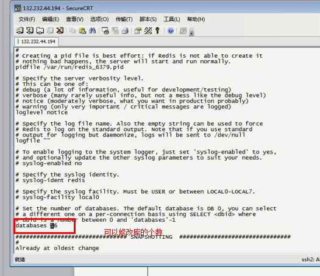

# 分布式缓存
- 1. 缓存
    - 1.1 why?
        - 使用缓存技术的目的为了减轻服务器端的压力
    - 1.2 场景
        - 浏览器访问图片
        - CDN内容分发
        - 代理缓存Nginx
        - App客户端 安卓、IOS底层有缓存技术
    - 1.3 框架分类
        - 单点缓存框架-Ehcache
            - 1  what
                - .Ehcache(java写的，在单个JVM中)
            - 2. Ehcache 实现集群方案（RMI方式）
                - 步骤  （不推荐，效率低）
                    - 1. 
                    - 2.
                        -  
                    - 3. 
                        -  
        - 分布式缓存框架
            - redis     menchache
        - Ehchae与分布式Redis的区别
            - 1.Ehcache适合单体项目缓存，不适合分布式。（不支持共享。）一般存在单个JVM重
            - 2. 分布式架构中使用Redis+Ehcache实现分布式缓存；分为一级、二级缓存
                -  
    - 1.4解决 缓存与DB不同步问题
        - （1）update语句后面加上主动通知 ，先修改在清除缓存
        - （2） 定时job健康检查；
    - Redis
        - 1.What
            - 非关系型数据库，内存数据库   ，单线程（保证线程安全问题）、使用持久化机制，保证高可用
        - 2.应用场景
            - 1.令牌的生成
            - 2. 短信验证码
            - 3. 热点数据
            - 4.使用Redis实现消息中间件（不推荐）
            - 5.分布式锁
            - 6.网站计数器
                - 因为redis是单线程，在高并发情况下，保证记录全局count唯一
        - 3. 根据不同的业务，分库
            - redis总共16个库
                - 每个库中的数据不可以重复 
        - 4.主从复制
            - 1.1.只有一个Master(运行读写)，多个Slave(只允许读操作)
            - 2.场景
                - 1.集群
                - 2.读写分离
                    - 读和写分开连接，读一个库，写一个库，增加整体吞吐量
                    - 存在同步问题
                - 3.日志备份
                - 4.高可用
            - 3.过程
                -  
            - 配置
                - 1.关闭防火墙
                - 2. 在从服务中配置 主服务内网 的ip  、port;以及主服务的密码
                    -  
        - 5.哨兵机制
            - 目的
                - 心跳检测、故障转移（选举策略）、监控
            - 过程
                -  
            - 搭建
                - 注意事项
                    - 1.修改redis为后台进程
                    - 2.注释掉 “bind 127.0.0.1” 允许ip地址访问
                    - 3.修改redis启动密码
                - 步骤
                    - 1.
        - 6.redis持久化机制
            - Why?
                - 因为redis 值存在内存中，防止断电
            - 分类
                - 1.RDB（默认开启）
                    - 以二进制文件形式，以某个时间点存储
                    - 缺点
                        - 非实时
                    - 优点
                        - 开启单独的进程去做写的io操作，和当前主进程没有任何关联
                - 2. AOF
                    - 实时日志记录，只记录写的操作
                    - 缺点
                        - 效率不高，影响整体性能
                    - 优点
                        - 比较安全
        - 7.redis 事务
        - 8. redis Cluster
            - 1. 常见市面上Redis集群方案
                - 1.客户端分片技术（mycat） 故障转移功能
                - 2.主从复制（实现集群）
                    - 缺点：数据非常冗余；浪费内存
                - 3.使用代理工具：
                - Redis-Cluster(redis 3.0之后实现的)
            - 2。实现原理
                -  
            - 3.搭建方式
                - 
            - 4. 事务
                - redis 集群默认是不支持事务的，但是事务可以在单独节点上可以支持的；
            - 5. Redis 雪崩
                - what
                    - 如果redis中所有的key 在同一时间失效，会导致大量请求访问数据库，会导致服务器连接异常，甚至直接瘫痪整个系统
                    -  
                - 解决方案
                    - 1.分布式锁
                        - 当突然有大量请求数据库服务器时，只能保证一个小线程连接
                        -  
                        - 代码实现，当时单个服务器的时候 
                    - 2. 使用消息中间件方式
                        -  
                    - 3.一级和二级缓存（Redis+ehcache）
                    - 4.设定不一样的key失效时间
                - 
            - 6. Redis 穿透
                - 原因：
                    - 客户端随机生成的key,redis 
                - 解决方案
                    - 1.网关判断客户端传入key 传入的规则，如果不符合数据库查询的规则，然后直接返回空。
                    - 2.如果使用key 数据库查询不到的结果的话，直接在redis 存一份null 一个结果；