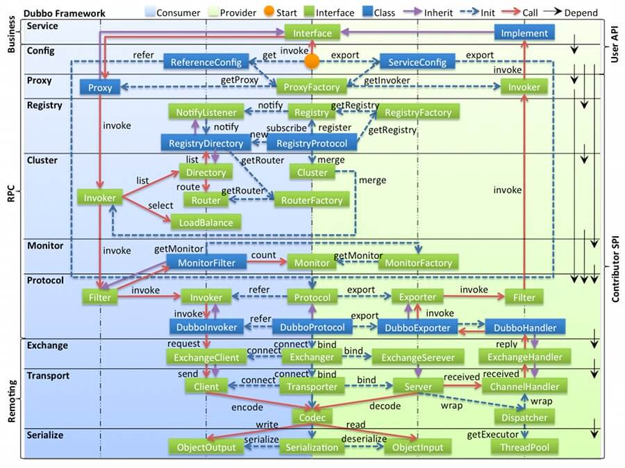
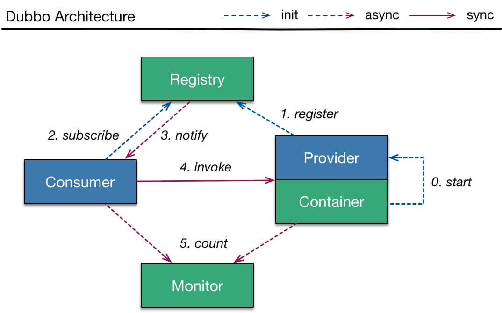
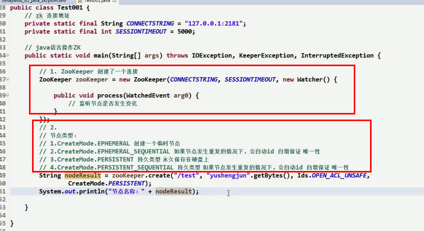
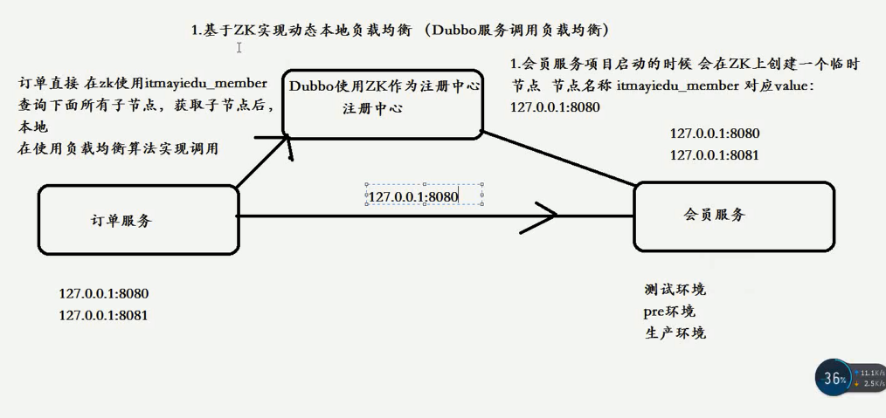

# 分布式面试题-20190827
- Dubbo
    - 配置方式  dubbo-spring-boot
        - XML 配置
        - 注解配置
        - 属性配置
        - Java API 配置
        - 外部化配置
    - 分层设计
        - 结构图示
            - **对象与流程**
            - **左边淡蓝背景** **Consumer** **右边淡绿色背景** **Provider**
            - **右边的黑色箭头** **Depend**
            - 注意，Dubbo 并未使用 JDK SPI 机制，而是自己实现了一套 Dubbo SPI 机制。
            - **绿色小块( Interface )** **蓝色小块( Class )**
            - **蓝色虚线( Init )** **红色实线( Call )** **紫色三角箭头( Inherit )** 
        - 各层说明 
            - **Business** **RPC** **Remoting&nbsp;**
            - **==================== Business ====================**
            - **Service 业务层**
            - 接口层，给服务提供者和消费者来实现的。
            - **==================== RPC =======================**
            - **config 配置层**
            - 配置层，主要是对 Dubbo 进行各种配置的。
            - **proxy 服务代理层**
            - **registry 注册中心层：**
            - **cluster 路由层：**
            - **monitor 监控层：**
            - **==================== Remoting ====================**
            - **protocol 远程调用层：**
            - **exchange 信息交换层：**
            - **transport 网络传输层：**
            - **serialize 数据序列化层：**
    - 调用流程
        - 流程图示
            - Provider
                - 第 0 步，start 启动服务。
                - 第 1 步，register 注册服务到注册中心。
            - Consumer
                - 第 2 步，subscribe 向注册中心订阅服务。
                    - 注意，只订阅使用到的服务。
                    - 再注意，首次会拉取订阅的服务列表，缓存在本地。
                - 第 3 步【异步】，notify 当服务发生变化时，获取最新的服务列表，更新本地缓存
            - invoke 调用
                - Consumer 直接发起对 Provider 的调用，无需经过注册中心。而对多个 Provider 的负载均衡，Consumer 通过 cluster 组件实现。
            - count 监控
                - 【异步】Consumer 和 Provider 都异步通知监控中心。
            -  
    - **==========服务稳定性:  怀疑第三方   防备使用方  做好自己========**
    - **降级**
        - ① Dubbo 原生自带的服务降级功能
            -  [http://dubbo.apache.org/zh-cn/docs/user/demos/service-downgrade.html]("http://dubbo.apache.org/zh-cn/docs/user/demos/service-downgrade.html")
            - 这个功能，并不能实现现代微服务的熔断器的功能。所以一般情况下，不太推荐这种方式，而是采用第二种方式。
        - ② 引入支持服务降级的组件
            - 目前开源社区常用的有两种组件支持服务降级的功能，分别是：
            - **Alibaba Sentinel**
            - **Netflix Hystrix**
            - 因为目前 Hystrix 已经停止维护，并且和 Dubbo 的集成度不是特别高，需要做二次开发，所以推荐使用 Sentinel 。
    - **限流**
        - ① Dubbo 原生自带的限流功能
            - 通过 TpsLimitFilter 实现，仅适用于服务提供者。
            - 参照 TpsLimitFilter 的思路，可以实现自定义限流的 Filter ，并且使用 Guava RateLimiter 工具类，达到&nbsp;令牌桶算法限流&nbsp;的功能。
        - ② 引入支持限流的组件
            - 关于这个功能，还是推荐集成 Sentinel 组件
    - **幂等性**
        - 对于每个请求必须有一个唯一的标识
        - 每次处理完请求之后，必须有一个记录标识这个请求处理过了，比如说常见的方案是在mysql中记录个状态啥
        - 每次接收请求需要进行判断之前是否处理过的逻辑处理，比如说，如果有一个订单已经支付了，就已经有了一条支付流水，那么如果重复发送这个请求，则此时先插入支付流水，orderId已经存在了，唯一键约束生效，报错插入不进去
    - **顺序性**
        - 一般来说是不用保证顺序的。但是有的时候可能确实是需要严格的顺序保证,因为一旦引入顺序性保障，会导致系统复杂度上升，而且会带来效率低下，热点数据压力过大，等问题
        - 首先你得用dubbo的一致性hash负载均衡策略，将比如某一个订单id对应的请求都给分发到某个机器上去，接着就是在那个机器上因为可能还是多线程并发执行的，你可能得立即将某个订单id对应的请求扔一个内存队列里去，强制排队，这样来确保他们的顺序性
    - **失败重试**
        - **抛异常** **调用超时**
        - **一般会禁用掉重试**
        - **failfast** **failover**
            - &lt;dubbo:service cluster="failfast" timeout="2000" /&gt;
        - **分成读和写两种**
    - **均衡策略**
        - random loadbalance
            - **按照权重来负载均衡**
        - roundrobin loadbalance
            - **均匀地将流量打到各个机器上去**
        - leastactive loadbalance
            - **不活跃的性能差的机器更少的请求**
        - consistanthash loadbalance
            - **请求一定分发到一个provider上去**
    - **容错策略**
        - failover cluster模式
            - **失败自动切换** **默认就是这个** **常见于读操作**
        - failfast cluster模式
            - **一次调用失败** **常见于写操作**
        - failsafe cluster模式
            - **出现异常时忽略掉** **记录日志**
        - failbackc cluster模式
            - **失败** **定时重发** **写消息队列这种**
        - forking cluster
            - **并行调用多个provider**
        - broadcacst cluster
            - 逐个调用所有的provider
    - **service provider interface**
        - 常用在插件扩展的场景，比如说你开发的是一个给别人使用的开源框架，如果你想让别人自己写个插件，插到你的开源框架里面来，扩展某个功能
        - 实际举例
            - **jdbc**
            - **没有提供jdbc的实现类**
            - **mysql-jdbc-connector.jar引入进来**
            - 在系统跑的时候，碰到你使用jdbc的接口，他会在底层使用你引入的那个jar中提供的实现类
            - **dubbo也用了spi思想** **不过没有用jdk的spi机制**
            - Protocol protocol = ExtensionLoader.getExtensionLoader(Protocol.class).getAdaptiveExtension();
            - Protocol接口，dubbo要判断一下，在系统运行的时候，应该选用这个Protocol接口的哪个实现类来实例化对象来使用呢？他会去找一个你配置的Protocol，他就会将你配置的Protocol实现类，加载到jvm中来，然后实例化对象，就用你的那个Protocol实现类就可以了
            - 微内核，可插拔，大量的组件，Protocol负责rpc调用的东西，你可以实现自己的rpc调用组件，实现Protocol接口，给自己的一个实现类即可。
            - 这行代码就是dubbo里大量使用的，就是对很多组件，都是保留一个接口和多个实现，然后在系统运行的时候动态根据配置去找到对应的实现类。如果你没配置，那就走默认的实现好了，没问题。
- Zookeeper  CP
    - what
        - 分布式协调工具
    - 特性
        - **顺序一致性**
            - 从同一个客户端发起的事务请求，最终会严格地按照发起顺序被应用到 Zookeeper 中去
            - 有序性是 Zookeeper 中非常重要的一个特性。所有的更新都是全局有序的，每个更新都有一个唯一的时间戳，这个时间戳称为zxid(Zookeeper Transaction Id)。而读请求只会相对于更新有序，也就是读请求的返回结果中会带有这个 Zookeeper 最新的 zxid 。
        - 原子性
            - 所有事务请求的处理结果在整个集群中所有机器上的应用情况是一致的，即整个集群要么都成功应用了某个事务，要么都没有应用。
        - 单一视图
            - 无论客户端连接的是哪个 Zookeeper 服务器，其看到的服务端数据模型都是一致的。
        - 可靠性
            - 一旦服务端成功地应用了一个事务，并完成对客户端的响应，那么该事务所引起的服务端状态变更将会一直被保留，除非有另一个事务对其进行了变更。
        - 实时性
            - 保证在一定的时间段内,客户端最终一定能够从服务端上读取到最新的数据状态
    - 存储结构
        - 1.Znode节点结构进行存储，类似于目录
        - 2.节点路径（节点名称）不能重复
        - > 同一层要唯一（保证整体路径的唯一）
        - 3.节点类型：
            - 1.临时节点
                - 当前节点与会话保持连接，如果断开的话，该节点也会被断开
            - 2.持久节点
                - 创建的节点永久的持久到硬盘上
        - 4.节点事件通知：
            - 每个节点都有事件通知（比如增删改）
    - 使用场景
        - 1.注册中心
        - 2.消息中间件  事件通知
        - 3.分布式事务
        - 4.分布式锁
        - 5. 选举策略
        - 6.本地动态负载均衡
        - 7. 消息中间件集群管理
        - 分布式协调
            - 这个其实是zk很经典的一个用法，简单来说，就好比，你A系统发送个请求到mq，然后B消息消费之后处理了。那A系统如何知道B系统的处理结果？用zk就可以实现分布式系统之间的协调工作。A系统发送请求之后可以在zk上对某个节点的值注册个监听器，一旦B系统处理完了就修改zk那个节点的值，A立马就可以收到通知，完美解决。
        - 分布式锁
            - 对某一个数据连续发出两个修改操作，两台机器同时收到了请求，但是只能一台机器先执行另外一个机器再执行。那么此时就可以使用zk分布式锁，一个机器接收到了请求之后先获取zk上的一把分布式锁，就是可以去创建一个znode，接着执行操作；然后另外一个机器也尝试去创建那个znode，结果发现自己创建不了，因为被别人创建了。。。。那只能等着，等第一个机器执行完了自己再执行。
        - 元数据/配置信息管理
            - zk可以用作很多系统的配置信息的管理，比如kafka、storm等等很多分布式系统都会选用zk来做一些元数据、配置信息的管理，包括dubbo注册中心不也支持zk么
        - HA高可用性
            - 这个应该是很常见的，比如hadoop、hdfs、yarn等很多大数据系统，都选择基于zk来开发HA高可用机制，就是一个重要进程一般会做主备两个，主进程挂了立马通过zk感知到切换到备用进程
    - 不适合发现服务
        - 作为一个分布式协同服务，ZooKeeper非常好，但是对于Service发现服务来说就不合适了
        - **返回了包含不实的信息的结果也比什么都不返回要好**
        - **暂时的网络故障而找不到可用的服务器**
    - 代码
        -  
- 基于ZK实现本地负载均衡
    - 原理 
- 分布式锁
    - 产生的原因
        -    
    - **Redis  分布式锁**
        - **RedLock算法**
        - **互斥** **不能死锁** **容错**
        - 普通的实现方式
            - 就是在redis里创建一个key算加锁
            - SET my:lock 随机值 NX PX 30000，这个命令就ok，这个的NX的意思就是只有key不存在的时候才会设置成功，PX 30000的意思是30秒后锁自动释放。别人创建的时候如果发现已经有了就不能加锁了。释放锁就是删除key，但是一般可以用lua脚本删除，判断value一样才删除：
        - RedLock算法实现
            - 场景假设有一个redis cluster，有5个redis master实例。然后执行如下步骤获取一把锁：
            - 1）获取当前时间戳，单位是毫秒
            - 2）跟上面类似，轮流尝试在每个master节点上创建锁，过期时间较短，一般就几十毫秒
            - 3）尝试在大多数节点上建立一个锁，比如5个节点就要求是3个节点（n / 2 +1）
            - 4）客户端计算建立好锁的时间，如果建立锁的时间小于超时时间，就算建立成功了
            - 5）要是锁建立失败了，那么就依次删除这个锁
            - 6）只要别人建立了一把分布式锁，你就得不断轮询去尝试获取锁
    - **Zookeeper   分布式锁**
        - zk分布式锁，其实可以做的比较简单，就是某个节点尝试创建临时znode，此时创建成功了就获取了这个锁；这个时候别的客户端来创建锁会失败，只能注册个监听器监听这个锁。释放锁就是删除这个znode，一旦释放掉就会通知客户端，然后有一个等待着的客户端就可以再次重新加锁
        - &nbsp;如果有一把锁，被多个人给竞争，此时多个人会排队，第一个拿到锁的人会执行，然后释放锁，后面的每个人都会去监听排在自己前面的那个人创建的node上，一旦某个人释放了锁，排在自己后面的人就会被zookeeper给通知，一旦被通知了之后，就ok了，自己就获取到了锁，就可以执行代码了
    - redis分布式锁和zk分布式锁的对比
        - redis分布式锁，其实需要自己不断去尝试获取锁，比较消耗性能
        - zk分布式锁，获取不到锁，注册个监听器即可，不需要不断主动尝试获取锁，性能开销较小
        - 另外一点就是，如果是redis获取锁的那个客户端bug了或者挂了，那么只能等待超时时间之后才能释放锁；而zk的话，因为创建的是临时znode，只要客户端挂了，znode就没了，此时就自动释放锁
    - **数据库   分布式锁**
- 分布式事务
    - **两阶段提交方案/XA方案**
        - 举例:比如说公司里团建一般会有个负责人,第一个阶段负责人会询问团队成员去吗？如果所有人都ok，那么就决定一起去。任何一个人不去，就取消活动。第二个阶段一起去团建
        - 两阶段提交/XA事务，有事务管理器的概念，协调多个数据库（资源管理器）的事务，事务管理器先问问各个数据库准备好了吗？如果每个数据库都ok，那就正式提交事务在各个数据库上执行操作；如果任何一个数据库不ok，那么就回滚事务。
        - **适合单块应用，跨多个库的分布式事务** **效率很低** **适合高并发的场景**
        - 这个方案很少用，一般来说某个系统内部如果出现跨多个库的这么一个操作是不合规的。现在微服务，一个大的系统分成几百个服务，几十个服务。一般来说规定和规范，要求每个服务只能操作自己对应的一个数据库。如果你要操作别的服务对应的库，不允许直连别的服务的库，违反微服务架构的规范，随便交叉访问几百个服务的话，这样的一套服务是没法管理治理的，数据被别人改错，自己的库被别人写挂。如果你要操作别人的服务的库，你必须是通过调用别的服务的接口来实现，绝对不允许你交叉访问别人的数据库
    - **TCC 方案   Try Confirm Cancel**
        - 是用到了补偿的概念，分为了三个阶段：
        - **Try阶段：**
        - **Confirm阶段：**
        - **Cancel阶段：**
        - 给大家举个例子吧，比如说跨银行转账的时候，要涉及到两个银行的分布式事务，如果用TCC方案来实现，思路是这样的：
            - 1）Try阶段：先把两个银行账户中的资金给它冻结住就不让操作了
            - 2）Confirm阶段：执行实际的转账操作，A银行账户的资金扣减，B银行账户的资金增加
            - 3）Cancel阶段：如果任何一个银行的操作执行失败，那么就需要回滚进行补偿，就是比如A银行账户如果已经扣减了，但是B银行账户资金增加失败了，那么就得把A银行账户资金给加回去
        - **依赖于你自己写代码来回滚和补偿了，会造成补偿代码巨大**
        - 比如说我们，一般来说跟钱相关的，跟钱打交道的，支付、交易相关的场景，我们会用TCC，严格严格保证分布式事务要么全部成功，要么全部自动回滚，严格保证资金的正确性，在资金上出现问题
        - 比较适合的场景：这个就是除非你是真的一致性要求太高，是你系统中核心之核心的场景，比如常见的就是资金类的场景，那你可以用TCC方案了，自己编写大量的业务逻辑，自己判断一个事务中的各个环节是否ok，不ok就执行补偿/回滚代码。
        - 而且最好是你的各个业务执行的时间都比较短。但是说实话，一般尽量别这么搞，自己手写回滚逻辑，或者是补偿逻辑，实在太恶心了，那个业务代码很难维护。
    - **本地消息表**
        - 国外的ebay搞出来的这么一套思想
        - 这个大概意思是这样的
        - 1）A系统在自己本地一个事务里操作同时，插入一条数据到消息表
        - 2）接着A系统将这个消息发送到MQ中去
        - 3）B系统接收到消息之后，在一个事务里，往自己本地消息表里插入一条数据，同时执行其他的业务操作，如果这个消息已经被处理过了，那么此时这个事务会回滚，这样保证不会重复处理消息
        - 4）B系统执行成功之后，就会更新自己本地消息表的状态以及A系统消息表的状态
        - 5）如果B系统处理失败了，那么就不会更新消息表状态，那么此时A系统会定时扫描自己的消息表，如果有没处理的消息，会再次发送到MQ中去，让B再次处理
        - **保证了最终一致性**
        - **严重依赖于数据库的消息表**
    - **可靠消息最终一致性方案**
        - **基于MQ来实现事务**
        - 大概的意思就是：
        - 1）A系统先发送一个prepared消息到mq，如果这个prepared消息发送失败那么就直接取消操作别执行了
        - 2）如果这个消息发送成功过了，那么接着执行本地事务，如果成功就告诉mq发送确认消息，如果失败就告诉mq回滚消息
        - 3）如果发送了确认消息，那么此时B系统会接收到确认消息，然后执行本地的事务
        - 4）mq会自动定时轮询所有prepared消息回调你的接口，问你，这个消息是不是本地事务处理失败了，所有没发送确认消息？那是继续重试还是回滚？一般来说这里你就可以查下数据库看之前本地事务是否执行，如果回滚了，那么这里也回滚吧。这个就是避免可能本地事务执行成功了，别确认消息发送失败了。
        - 5）这个方案里，要是系统B的事务失败了咋办？重试咯，自动不断重试直到成功，如果实在是不行，要么就是针对重要的资金类业务进行回滚，比如B系统本地回滚后，想办法通知系统A也回滚；或者是发送报警由人工来手工回滚和补偿
        - **目前国内互联网公司大都是这么使用的**
    - **最大努力通知方案**
        - 这个方案的大致意思就是：
        - 1）系统A本地事务执行完之后，发送个消息到MQ
        - 2）这里会有个专门消费MQ的最大努力通知服务，这个服务会消费MQ然后写入数据库中记录下来，或者是放入个内存队列也可以，接着调用系统B的接口
        - 3）要是系统B执行成功就ok了；要是系统B执行失败了，那么最大努力通知服务就定时尝试重新调用系统B，反复N次，最后还是不行就放弃
- 分布式数据库
    - 中间件
        - cobar
            - **proxy层** **基本没啥人用** **不支持读写分离、存储过程、跨库join和分页**
        - TDDL
            - **client层**
        - atlas
            - **proxy层**
        - **sharding-jdbc**
            - **client层**
        - **mycat**
            - **proxy层**
    - 迁移方案
        - **停机迁移**
            - 我先给你说一个最low的方案，就是很简单，大家伙儿凌晨12点开始运维，网站或者app挂个公告，说0点到早上6点进行运维，无法访问。。。。。。
            - 接着到0点，停机系统停掉，没有流量写入了，此时老的单库单表数据库静止了。然后你之前得写好一个导数的一次性工具，此时直接跑起来，然后将单库单表的数据哗哗哗读出来，写到分库分表里面去。
            - 导数完了之后，就ok了，修改系统的数据库连接配置啥的，包括可能代码和SQL也许有修改，那你就用最新的代码，然后直接启动连到新的分库分表上去。
            - 验证一下，ok了完美，大家伸个懒腰，看看看凌晨4点钟的北京夜景，打个滴滴回家吧
            - 但是这个方案比较low，谁都能干
        - **双写迁移**
            - 这个是我们常用的一种迁移方案，比较靠谱一些，不用停机，不用看北京凌晨4点的风景
            - **都加上对新库的增删改** **双写,同时写俩库，老库和新库**
            - 然后系统部署之后，新库数据差很多，用导数据工具，跑起来读老库数据写新库，写的时候要根据gmt_modified这类字段判断这条数据最后修改的时间，除非是读出来的数据在新库里没有，或者是比新库的数据新才会写。
            - 接着导完一轮之后，有可能数据还是存在不一致，那么就程序自动做一轮校验，比对新老库每个表的每条数据，接着如果有不一样的，就针对那些不一样的，从老库读数据再次写。反复循环，直到两个库每个表的数据都完全一致为止。
            - 接着当数据完全一致了，就ok了，基于仅仅使用分库分表的最新代码，重新部署一次，不就仅仅基于分库分表在操作了么，还没有几个小时的停机时间，很稳。所以现在基本玩儿数据迁移之类的，都是这么干了。
    - 读写分离
        - 原理
            - 主库将变更写binlog日志，然后从库连接到主库之后，从库有一个IO线程，将主库的binlog日志拷贝到自己本地，写入一个中继日志中。接着从库中有一个SQL线程会从中继日志读取binlog，然后执行binlog日志中的内容，也就是在自己本地再次执行一遍SQL，这样就可以保证自己跟主库的数据是一样的。
        - 同步机制
            - 半同步复制    用来解决主库数据丢失问题
                - semi-sync复制，就是主库写入binlog日志之后，就会将强制此时立即将数据同步到从库，从库将日志写入自己本地的relay log之后，接着会返回一个ack给主库，主库接收到至少一个从库的ack之后才会认为写操作完成了
            - 并行复制        用来解决主从同步延时问题
                - 指的是从库开启多个线程，并行读取relay log中不同库的日志，然后并行重放不同库的日志，这是库级别的并行
        - 延时问题
            - **库级别的并行**
            - 会对于那种写了之后立马就要保证可以查到的场景，采用强制读主库的方式，这样就可以保证可以读到正确数据,这里用一些数据库中间件是没问题的
    - 扩缩容方案
        - 停机扩容
            - 这个方案就跟停机迁移一样，步骤几乎一致，唯一的一点就是那个导数据的工具，是把现有库表的数据抽出来慢慢倒入到新的库和表里去。但是最好别这么玩儿，有点不太靠谱，因为既然分库分表就说明数据量实在是太大了，可能多达几亿条，甚至几十亿，你这么玩儿，可能会出问题。
            - 从单库单表迁移到分库分表的时候，数据量并不是很大，单表最大也就两三千万
            - 写个工具，多弄几台机器并行跑，1小时数据就导完了
            - 3个库+12个表，跑了一段时间了，数据量都1亿~2亿了。光是导2亿数据，都要导个几个小时，6点，刚刚导完数据，还要搞后续的修改配置，重启系统，测试验证，10点才可以搞完
        - 优化后的方案
            - 一开始上来就是32个库，每个库32个表，1024张表
            - 我可以告诉各位同学说，这个分法，第一，基本上国内的互联网肯定都是够用了，第二，无论是并发支撑还是数据量支撑都没问题
            - 每个库正常承载的写入并发量是1000，那么32个库就可以承载32 * 1000 = 32000的写并发，如果每个库承载1500的写并发，32 * 1500 = 48000的写并发，接近5万/s的写入并发，前面再加一个MQ，削峰，每秒写入MQ 8万条数据，每秒消费5万条数据。
            - 有些除非是国内排名非常靠前的这些公司，他们的最核心的系统的数据库，可能会出现几百台数据库的这么一个规模，128个库，256个库，512个库
            - 1024张表，假设每个表放500万数据，在MySQL里可以放50亿条数据
            - 每秒的5万写并发，总共50亿条数据，对于国内大部分的互联网公司来说，其实一般来说都够了
            - 谈分库分表的扩容，第一次分库分表，就一次性给他分个够，32个库，1024张表，可能对大部分的中小型互联网公司来说，已经可以支撑好几年了
            - 一个实践是利用32 * 32来分库分表，即分为32个库，每个库里一个表分为32张表。一共就是1024张表。根据某个id先根据32取模路由到库，再根据32取模路由到库里的表。
            - 刚开始的时候，这个库可能就是逻辑库，建在一个数据库上的，就是一个mysql服务器可能建了n个库，比如16个库。后面如果要拆分，就是不断在库和mysql服务器之间做迁移就可以了。然后系统配合改一下配置即可。
            - 比如说最多可以扩展到32个数据库服务器，每个数据库服务器是一个库。如果还是不够？最多可以扩展到1024个数据库服务器，每个数据库服务器上面一个库一个表。因为最多是1024个表么。
            - 这么搞，是不用自己写代码做数据迁移的，都交给dba来搞好了，但是dba确实是需要做一些库表迁移的工作，但是总比你自己写代码，抽数据导数据来的效率高得多了。
            - 哪怕是要减少库的数量，也很简单，其实说白了就是按倍数缩容就可以了，然后修改一下路由规则。
            - 对2 ^ n取模
            - orderId 模 32 = 库
            - orderId / 32 模 32 = 表
            - 259	3	8
            - 1189	5	5
            - 352	0	11
            - 4593 17	15
            - 1、设定好几台数据库服务器，每台服务器上几个库，每个库多少个表，推荐是32库 * 32表，对于大部分公司来说，可能几年都够了
            - 2、路由的规则，orderId 模 32 = 库，orderId / 32 模 32 = 表
            - 3、扩容的时候，申请增加更多的数据库服务器，装好mysql，倍数扩容，4台服务器，扩到8台服务器，16台服务器
            - 4、由dba负责将原先数据库服务器的库，迁移到新的数据库服务器上去，很多工具，库迁移，比较便捷
            - 5、我们这边就是修改一下配置，调整迁移的库所在数据库服务器的地址
            - 6、重新发布系统，上线，原先的路由规则变都不用变，直接可以基于2倍的数据库服务器的资源，继续进行线上系统的提供服务
    - 唯一ID方案
        - 数据库自增id
            - 这个就是说你的系统里每次得到一个id，都是往一个库的一个表里插入一条没什么业务含义的数据，然后获取一个数据库自增的一个id。拿到这个id之后再往对应的分库分表里去写入。
            - **高并发就会有瓶颈**
            - 适合的场景：你分库分表就俩原因，要不就是单库并发太高，要不就是单库数据量太大；除非是你并发不高，但是数据量太大导致的分库分表扩容，你可以用这个方案，因为可能每秒最高并发最多就几百，那么就走单独的一个库和表生成自增主键即可。
            - 并发很低，几百/s，但是数据量大，几十亿的数据，所以需要靠分库分表来存放海量的数据
        - uuid
            - **太长了，作为主键性能太差了，不适合用于主键**
            - 适合的场景：如果你是要随机生成个什么文件名了，编号之类的，你可以用uuid，但是作为主键是不能用uuid的。
            - UUID.randomUUID().toString().replace(“-”, “”) -&gt; sfsdf23423rr234sfdaf
        - snowflake算法
            - twitter开源的分布式id生成算法，就是把一个64位的long型的id，1个bit是不用的，用其中的41 bit作为毫秒数，用10 bit作为工作机器id，12 bit作为序列号
            - 这个snowflake算法相对来说还是比较靠谱的，所以你要真是搞分布式id生成，如果是高并发啥的，那么用这个应该性能比较好，一般每秒几万并发的场景，也足够用了。
    - 分库分表的方式
        - range 连续数据 产生热点问题 数据均匀 容易扩容
        - hash 扩容时需要数据迁移
- 分布式Session
    - **Tomcat + Redis**
        - 这个其实还挺方便的，就是使用session的代码跟以前一样，还是基于tomcat原生的session支持即可，然后就是用一个叫做Tomcat RedisSessionManager的东西，让所有我们部署的tomcat都将session数据存储到redis即可。
        - 在tomcat的配置文件中，配置一下
            - &lt;Valve className="com.orangefunction.tomcat.redissessions.RedisSessionHandlerValve" /&gt;
            - &lt;Manager className="com.orangefunction.tomcat.redissessions.RedisSessionManager"
            - host="{redis.host}"
            - port="{redis.port}"
            - database="{redis.dbnum}"
            - maxInactiveInterval="60"/&gt;
        - 弄好上面的配置即可，就是用了RedisSessionManager，然后指定了redis的host和 port
            - &lt;Valve className="com.orangefunction.tomcat.redissessions.RedisSessionHandlerValve" /&gt;
            - &lt;Manager className="com.orangefunction.tomcat.redissessions.RedisSessionManager"
            - sentinelMaster="mymaster"
            - sentinels="&lt;sentinel1-ip&gt;:26379,&lt;sentinel2-ip&gt;:26379,&lt;sentinel3-ip&gt;:26379"
            - maxInactiveInterval="60"/&gt;
        - 还可以用上面这种方式基于redis哨兵支持的redis高可用集群来保存session数据，都是ok的
    - **Spring session + Redis**
        - 分布式会话的这个东西重耦合在tomcat中，如果我要将web容器迁移成jetty，难道你重新把jetty都配置一遍吗？
        - 因为上面那种tomcat + redis的方式好用，但是会严重依赖于web容器，不好将代码移植到其他web容器上去，尤其是你要是换了技术栈咋整？比如换成了spring cloud或者是spring boot之类的。还得好好思忖思忖。
        - 所以现在比较好的还是基于java一站式解决方案，spring了。人家spring基本上包掉了大部分的我们需要使用的框架了，spirng cloud做微服务了，spring boot做脚手架了，所以用sping session是一个很好的选择。
            - pom.xml
                - &lt;dependency&gt;
                - &lt;groupId&gt;org.springframework.session&lt;/groupId&gt;
                - &lt;artifactId&gt;spring-session-data-redis&lt;/artifactId&gt;
                - &lt;version&gt;1.2.1.RELEASE&lt;/version&gt;
                - &lt;/dependency&gt;
                - &lt;dependency&gt;
                - &lt;groupId&gt;redis.clients&lt;/groupId&gt;
                - &lt;artifactId&gt;jedis&lt;/artifactId&gt;
                - &lt;version&gt;2.8.1&lt;/version&gt;
                - &lt;/dependency&gt;
            - spring配置文件中
                - &lt;bean id="redisHttpSessionConfiguration"
                - class="org.springframework.session.data.redis.config.annotation.web.http.RedisHttpSessionConfiguration"&gt;
                - &lt;property name="maxInactiveIntervalInSeconds" value="600"/&gt;
                - &lt;/bean&gt;
                - &lt;bean id="jedisPoolConfig" class="redis.clients.jedis.JedisPoolConfig"&gt;
                - &lt;property name="maxTotal" value="100" /&gt;
                - &lt;property name="maxIdle" value="10" /&gt;
                - &lt;/bean&gt;
                - &lt;bean id="jedisConnectionFactory"
                - class="org.springframework.data.redis.connection.jedis.JedisConnectionFactory" destroy-method="destroy"&gt;
                - &lt;property name="hostName" value="${redis_hostname}"/&gt;
                - &lt;property name="port" value="${redis_port}"/&gt;
                - &lt;property name="password" value="${redis_pwd}" /&gt;
                - &lt;property name="timeout" value="3000"/&gt;
                - &lt;property name="usePool" value="true"/&gt;
                - &lt;property name="poolConfig" ref="jedisPoolConfig"/&gt;
                - &lt;/bean&gt;
            - web.xml
                - &lt;filter&gt;
                - &lt;filter-name&gt;springSessionRepositoryFilter&lt;/filter-name&gt;
                - &lt;filter-class&gt;org.springframework.web.filter.DelegatingFilterProxy&lt;/filter-class&gt;
                - &lt;/filter&gt;
                - &lt;filter-mapping&gt;
                - &lt;filter-name&gt;springSessionRepositoryFilter&lt;/filter-name&gt;
                - &lt;url-pattern&gt;/*&lt;/url-pattern&gt;
                - &lt;/filter-mapping&gt;
            - 示例代码
                - @Controller
                - @RequestMapping("/test")
                - public class TestController {
                - @RequestMapping("/putIntoSession")
                - @ResponseBody
                - public String putIntoSession(HttpServletRequest request, String username){
                - request.getSession().setAttribute("name",  “leo”);
                - return "ok";
                - }
                - @RequestMapping("/getFromSession")
                - @ResponseBody
                - public String getFromSession(HttpServletRequest request, Model model){
                - String name = request.getSession().getAttribute("name");
                - return name;
                - }
                - }
        - 上面的代码就是ok的，给sping session配置基于redis来存储session数据，然后配置了一个spring session的过滤器，这样的话，session相关操作都会交给spring session来管了。接着在代码中，就用原生的session操作，就是直接基于spring sesion从redis中获取数据了。
        - 实现分布式的会话，有很多种很多种方式，我说的只不过比较常见的两种方式，tomcat + redis早期比较常用；近些年，重耦合到tomcat中去，通过spring session来实现。
- 分布式高可用
    - 系统拆分
        - 将一个系统拆分为多个子系统，用dubbo来搞。然后每个系统连一个数据库，这样本来就一个库，现在多个数据库，不也可以抗高并发么。
    - 缓存
        - 必须得用缓存。大部分的高并发场景，都是读多写少，那你完全可以在数据库和缓存里都写一份，然后读的时候大量走缓存不就得了。毕竟人家redis轻轻松松单机几万的并发啊。没问题的。所以你可以考虑考虑你的项目里，那些承载主要请求的读场景，怎么用缓存来抗高并发。
    - MQ
        - 必须得用MQ。可能你还是会出现高并发写的场景，比如说一个业务操作里要频繁搞数据库几十次，增删改增删改，疯了。那高并发绝对搞挂你的系统，你要是用redis来承载写那肯定不行，人家是缓存，数据随时就被LRU了，数据格式还无比简单，没有事务支持。所以该用mysql还得用mysql啊。那你咋办？用MQ吧，大量的写请求灌入MQ里，排队慢慢玩儿，后边系统消费后慢慢写，控制在mysql承载范围之内。所以你得考虑考虑你的项目里，那些承载复杂写业务逻辑的场景里，如何用MQ来异步写，提升并发性。MQ单机抗几万并发也是ok的，这个之前还特意说过。
    - 分库分表
        - 可能到了最后数据库层面还是免不了抗高并发的要求，好吧，那么就将一个数据库拆分为多个库，多个库来抗更高的并发；然后将一个表拆分为多个表，每个表的数据量保持少一点，提高sql跑的性能。
    - 读写分离
        - 就是说大部分时候数据库可能也是读多写少，没必要所有请求都集中在一个库上吧，可以搞个主从架构，主库写入，从库读取，搞一个读写分离。读流量太多的时候，还可以加更多的从库。
    - Elasticsearch
        - 可以考虑用es。es是分布式的，可以随便扩容，分布式天然就可以支撑高并发，因为动不动就可以扩容加机器来抗更高的并发。那么一些比较简单的查询、统计类的操作，可以考虑用es来承载，还有一些全文搜索类的操作，也可以考虑用es来承载。
- 分布式限流-熔断-降级
    - **hystrix**
        - 提供了高可用相关的各种功能，确保在hystrix的保护下整个系统长期处于高可用状态
        - **资源隔离**
            - 让你的系统里，某一块东西，在故障的情况下，不会耗尽系统所有的资源，比如线程资源
            - 我实际的项目中的一个case，有一块东西，是要用多线程做一些事情，小伙伴做项目的时候，没有太留神，资源隔离，那块代码，在遇到一些故障的情况下，每个线程在跑的时候，因为那个bug，直接就死循环了，导致那块东西启动了大量的线程，每个线程都死循环最终导致我的系统资源耗尽，崩溃，不工作，不可用，废掉了
            - **资源隔离后**
        - **限流**
            - 高并发的流量涌入进来，比如说突然间一秒钟100万QPS，系统就废掉了
            - **限流后**
        - 熔断
            - 系统后端的一些依赖，出了一些故障，比如说mysql挂掉了，每次请求都是报错的
            - **熔断了**
        - 降级
            - mysql挂了，系统发现了，自动降级，从内存里存的少量数据中，去提取一些数据出来
        - 运维监控
            - 监控+报警+优化，各种异常的情况，有问题就及时报警，优化一些系统的配置和参数，或者代码