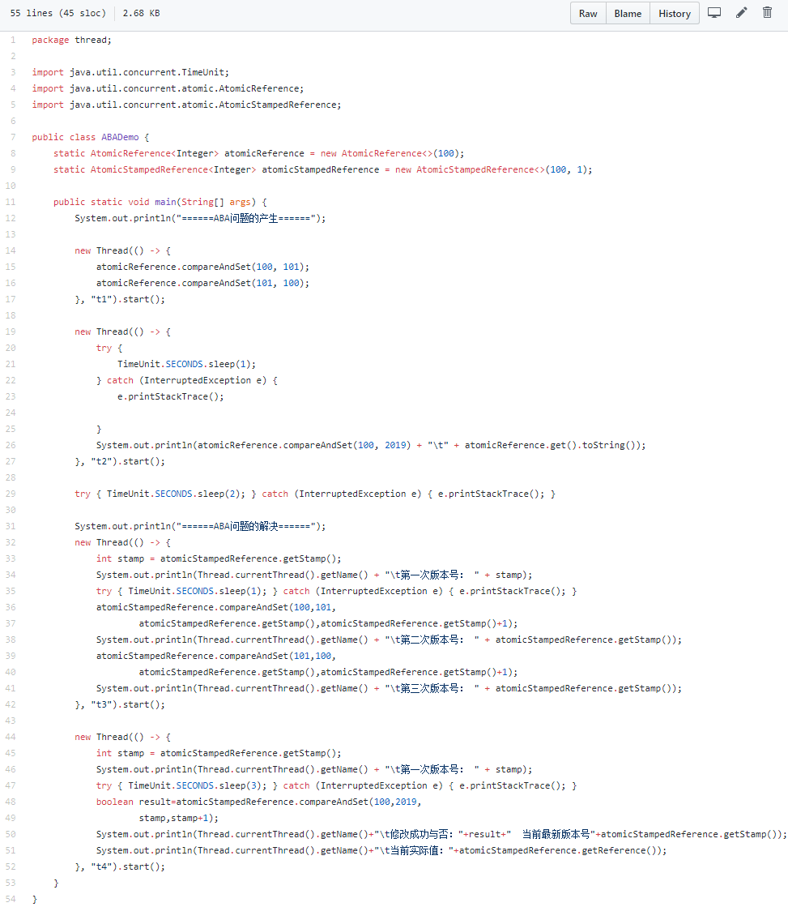
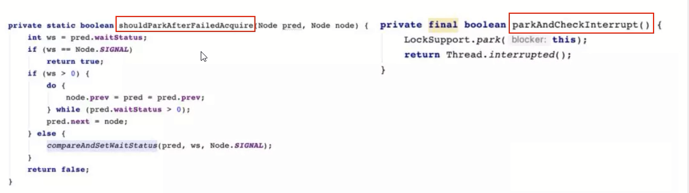

# 多线程-整理总结20210316
- JUC编程  特性: 原子性 可见性 有序性
    - 基本概念
        - 多线程为什么重要
            - 硬件-摩尔定律失效(单核CPU主频不再翻倍,采用多核方案)
            - 软件-高并发系统需处理异步+回调等生产需求
        - 进程 是程序的⼀次执⾏
            - 是系统进⾏资源分配和调度的独⽴单位
            - 每⼀个进程都有它⾃⼰的内存空间和系统资源
        - 线程 是进程内的一个任务
            - 在同⼀个进程内可以执⾏多个任务，每⼀个任务我们就可以看做是⼀个线程
            - **用户线程**
                - 是系统的工作线程，它会完成这个程序需要完成的业务操作
            - **GC守护线程**
                - 是一种特殊的线程，在后台默默地完成一些系统性的服务，比如垃圾回收线程
        - 管程 是线程执行方法需要持有的凭证(设置了访问标识)
            - Monitor(监视器)，也就是我们平时所说的锁
            - 如果线程设置了访问标识就需要先持有管程才能执行方法
        - 线程异步编排
            - FutureTask  Future和Callable接口
                - get()方法不管是否计算完成都会导致阻塞,实际使用必须加过期时间
                - isDone()轮询会耗费无谓的CPU资源，不能及时地得到计算结果
            - CompletableFuture和CompletionStage
                - Java8引入了CompletableFuture，它是Future的功能增强版
                - 可以传入回调对象，当异步任务完成或者发生异常时，自动调用回调对象的回调方法
                - 有点说明
                    - 异步任务结束时，会自动回调某个对象的方法；
                    - 异步任务出错时，会自动回调某个对象的方法；
                    - 主线程设置好回调后，不再关心异步任务的执行，异步任务之间可以顺序执行
                - runAsync 无 返回值
                    - public static CompletableFuture<Void> runAsync(Runnable runnable)
                    - public static CompletableFuture<Void> runAsync(Runnable runnable,Executor executor)
                - supplyAsync 有 返回值
                    - public static <U> CompletableFuture<U> supplyAsync(Supplier<U> supplier)
                    - public static <U> CompletableFuture<U> supplyAsync(Supplier<U> supplier,Executor executor)
    - 特性分析
        - 1.谈谈对volatile理解
            - Volatile是JVM提供的 **轻量级** 的同步机制
                - **保证可见性**
                - **不保证原子性**
                - **禁止指令重排**
            - 场景
                - 项目中，使用全局变量，全部都可以加上volatile
            - JMM Java内存模型
                - 描述
                    - 指Java内存模型，不是Java内存布局，不是所谓的栈、堆、方法区。
                    - 每个Java线程都有自己的工作内存。操作数据，首先从主内存中读，得到一份拷贝，操作完毕后再写回到主内存。 
                    - JMM可能带来 **可见性、原子性和有序性问题** 。所谓可见性，就是某个线程对主内存内容的更改，应该立刻通知到其它线程。原子性是指一个操作是不可分割的，不能执行到一半，就不执行了。所谓有序性，就是指令是有序的，不会被重排。
                - 可见性
                    - 说明
                        - 对变量添加Volatile修饰,某个线程对变量的修改，会立刻反映到主内存上。
                    - 代码图示
                        -  
                    - 代码实例
                        - package thread;
                        - import java.util.concurrent.TimeUnit;
                        - import java.util.concurrent.atomic.AtomicInteger;
                        - public class VolatileDemo {
                        - public static void main(String[] args) {
                        - volatileVisibilityDemo();
                        - atomicDemo();
                        - }
                        - private static void atomicDemo() {
                        - System.out.println("原子性测试");
                        - MyData myData=new MyData();
                        - for (int i = 1; i <= 20; i++) {
                        - new Thread(()->{
                        - for (int j = 0; j <1000 ; j++) {
                        - myData.addPlusPlus();
                        - myData.addAtomic();
                        - }
                        - },String.valueOf(i)).start();
                        - }
                        - while (Thread.activeCount()>2){
                        - Thread.yield();
                        - }
                        - System.out.println(Thread.currentThread().getName()+"\t int type finally number value: "+myData.number);
                        - System.out.println(Thread.currentThread().getName()+"\t AtomicInteger type finally number value: "+myData.atomicInteger);
                        - }
                        - //volatile可以保证可见性，及时通知其它线程主物理内存的值已被修改
                        - private static void volatileVisibilityDemo() {
                        - System.out.println("可见性测试");
                        - MyData myData=new MyData();//资源类
                        - //启动一个线程操作共享数据
                        - new Thread(()->{
                        - System.out.println(Thread.currentThread().getName()+"\t come in");
                        - try {
                        - TimeUnit.SECONDS.sleep(3);
                        - myData.setTo60();
                        - System.out.println(Thread.currentThread().getName()+"\t update number value: "+myData.number);
                        - }catch (InterruptedException e)
                        - {
                        - e.printStackTrace();
                        - }
                        - },"AAA").start();
                        - while (myData.number==0){
                        - //main线程持有共享数据的拷贝，一直为0
                        - }
                        - System.out.println(Thread.currentThread().getName()+"\t mission is over. main get number value: "+myData.number);
                        - }
                        - }
                        - class MyData{
                        - int number=0;
                        - //volatile int number=0;
                        - AtomicInteger atomicInteger=new AtomicInteger();
                        - public void setTo60(){
                        - this.number=60;
                        - }
                        - //此时number前面已经加了volatile，但是不保证原子性
                        - public void addPlusPlus(){
                        - number++;
                        - }
                        - public void addAtomic(){
                        - atomicInteger.getAndIncrement();
                        - }
                        - }
                - 原子性
                    - number++在多线程中就算加了volatile也不是安全的，如何不加synchronized解决？
                        - 第一种加sync关键字
                        - 第二种使用java.util.concurrent.AtomicInteger(原子类)
                - 有序性
                    - 图示说明
                        -  
                    - 如何保证有序性
                        - **volatile** 可以保证有序性，也就是 **防止指令重排序** 。所谓指令重排序，就是出于优化考虑，CPU执行指令的顺序跟程序员自己编写的顺序不一致。就好比一份试卷，题号是老师规定的，是程序员规定的，但是考生（CPU）可以先做选择，也可以先做填空。
                    - 实践:单例模式的安全问题
                        - 需要给singletonDemo添加Volatile 
                    - 禁止指令重排底层原理
                        - 由于编译器和处理器都能执行指令重排优化。如果在指令间插入一条Memory Barrier则会告诉编译器和CPU，不管什么指令都不能和这条Memory Barrier指令重排，也就是说 **通过插入内存屏障，就能禁止在内存屏障前后的指令执行重排优化** 。内存屏障另外一个作用就是强制刷出各种CPU的缓存数据，因此任何CPU上的线程都能读取到这些数据的最新版本。
        - 2.CAS (Compare And Swap)
            - CAS (比较并交换)
                - 一种重要的同步思想。如果主内存值跟期望值一样，就进行修改否则一直重试，直到一致为止 
            - CAS底层原理  为什么不用synchronized也能实现++操作？
                - 原子类底层由Unsafe类实现,Unsafe类使用了自旋锁 
            - CAS的缺点
                - 是一种自旋锁
                - 循环时间长，开销大
                - 只能保证一个共享变量的原子操作
                - 会引出ABA问题
        - 3.ABA问题-原子更新引用
            - ABA问题的产生
                - CAS只注重头和尾，只要 **首尾一致** 就接受。但是有的需求还看重过程，中间不能发生任何修改，这就引出了AtomicReference原子引用
                - 所谓ABA问题，就是比较并交换的循环，存在一个时间差，而这个时间差可能带来意想不到的问题。比如 **线程T1将值从A改为B，然后又从B改为A** 。 **线程T2看到的就是A** ，但是却不知道这个A发生了更改。 **尽管线程T2 CAS操作成功，但不代表就没有问题** 。
            - 原子引用
                - AtomicReference类 
            - ABA问题的解决
                - 使用AtomicStampedReference类解决ABA问题
                - 原理是使用乐观锁,通过版本号或时间戳比较实现写时复制
                - 这个类维护了“版本号”Stamp，在进行CAS操作的时候，不仅要比较当前值，还要比较版本号。只有两者都相等时才执行更新操作。代码实例: 
        - 4.集合类不安全问题
            - List---ArrayList是线程不安全的，编写一个案例并提供解决方案
                - 分析
                    -  
                - 解决方案
                    - 使用Vector（ArrayList所有方法加synchronized，重量级锁）
                    - 使用Collections.synchronizedList()转换成线程安全类
                    - 使用java.util.concurrent.CopyOnWriteArrayList（写时复制-推荐）
                - CopyOnWriteArrayList实现
                    - 这是JUC类，通过 **写时复制** 来实现 **读写分离** 。其源码如add()方法，就是先复制一个新数组，长度为原数组长度+1，然后将新数组最后一个元素设为添加的元素。 
            - Set---HashSet和TreeSet都是线程不安全的,底层维护CopyOnWriteArrayList
                - HashSet与HashMap
                    - HashSet底层是用HashMap实现的
                    - HashMap.put()需要传两个参数，而HashSet.add()只传一个参数.实际上HashSet.add()就是调用的HashMap.put()，只不过Value被写死了，是一个 **Private Static Final Object** 对象。
                - HashMap
                    - HashMap是线程不安全的，Hashtable是线程安全的，但是跟Vector类似，太重量级。
                    - 所以也有类似CopyOnWriteMap，只不过叫ConcurrentHashMap。
            - java.util.concurrent.CopyOnWrite 实现安全集合类
                -  
        - 5.公平锁/非公平锁/可重入锁/递归锁/自旋锁的理解
            - 悲观锁/乐观锁
                - 悲观锁
                    - 适合写操作多的场景，先加锁可以保证写操作时数据正确
                    - 显式的锁定之后再操作同步资源
                - 乐观锁
                    - 适合读操作多的场景，不加锁的特点能够使其读操作的性能大幅提升
                    - 本质没有锁、效率比较高、无阻塞
                    - 一般有两种实现方式  版本号/CAS
                        - 采用版本号机制
                        - CAS（Compare-and-Swap，即比较并替换）算法实现
            - 对象锁/类锁
                - 
            - 公平锁/非公平锁
                - 概念
                    - **公平锁** 是多个线程按照申请锁的顺序来获取锁，类似排队先到先得
                    - **非公平锁** 是多个线程抢夺锁，会导致优先级反转或饥饿现象
                - 区别
                    - **公平锁** 在获取锁时 先查看此锁维护的等待队列，为空或者当前线程是等待队列的队首，则直接占有锁，否则插入到等待队列， **FIFO原则** 。
                    - **非公平锁** 比较粗鲁，上来直接先尝试占有锁，失败再插入队列。非公平锁的优点是吞吐量比公平锁更大。
                - 实例
                    - **synchronized** 是非公平锁
                    - juc. **ReentrantLock** 默认是非公平锁,ReentrantLock在构造时传入true则是公平锁
            - 可重入锁/递归锁
                - 概念
                    - 可重入锁又叫递归锁,
                    - 指的 **同一个线程** 在外层方法获得锁时，进入内层方法会自动获取锁。
                    - 线程可以进入任何一个它已经拥有锁的代码块。比如get方法里面有set方法，两个方法都有同一把锁，得到了get的锁，就自动得到了set的锁. **优点是可以避免死锁的问题**
                - 实例:ReentrantLockDemo
                    -  
            - 自旋锁
                - 概念
                    - 自旋锁就是尝试获取锁的线程不会立即阻塞，而是采用循环的方式去尝试获取。
                    - 自己在那儿一直循环获取，就像“自旋”一样。CAS底层的getAndAddInt就是自旋锁思想
                    - **优点是** 减少线程切换的上下文开销
                    - **缺点是** 循环会消耗CPU
                - 实例
                    - 获取锁的时候，如果原子引用为空就获取锁，不为空表示有人获取了锁，就循环尝试。 
            - 独占锁（写锁）/共享锁（读锁）/互斥锁
                - 概念
                    - **独占锁** ：指该锁一次只能被一个线程持有
                    - **共享锁** ：该锁可以被多个线程持有
                - 举例
                    - juc. **ReentrantLock** 和 **synchronized** 都是独占锁
                    - juc. **ReentrantReadWriteLock** 其读锁是共享锁而写锁是独占锁。读锁的共享可保证并发读是非常高效的，读写、写读和写写的过程是互斥的。
                    - 例如缓存需要读写锁来控制。缓存就是一个键值对，读的get方法使用了ReentrantReadWriteLock. **ReadLock** (),写的put方法使用了ReentrantReadWriteLock. **WriteLock** (),这样避免了写被打断，实现了多个线程同时读 .下面Demo模拟了缓存的读写操作
                - 实例
                    -  
            - Synchronized和Volatile的区别
                - volatile是将要使用工作内存中的变量值时从主内存中读取；synchronized是锁定当前变量，只有当前线程可以访问到该变量，其他的线程将会被阻塞
                - volatile仅使用在变量上,synchronized可以使用在变量、方法、类
                - volatile仅实现变量的修改可见性,synchronized可以保证变量的修改可见性以及原子性
                - volatile不会造成线程阻塞,而synchronized可能会造成线程阻塞
            - Synchronized和Lock的区别
                - 1.原始构成： **sync是JVM关键字** ，底层通过monitorenter和monitorexit来实现的。 **Lock是JDK API层面的** 。（sync一个enter会有两个exit，一个是正常退出，一个是异常退出）
                - 2.使用方法：sync不需要手动释放锁，而Lock需要 **手动释放**
                    - synchronized在发生异常时会自动释放线程占有的锁，因此不会导致死锁现象发生；Lock在发生异常时如果没有主动通过unLock()去释放锁很可能造成死锁现象，因此使用Lock时需要在finally块中释放锁
                - 3.是否可中断：sync **不可中断** ，除非抛出异常或者正常运行完成。Lock是可中断的，通过调用interrupt()方法。
                - 4.是否为公平锁：sync只能是 **非公平锁** ，而Lock能是公平锁，也能是非公平锁。
                - 5.绑定多个条件：sync不能，只能随机唤醒。而Lock可以通过Condition来绑定多个条件， **精确唤醒**
        - 6. **CountDownLatch** / **CyclicBarrier** / **Semaphore** 使用过吗？
            - CountDownLatch 倒计时器
                - 概念
                    - 让一些线程堵塞直到另一个线程完成一系列操作后才被唤醒
                    - 一个非常实用的 **多线程控制工具类** ,内部维护了一个计数器，只有当计数器==0时，某些线程才会停止阻塞开始执行.主要有两个方法， **countDown()** 来让计数器-1， **await()** 来让线程阻塞。当count==0时，阻塞线程自动唤醒。
                - 故事举例
                    - 班长关门
                        - main线程是班长，6个线程是学生。只有6个线程运行完毕，都离开教室后，main线程班长才会关教室门。
                    - 秦灭六国
                        - 只有6国都被灭亡后（执行完毕），main线程才会显示“秦国一统天下”
                - 代码实现
                    -  
            - CyclicBarrier 屏障
                - 概念
                    - **CountDownLatch** 是减，而 **CyclicBarrier** 是加
                    - CyclicBarrie字面上就是 **可循环使用的屏障**
                    - 当一组线程得到一个屏障（同步点）时被阻塞，直到最后一个线程到达屏障时，屏障才会打开，所有被屏障拦截的线程才会继续工作。进入屏障通过await()方法。
                - 故事举例
                    - 集齐7颗龙珠才能召唤神龙
                - 代码实现
                    -  
            - Semaphore 信号量
                - 概念
                    - **CountDownLatch** 不可复用， **Semaphore** 可以
                    - 主要用于两个目的，一个是多个共享资源的互斥使用，一个是并发线程数的控制。
                    - 需要用到Semaphore. **accquire()** 和Semaphore. **release()** 方法。
                - 故事举例
                    - 停车位停车
                        - 3个停车位6辆车，对于CountDownLatch只能停3辆车，而Semaphore可以停6辆车，车位空出来后，其它车可以占有，
                - 代码实现
                    -  
        - 7.谈谈阻塞队列
            - 概念
                - 当阻塞队列为空时 **'获取-take'** 操作是阻塞的
                - 当阻塞队列为满时 **'添加-put '** 操作是阻塞的 
            - 好处
                - 1.阻塞队列不用手动控制线程什么时候该被阻塞，什么时候该被唤醒，简化了操作
                - 2. 防止队列容器溢出，防止数据丢失
            - 注意
                - 消费者消费信息后，一定要删除队列中的数据
            - 体系
                - Collection-->Queue--> **BlockingQueue** -->7个实现类
                    - **ArrayBlockingQueue** ： 由 **数组** 结构组成的 **有界** 阻塞队列
                    - **LinkedBlockingQueue** ： 由 **链表** 结构组成的 **有界** 阻塞队列。
                    - PriorityBlockingQueue： 支持优先级排序的无界阻塞队列
                    - DelayQueue： 使用优先级队列实现的延迟无界阻塞队列
                    - **SynchronousQueue** ： 单个元素的队列
                    - LinkedTransferQueue： 由链表组成的无界阻塞队列
                    - LinkedBlockingDeque： 有链表组成的双向阻塞队列
                - **ArrayBlockingQueue** - **LinkedBlockingQueue** - **SynchronousQueue** 用得比较多,许多消息中间件底层就是用它们实现的.
                - 需要注意的是 **LinkedBlockingQueue** 虽然是有界的，但有个巨坑，其默认大小是Integer.MAX_VALUE，高达21亿，一般情况下内存早爆了（在线程池的ThreadPoolExecutor有体现）
                - **BlockingQueue核心方法** 插入-取出-队首
                    - **抛出异常** 是指当队列满时，再次插入会抛出异常
                    - **返回布尔** 是指当队列满时，再次插入会返回false
                    - **阻塞** 是指当队列满时，再次插入会被阻塞，直到队列取出一个元素，才能插入
                    - **超时** 是指当一个时限过后，才会插入或者取出 
                - BlockingQueue 代码实现
                    -  
            - 应用场景
                - 生产者消费者模式
                    - 传统版 ProdCons_TradDemo
                        - 传统模式使用Lock来进行操作，需要手动加锁-解锁 
                    - 阻塞队列版 ProdCons_QueueDemo
                        -  
                - 线程池 (下面详细说明)
                - 消息中间件
        - 8.线程池用过吗？ThreadPoolExecutor谈谈你的理解？
            - 概念
                - 线程池主要是控制运行线程的数量，将待处理任务放到等待队列，然后创建线程执行这些任务。如果超过了最大线程数，则等待。
            - 好处
                - **线程复用** ：不用一直new新线程，重复利用已经创建的线程来降低线程的创建和销毁开销，节省系统资源。
                - **提高响应速度** ：当任务达到时，不用创建新的线程，直接利用线程池的线程。
                - **管理线程** ：可以控制最大并发数，控制线程的创建等。
            - 体系结构
                - Executor→ExecutorService→AbstractExecutorService→ThreadPoolExecutor
                - **ThreadPoolExecutor** 是线程池创建的核心类。
                - 类似Arrays、Collections工具类，Executor也有自己的工具类 **Executors** 
            - 四种常用创建方式
                - newFixedThreadPool：使用LinkedBlockingQueue实现 **定长** 线程池 
                - newSingleThreadExecutor：使用LinkedBlockingQueue实现一池只有一个线程 
                - newCachedThreadPool：使用SynchronousQueue实现 **变长** 线程池 
                - newScheduledThreadPool :   创建一个定长线程池，支持定时及周期性任务执行
            - 线程池的七个参数
                - 描述
                    - corePoolSize：线程池中常驻的核心线程数
                    - > 实际运行线程数
                    - maxiumPoolSize：能够容纳的最大线程数，必须大于等于1。
                    - > 线程池最多创建多个线程
                    - keepAliveTime：多余空闲线程的存活时间。当前线程数量超过corePoolSize时，当空闲时间达到keepAliveTime时，多余线程会被销毁直到只剩下corePoolSize个线程位置。
                    - unit：keepAliveTime的单位
                    - workQueue：任务队列，被提交但未被执行的任务
                    - threadFactory：生成线程池中工作线程的线程工厂，用于创建线程，默认即可。
                    - handler：拒绝策略，当队列满了且工作线程大于等于最大线程数时如何拒绝请求
                - 图示说明
                    -  
                - 故事 线程池创建参数像一个银行
                    - **corePoolSize** 就像银行的“当值窗口“，比如今天有2位柜员在受理客户请求（任务）。如果超过2个客户，那么新的客户就会在等候区（等待队列 **workQueue** ）等待。当等候区也满了，这个时候就要开启“加班窗口”，让其它3位柜员来加班，此时达到最大窗口 **maximumPoolSize** 为5个。如果开启了所有窗口，等候区依然满员，此时就应该启动”拒绝策略“ **handler** ，告诉不断涌入的客户，叫他们不要进入，已经爆满了。由于不再涌入新客户，办完事的客户增多，窗口开始空闲，这个时候就通过 **keepAlivetTime** 将多余的3个”加班窗口“取消，恢复到2个”当值窗口“。
            - 为什么选用阻塞队列
                - 等待核心线程数执行任务，等到核心线程数释放资源后，可以复用资源
            - 线程池底层原理
                - 原理图
                    -  
                - 流程图
                    -  
        - 9.生产上如何设置线程池参数？拒绝策略怎么配？
            - 谈谈拒绝策略
                - 概念
                    - 当达到最大线程数且等待队列满时，就要启用拒绝策略。
                - JDK的四种拒绝策略
                    - AbortPolicy(默认):直接抛出RejectedException异常,阻止系统正常运行
                    - CallerRunsPolicy:不会抛弃任务也不会抛出异常，而是回退给调用者
                    - DiscardOldestPolicy:丢弃等待最久的任务,然后把当前任务加入队列中
                    - DiscardPolicy：直接丢弃任务，不做任何处理。
                - 以上四种内置策略均实现了RejectedExecutionHandler接口
            - 实际生产使用哪一个线程池 , **单一** 、 **固定** 、 **可变** 哪个用得最多？大坑
                - 答案是一个都不用，生产中用自己定义的
                    - 通过ThreadPoolExecutor的7个参数自定义线程池 
                - JDK已经提供给你了，为什么不用？
                    - FixedThreadPool和SingleThreadExecutor底层都是用LinkedBlockingQueue实现的
                    - 坑就在LinkedBlockingQueue的最大长度是21亿，会导致OOM。
            - 工作中如何使用线程池的？自己如何定义一个线程池？
                - 自己用ThreadPoolExecutor创建
            - 合理配置线程池参数你是如何考虑的？
                - CPU密集型
                    - 代码不会产生阻塞
                    - 对于CPU密集型任务，最大线程数是CPU线程数+1
                - IO密集型
                    - 1. 对于IO密集型任务，可能回导致IO阻塞，尽量多配点，
                    - 2.为了不浪费资源，可以是CPU线程数*2，或者CPU线程数/(1-阻塞系数)
        - 10.死锁编码及定位分析
            - 产生死锁的原因
                - 系统资源不足
                - 进程运行推进顺序不对
                - 资源分配不当
            - 解决
                - jps命令定位进程号 
                    -  
                - jstack找到死锁查看
                    - **jstack 9688** 
    - 多线程编程
        - AQS  抽象 队列 同步器
            - 是什么: AbstractQueuedSynchronizer **抽象 队列 同步器**
                - 图示说明
                    - 类图
                        - 通常地: AbstractQueuedSynchronizer简 称为AQS 
                    - 概念图
                        -  
                - 技术翻译
                    - 是用来构建锁或者其它同步器组件的 **重量级基础框架及整个JUC体系的基石**
                    - 通过内置的 **FIFO队列** 来完成资源获取线程的排队工作
                    - 通过一个 **int类变量** 表示持有锁的状态 
            - 为什么是JUC重要基石: 是JUC包多个类的同步器
                - ReentrantLock
                    -  
                - CountDownLatch
                    -  
                - ReentrantReadWriteLock
                    -  
                - Semaphore
                    -  
            - 怎么实现: 使用volatile修饰的Int类的state变量 + CLH变种的双端队列
                - AQS使用一个volatile的int类型的成员变量来表示同步状态
                - 通过CAS完成对State值的修改
                - 通过内置的 FIFO队列来完成资源获取的排队工作将每条要去抢占资源的线程封装成 一个Node节点来实现锁的分配 
            - AQS内部体系架构 (Node类在AQS类内部)
                - 结构图示
                    -   
                - 属性图示
                    -   
            - 底层是怎么排队的: 用LockSupport.pork()来进行排队的
            - 从ReentrantLock解读AQS
                - Lock与AQS类图
                    -  
                - ReentrantLock源码看公平锁与非公平锁
                    - ReentrantLock的公平锁与非公平锁
                        -  
                    - 公平锁与非公平锁
                        - hasQueuedPredecessors()用来判断线程需不需要排队 
                    - ReentrantLock加锁过程
                        - **尝试获取锁** tryAcquire()
                            - 获取锁失败情况
                                - 锁已经被其它线程获取
                                - 锁没有被其它线程获取,但当前线程需要排队
                                - CAS失败,过程中有其它线程拿到锁了
                            - 锁为自由状态(c == 0),不能说明可以执行CAS获取锁
                                - 因为可能当前线程获取锁之前,已经有其它线程在排队了
                                - 必须遵循先来后到后去锁,调用hasQueuePredecessors方法查看自己是否需要排队
                        - **获取锁失败,线程入队列**
                        - **线程入队列,进入阻塞状态**
                - AQS源码分析
                    - **lock()** ->  调用 acquire() 抢占资源
                        -  
                    - acquire()  -> 调用 tryAcquire()  获取锁实现类
                        -   
                    - tryAcquire(arg) -> nonfairTryAcquire() 获取非公平锁
                        - fairTryAcquire(acquires)  公平
                        - nonfairTryAcquire(acquires) 非公平 
                    - nonfairTryAcquire(acquires) ->  addWaiter() 添加等待
                        - 源码解析 获取锁成功返回True , 否则返回false
                            -  
                        - return true;  尝试获取锁成功, 结束
                        - return false; 继续推进条件,走下一步方法addWaiter()
                    - addWaiter(Node.EXCLUSIVE) ->  acquireQueued() 获取队列
                        - 方法说明
                            - 双向链表中第一个节点为虚节点(哨兵节点),并不存储任何信息只是占位
                            - 真正的第一个有数据的节点，是从第二个节点开始
                        - 源码解析    创建新节点 / 更新队列指针
                            - 如果队列为空就创建新节点 enq() , 否则更新指针 prev -> compareAndSetTail -> next 
                        - enq(node);  创建一个虚节点(哨兵节点)
                            -  
                    - acquireQueued(addWaiter(Node.EXCLUSIVE), arg)  添加到队列
                        - 源码解析 再抢锁 / 阻塞当前线程
                            - 如果前节点是头则再尝试抢锁并替换节点
                            - 抢锁失败尝试添加到阻塞队列 
                        - shouldParkAterFailedAcquire()  parkACI() 添加到等待队列
                            - 更新节点指针, LockSupport.part停止当前线程 
                            - shouldParkAterFailedAcquire() 解析
                                -   
                            - parkAndCheckInterrupt() 解析
                                -  
                    - **unlock()** ->  sync.release(1);  -> tryRelease(arg) -> unparkSuccessor
                        - 更新state状态,更新队列状态 
                - AQS里面有个变量叫State，它的值有几种
                    - 3个状态：没占用是0，占用了是1，大于1是可重入锁
                - 如果AB两个线程进来了以后，请问这个总共有多少个Node节点
                    - 3个 , 前哨节点 + 阻塞的线程节点
        - 创建线程方式
            - 继承Thread类 重写run方法(不推荐-单继承局限性)
            - 实现runnable 接口 (推荐)
            - 实现Callable接口  Future 创建线程
        - 五种状态
            - 通俗图示
                -  
            - 详情图示
                -  
        - 线程调度算法是什么
            - 分时调度模型
                - 指让所有的线程轮流获得 CPU 的使用权,并且平均分配每个线程占用的 CPU 的时间片这个也比较好理解
            - 抢占式调度模型 (JVM采用)
                - 指优先让可运行池中优先级高的线程占用 CPU ，如果可运行池中的线程优先级相同，那么就随机选择一个线程，使其占用 CPU 。处于运行状态的线程会一直运行，直至它不得不放弃 CPU
        - 守护线程与非守护线程
            - 守护线程：
                - 和main相关；如gc()线程
                - 代码：setDeamon(true)
                - 实例：
                    - 迅雷下载（应用关闭，后台可以继续下载）
            - 用户线程
                - 用户自己创建的线程，如果主线程停止，不影响它
        - 线程通信
            - Synchronized (wait-notify一定要一起用)
                - 代码图示
                    -  
                - wait :等待  ：释放当前锁对象
                - notify：唤醒：唤醒等待的线程
            - Lock
                - 代码图示
                    -  
                - await   等待
                - signal   唤醒
            - LockSupport 可以先唤醒再等待
                - 说明
                    -   
                - 代码图示
                    -  
                - park   等待
                - unpark   唤醒
            - join方法
                - A让B执行完，再执行；优先级设定
                - 代码：
                    -  
            - wait 和join的区别
                - 1.wait 需要唤醒，join 不需要
                - 2.wait 需要用在同步代码中
            - wait和sleep的区别
                - wait 需要释放锁，sleep不用
            - wait 和notify放到Object类中
                - 因为他们需要对象的锁，而Object是很多对象的父类