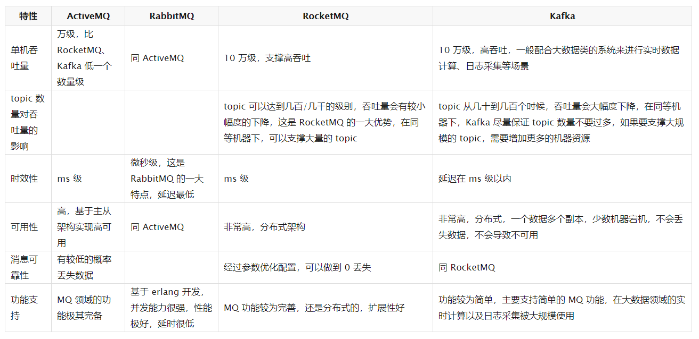
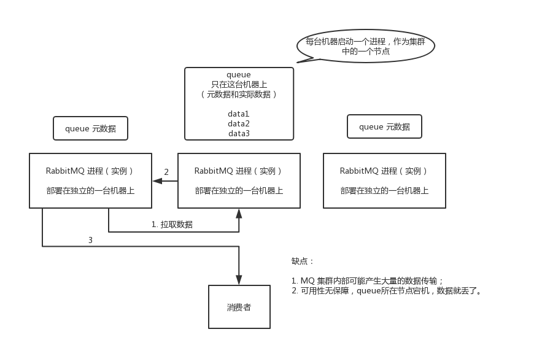
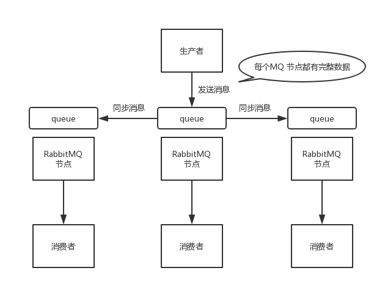
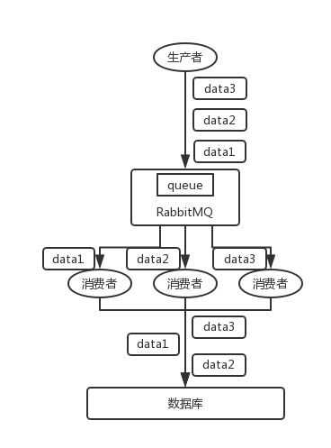
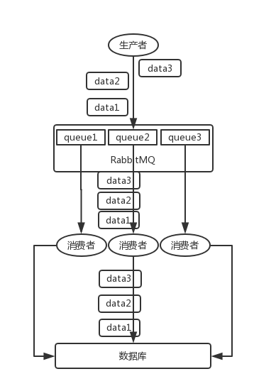

# 消息队列-总结整理20190827
- 使用场景
    - 应用解耦
    - 异步处理
    - 流量削峰
    - 消息通讯
    - 日志处理
        -  [http://www.demodashi.com/demo/10181.html]("http://www.demodashi.com/demo/10181.html")
- 分析对比
    - **ActiveMQ**
        - **最早** **性能较差** **社区也不是很活跃**
    - **RabbitMQ**
        - **Erlang 语言阻** **不可控的状态** **社区活跃度也高** **Spring Cloud**
    - **RocketMQ**
        - **阿里出品** **Java 语言进行实现** **直接使用其云服务**
        - **暂未提供比较好的中文文档** **书籍**
    - **总结**
        - 所以中小型公司，技术实力较为一般，技术挑战不是特别高，用 RabbitMQ 是不错的选择
        - 大型公司，基础架构研发实力较强，用 RocketMQ 是很好的选择。当然，中小型公司使用 RocketMQ 也是没什么问题的选择，特别是以 Java 为主语言的公司。
        - 如果是大数据领域的实时计算、日志采集等场景，用 Kafka 是业内标准的，绝对没问题，社区活跃度很高，绝对不会黄，何况几乎是全世界这个领域的事实性规范。
        - 另外，目前国内也是有非常多的公司将 Kafka 应用在业务系统中例如唯品会-陆金所-美团等等 
- 注意事项
    - 系统可用性降低。
        - 引入的依赖越多越容易挂掉,消息队列一定要做高可用
    - 系统复杂度提高。
        - 消息怎么不重复消息
        - 消息怎么保证不丢失
        - 需要消息顺序的业务场景
    - 一致性问题。
        - A 系统处理完了直接返回成功了，人都以为你这个请求就成功了。但是问题是，要是 B、C。D 三个系统那里，B、D 两个系统写库成功了，结果 C 系统写库失败了，咋整？你这数据就不一致了。当然，这不仅仅是 MQ 的问题，引入 RPC 之后本身就存在这样的问题。如果我们在使用 MQ 时，一定要达到数据的最终一致性。即，C 系统最终执行完成。
- 投递方式
    - Push 推送
        - 优点---及时性。
        - 缺点---就是受限于消费者的消费能力，可能造成消息的堆积，Broker 会不断给消费者发送不能处理的消息
    - Pull   拉取
        - 优点---就是主动权掌握在消费方，可以根据自己的消息速度进行消息拉取
        - 缺点---就是消费方不知道什么时候可以获取的最新的消息，会有消息延迟和忙等
    - 目前的消息队列是push + pull 模式结合的方式，Broker 仅仅告诉 Consumer 有新的消息，具体的消息拉取还是 Consumer 自己主动拉取
- 消费语义
    - 消息至多被消费一次（At most once）
        - 消息可能会丢失，但绝不重传
        - 适合能容忍丢消息的业务
        - 设计步骤
            - Producer 发送消息到 Message Broker 阶段
                - Producer 发消息给Message Broker 时，不要求 Message Broker 对接收到的消息响应确认，Producer 也不用关心 Message Broker 是否收到消息了。
            - Message Broker 存储/转发阶段
                - 对 Message Broker 的存储不要求持久性。
                - 转发消息时，也不用关心 Consumer 是否真的收到了。
            - Consumer 消费阶段
                - Consumer 从 Message Broker 中获取到消息后，可以从 Message Broker 删除消息。
                - 或 Message Broker 在消息被 Consumer 拿去消费时删除消息，不用关心 Consumer 最后对消息的消费情况如何。
    - 消息至少被消费一次（At least once）
        - 消息可以重传，但绝不丢失
        - 适合不能容忍丢消息，允许重复消费的业务
        - 设计步骤
            - Producer 发送消息到 Message Broker 阶段
                - Producer 发消息给 Message Broker ，Message Broker 必须响应对消息的确认。
            - Message Broker 存储/转发阶段
                - Message Broker 必须提供持久性保障。
                - 转发消息时，Message Broker 需要 Consumer 通知删除消息，才能将消息删除。
            - Consumer消费阶段
                - Consumer 从 Message Broker 中获取到消息，必须在消费完成后，Message Broker上的消息才能被删除。
    - 消息仅被消费一次（Exactly once）
        - 每一条消息只被传递一次
        - 适合对消息消费情况要求非常高的任务，实现较为复杂  
        - 设计步骤
            - Producer 发送消息到 Message Broker 阶段
                - Producer 发消息给 Message Broker 时，Message Broker 必须响应对消息的确认，并且 Producer 负责为该消息产生唯一标识，以防止 Consumer 重复消费（因为 Producer 发消息给Message Broker 后，由于网络问题没收到 Message Broker 的响应，可能会重发消息给到 Message Broker ）。
            - Message Broker 存储/转发阶段
                - Message Broker 必须提供持久性保障
                - 每条消息在其消费队列里有唯一标识（这个唯一标识需要由Producer产生）。
            - Consumer 消费阶段
                - Consumer 从 Message Broker中获取到消息后，需要记录下消费的消息标识，以便在后续消费中防止对某个消息重复消费（比如 Consumer 获取到消息，消费完后，还没来得及从 Message Broker 删除消息，就挂了，这样 Message Broker 如果把消息重新加入待消费队列的话，那么这条消息就会被重复消费了）
- 存储方式
    - **文件系统**
        - 目前业界较为常用的几款产品（RocketMQ / Kafka / RabbitMQ）均采用的是消息刷盘至所部署虚拟机/物理机的文件系统来做持久化（刷盘指的是存储到硬盘,刷盘一般可以分为异步刷盘和同步刷盘两种模式）
        - 消息刷盘为消息存储提供了一种高效率、高可靠性和高性能的数据持久化方式。除非部署 MQ 机器本身或是本地磁盘挂了，否则一般是不会出现无法持久化的故障问题。
    - **分布式KV存储**
        - 这类 MQ 一般会采用诸如 LevelDB 、RocksDB 和 Redis 来作为消息持久化的方式。由于分布式缓存的读写能力要优于 DB ，所以在对消息的读写能力要求都不是比较高的情况下，采用这种方式倒也不失为一种可以替代的设计方案。
    - **关系型数据库 DB**
        - Apache下开源的另外一款MQ—ActiveMQ（默认采用的KahaDB做消息存储）可选用 JDBC 的方式来做消息持久化，通过简单的 XML 配置信息即可实现JDBC消息存储。
        - 由于，普通关 系型数据库（如 MySQL ）在单表数据量达到千万级别的情况下，其 IO 读写性能往往会出现瓶颈。因此，如果要选型或者自研一款性能强劲、吞吐量大、消息堆积能力突出的 MQ 消息队列，那么并不推荐采用关系型数据库作为消息持久化的方案。在可靠性方面，该种方案非常依赖 DB ，如果一旦 DB 出现故障，则 MQ 的消息就无法落盘存储会导致线上故障。
    - **小结**
        - 因此，综合上所述从存储效率来说，文件系统 &gt; 分布式 KV 存储 &gt; 关系型数据库 DB ，直接操作文件系统肯定是最快和最高效的，而关系型数据库 TPS 一般相比于分布式 KV 系统会更低一些（简略地说，关系型数据库本身也是一个需要读写文件 Server ，这时 MQ 作为 Client与其建立连接并发送待持久化的消息数据，同时又需要依赖 DB 的事务等，这一系列操作都比较消耗性能），所以如果追求高效的IO读写，那么选择操作文件系统会更加合适一些。但是如果从易于实现和快速集成来看，文件系统 &gt; 分布式 KV 存储 &gt; 关系型数据库 DB，但是性能会下降很多。
        - 另外，从消息中间件的本身定义来考虑，应该尽量减少对于外部第三方中间件的依赖。一般来说依赖的外部系统越多，也会使得本身的设计越复杂，所以个人的理解是采用文件系统作为消息存储的方式，更贴近消息中间件本身的定义。
- 消息幂等性
    - 原因分析
        - 对 Producer 来说
            - 可能因为网络问题，Producer 重试多次发送消息，实际第一次就发送成功，那么就会产生多条相同的消息
        - 对 Consumer 来说
            - 可能因为 Broker 的消息进度丢失，导致消息重复投递给 Consumer 。
            - Consumer 消费成功，但是因为 JVM 异常崩溃，导致消息消费进度未及时同步
    - 解决方案
        - 框架层统一封装
        - 业务层自己实现
    - 一条数据重复出现两次，数据库里就只有一条数据，这就保证了系统的幂等性
        - 让生产者发送每条数据的时候，里面加一个全局唯一的id，类似订单id之类的东西，然后你这里消费到了之后，先根据这个id去比如redis里查一下，之前消费过吗？如果没有消费过，你就处理，然后这个id写redis。如果消费过了，那你就别处理了，保证别重复处理相同的消息即可
- 消息可靠性
    - RabbitMQ丢消息
        - 生产者弄丢了数据
            - 生产者将数据发送到rabbitmq的时候，可能数据就在半路给搞丢了，因为网络啥的问题，都有可能。
            - 此时可以选择用rabbitmq提供的事务功能，就是生产者发送数据之前开启rabbitmq事务（channel.txSelect），然后发送消息，如果消息没有成功被rabbitmq接收到，那么生产者会收到异常报错，此时就可以回滚事务（channel.txRollback），然后重试发送消息；如果收到了消息，那么可以提交事务（channel.txCommit）。但是问题是，rabbitmq事务机制一搞，基本上吞吐量会下来，因为太耗性能。
            - 所以一般来说，如果你要确保说写rabbitmq的消息别丢，可以开启confirm模式，在生产者那里设置开启confirm模式之后，你每次写的消息都会分配一个唯一的id，然后如果写入了rabbitmq中，rabbitmq会给你回传一个ack消息，告诉你说这个消息ok了。如果rabbitmq没能处理这个消息，会回调你一个nack接口，告诉你这个消息接收失败，你可以重试。而且你可以结合这个机制自己在内存里维护每个消息id的状态，如果超过一定时间还没接收到这个消息的回调，那么你可以重发。
            - 事务机制和cnofirm机制最大的不同在于，事务机制是同步的，你提交一个事务之后会阻塞在那儿，但是confirm机制是异步的，你发送个消息之后就可以发送下一个消息，然后那个消息rabbitmq接收了之后会异步回调你一个接口通知你这个消息接收到了。
            - 所以一般在生产者这块避免数据丢失，都是用confirm机制的。
        - rabbitmq弄丢了数据
            - 就是rabbitmq自己弄丢了数据，这个你必须开启rabbitmq的持久化，就是消息写入之后会持久化到磁盘，哪怕是rabbitmq自己挂了，恢复之后会自动读取之前存储的数据，一般数据不会丢。除非极其罕见的是，rabbitmq还没持久化，自己就挂了，可能导致少量数据会丢失的，但是这个概率较小。
            - 设置持久化有两个步骤，第一个是创建queue的时候将其设置为持久化的，这样就可以保证rabbitmq持久化queue的元数据，但是不会持久化queue里的数据；第二个是发送消息的时候将消息的deliveryMode设置为2，就是将消息设置为持久化的，此时rabbitmq就会将消息持久化到磁盘上去。必须要同时设置这两个持久化才行，rabbitmq哪怕是挂了，再次重启，也会从磁盘上重启恢复queue，恢复这个queue里的数据。
            - 而且持久化可以跟生产者那边的confirm机制配合起来，只有消息被持久化到磁盘之后，才会通知生产者ack了，所以哪怕是在持久化到磁盘之前，rabbitmq挂了，数据丢了，生产者收不到ack，你也是可以自己重发的。
            - 哪怕是你给rabbitmq开启了持久化机制，也有一种可能，就是这个消息写到了rabbitmq中，但是还没来得及持久化到磁盘上，结果不巧，此时rabbitmq挂了，就会导致内存里的一点点数据会丢失。
        - 消费端弄丢了数据
            - rabbitmq如果丢失了数据，主要是因为你消费的时候，刚消费到，还没处理，结果进程挂了，比如重启了，那么就尴尬了，rabbitmq认为你都消费了，这数据就丢了。
            - 这个时候得用rabbitmq提供的ack机制，简单来说，就是你关闭rabbitmq自动ack，可以通过一个api来调用就行，然后每次你自己代码里确保处理完的时候，再程序里ack一把。这样的话，如果你还没处理完，不就没有ack？那rabbitmq就认为你还没处理完，这个时候rabbitmq会把这个消费分配给别的consumer去处理，消息是不会丢的。
    - RocketMQ丢消息
    - Kafka          丢消息
        - 消费端弄丢了数据
            - 唯一可能导致消费者弄丢数据的情况，就是说，你那个消费到了这个消息，然后消费者那边自动提交了offset，让kafka以为你已经消费好了这个消息，其实你刚准备处理这个消息，你还没处理，你自己就挂了，此时这条消息就丢咯。
            - 这不是一样么，大家都知道kafka会自动提交offset，那么只要关闭自动提交offset，在处理完之后自己手动提交offset，就可以保证数据不会丢。但是此时确实还是会重复消费，比如你刚处理完，还没提交offset，结果自己挂了，此时肯定会重复消费一次，自己保证幂等性就好了。
            - 生产环境碰到的一个问题，就是说我们的kafka消费者消费到了数据之后是写到一个内存的queue里先缓冲一下，结果有的时候，你刚把消息写入内存queue，然后消费者会自动提交offset。
            - 然后此时我们重启了系统，就会导致内存queue里还没来得及处理的数据就丢失了
        - kafka弄丢了数据
            - 这块比较常见的一个场景，就是kafka某个broker宕机，然后重新选举partiton的leader时。大家想想，要是此时其他的follower刚好还有些数据没有同步，结果此时leader挂了，然后选举某个follower成leader之后，他不就少了一些数据？这就丢了一些数据啊。
            - 生产环境也遇到过，我们也是，之前kafka的leader机器宕机了，将follower切换为leader之后，就会发现说这个数据就丢了
            - 所以此时一般是要求起码设置如下4个参数：
            - 给这个topic设置replication.factor参数：这个值必须大于1，要求每个partition必须有至少2个副本
            - 在kafka服务端设置min.insync.replicas参数：这个值必须大于1，这个是要求一个leader至少感知到有至少一个follower还跟自己保持联系，没掉队，这样才能确保leader挂了还有一个follower吧
            - 在producer端设置acks=all：这个是要求每条数据，必须是写入所有replica之后，才能认为是写成功了
            - 在producer端设置retries=MAX（很大很大很大的一个值，无限次重试的意思）：这个是要求一旦写入失败，就无限重试，卡在这里了
            - 我们生产环境就是按照上述要求配置的，这样配置之后，至少在kafka broker端就可以保证在leader所在broker发生故障，进行leader切换时，数据不会丢失
        - 生产者会不会弄丢数据
            - 如果按照上述的思路设置了ack=all，一定不会丢，要求是，你的leader接收到消息，所有的follower都同步到了消息之后，才认为本次写成功了。如果没满足这个条件，生产者会自动不断的重试，重试无限次。
- 消息顺序性
    - 场景
        - （1）rabbitmq：一个queue，多个consumer，这不明显乱了
        - （2）kafka：一个topic，一个partition，一个consumer，内部多线程，这不也明显乱了
    - 解决
        - （1）rabbitmq：拆分多个queue，每个queue一个consumer，就是多一些queue而已，确实是麻烦点；或者就一个queue但是对应一个consumer，然后这个consumer内部用内存队列做排队，然后分发给底层不同的worker来处理
        - （2）kafka：一个topic，一个partition，一个consumer，内部单线程消费，写N个内存queue，然后N个线程分别消费一个内存queue即可
- 应对消息积压
    - 步骤
        - 1）先修复consumer的问题，确保其恢复消费速度，然后将现有cnosumer都停掉
        - 2）新建一个topic，partition是原来的10倍，临时建立好原先10倍或者20倍的queue数量
        - 3）然后写一个临时的分发数据的consumer程序，这个程序部署上去消费积压的数据，消费之后不做耗时的处理，直接均匀轮询写入临时建立好的10倍数量的queue
        - 4）接着临时征用10倍的机器来部署consumer，每一批consumer消费一个临时queue的数据
        - 5）这种做法相当于是临时将queue资源和consumer资源扩大10倍，以10倍速度来消费数据
        - 6）等快速消费完积压数据之后，得恢复原先部署架构，重新用原先的consumer机器来消费消息
    - 假设再来第二个坑
        - **TTL**
        - 这个情况下，就不是说要增加consumer消费积压的消息，因为实际上没啥积压，而是丢了大量的消息。我们可以采取一个方案，就是批量重导，这个我们之前线上也有类似的场景干过。就是大量积压的时候，我们当时就直接丢弃数据了，然后等过了高峰期以后，比如大家一起喝咖啡熬夜到晚上12点以后，用户都睡觉了。这个时候我们就开始写程序，将丢失的那批数据，写个临时程序，一点一点的查出来，然后重新灌入mq里面去，把白天丢的数据给他补回来。也只能是这样了。假设1万个订单积压在mq里面，没有处理，其中1000个订单都丢了，你只能手动写程序把那1000个订单给查出来，手动发到mq里去再补一次
    - 再来假设第三个坑
        - 如果走的方式是消息积压在mq里，那么如果你很长时间都没处理掉，此时导致mq都快写满了，咋办？这个还有别的办法吗？没有，谁让你第一个方案执行的太慢了，你临时写程序，接入数据来消费，消费一个丢弃一个，都不要了，快速消费掉所有的消息。然后走第二个方案，到了晚上再补数据吧。
- 设计消息队列
    - **可伸缩性**
    - **落地磁盘**
    - **可用性**
    - （4）能不能支持数据0丢失啊？可以的，参考我们之前说的那个kafka数据零丢失方案其实一个mq肯定是很复杂的，面试官问你这个问题，其实是个开放题，他就是看看你有没有从架构角度整体构思和设计的思维以及能力。确实这个问题可以刷掉一大批人，因为大部分人平时不思考这些东西。
- 实现高可用
    - RabbitMQ高可用
        - **单机模式**
            - Demo级别，一般就是本地启动了测试，没人生产用单机模式
        - **普通集群模式**
            - **cluster&nbsp;&nbsp;**
                -  
            - 普通集群模式，意思就是在多台机器上启动多个 RabbitMQ 实例，每个机器启动一个。
            - 你创建的 queue，只会放在一个 RabbitMQ 实例上，但是每个实例都同步 queue 的元数据（元数据可以认为是 queue 的一些配置信息，通过元数据，可以找到 queue 所在实例）
            - 实际上如果连接到了另外一个实例，那么那个实例会从 queue 所在实例上拉取数据过来
            - **没做到所谓的分布式** **前者有数据拉取的开销，后者导致单实例性能瓶颈**
            - **开启了消息持久化**
            - **这就没有什么所谓的高可用性，这方案主要是提高吞吐量的**
        - **镜像集群模式**
            - **Mirrored queue**
                -  
            - 这种模式，才是所谓的 RabbitMQ 的高可用模式。跟普通集群模式不一样的是，在镜像集群模式下，你创建的 queue，无论元数据还是 queue 里的消息都会存在于多个实例上，就是说，每个 RabbitMQ 节点都有这个 queue 的一个完整镜像，包含 queue 的全部数据的意思。然后每次你写消息到 queue 的时候，都会自动把消息同步到多个实例的 queue 上
            - 如何开启这个镜像集群模式呢,RabbitMQ 有很好的管理控制台，就是在后台新增一个策略，这个策略是镜像集群模式的策略，指定的时候是可以要求数据同步到所有节点的，也可以要求同步到指定数量的节点，再次创建 queue 的时候，应用这个策略，就会自动将数据同步到其他的节点上去了
            - 好处在于，你任何一个机器宕机了，其它机器（节点）还包含了这个 queue 的完整数据，别的 consumer 都可以到其它节点上去消费数据。
            - 坏处在于，第一性能开销太大，消息需要同步到所有机器上，导致网络带宽压力和消耗很重！第二这么配置不是分布式的，就没有扩展性可言了，如果某个 queue 负载很重，你加机器，新增的机器也包含了这个 queue 的所有数据，并没有办法线性扩展你的 queue。你想，如果这个 queue 的数据量很大，大到这个机器上的容量无法容纳了，此时该怎么办呢？
    - Kafka的高可用
        - kafka一个最基本的架构认识：多个broker组成，每个broker是一个节点；你创建一个topic，这个topic可以划分为多个partition，每个partition可以存在于不同的broker上，每个partition就放一部分数据。这就是天然的分布式消息队列，就是说一个topic的数据，是分散放在多个机器上的，每个机器就放一部分数据。
        - 实际上rabbitmq之类的，并不是分布式消息队列，只是是传统的消息队列，只不过提供了一些集群、HA的机制而已，因为无论怎么设置，RabbitMQ一个queue的数据都是放在一个节点里的，镜像集群下，也是每个节点都放这个queue的完整数据。
        - Kafka 0.8以前，是没有HA机制的，就是任何一个broker宕机了，那个broker上的partition就废了，没法写也没法读，没有什么高可用性可言。Kafka 0.8以后，提供了HA机制，就是replica副本机制。每个partition的数据都会同步到吉他机器上，形成自己的多个replica副本。然后所有replica会选举一个leader出来，那么生产和消费都跟这个leader打交道，然后其他replica就是follower。写的时候，leader会负责把数据同步到所有follower上去，读的时候就直接读leader上数据即可。只能读写leader？很简单，要是你可以随意读写每个follower，那么就要care数据一致性的问题，系统复杂度太高，很容易出问题。kafka会均匀的将一个partition的所有replica分布在不同的机器上，这样才可以提高容错性。
        - 这么搞，就有所谓的高可用性了，因为如果某个broker宕机了，没事儿，那个broker上面的partition在其他机器上都有副本的，如果这上面有某个partition的leader，那么此时会重新选举一个新的leader出来，大家继续读写那个新的leader即可。这就有所谓的高可用性了。
        - **写数据的时候，生产者就写leader，然后leader将数据落地写本地磁盘，接着其他follower自己主动从leader来pull数据。一旦所有follower同步好数据了，就会发送ack给leader，leader收到所有follower的ack之后，就会返回写成功的消息给生产者。**
        - 实际上这块机制，讲深了，是可以非常之深入的，但是我还是回到我们这个课程的主题和定位，聚焦面试，至少你听到这里大致明白了kafka是如何保证高可用机制的了，对吧？不至于一无所知，现场还能给面试官画画图。要遇上面试官确实是kafka高手，深挖了问，那你只能说不好意思，太深入的你没研究过。
        - 但是大家一定要明白，这个事情是要权衡的，你现在是要快速突击常见面试题体系，而不是要深入学习kafka，要深入学习kafka，你是没那么多时间的。你只能确保，你之前也许压根儿不知道这块，但是现在你知道了，面试被问到，你大概可以说一说。然后很多其他的候选人，也许还不如你，没看过这个，被问到了压根儿答不出来，相比之下，你还能说点出来，大概就是这个意思了。
- ActiveMQ
    - 单机吞吐量
        - 万级，吞吐量比RocketMQ和Kafka要低了一个数量级
    - 优劣势总结
        - 非常成熟，功能强大，在业内大量的公司以及项目中都有应用
        - 偶尔会有较低概率丢失消息
        - 现在应用越来越少，官方社区现在对ActiveMQ 5.x维护越来越少，几个月才发布一个版本
        - 主要是基于解耦和异步来用的，较少在大规模吞吐的场景中使用
- RabbitMQ
    - 描述
        - 由 Erlang 语言开发的 AMQP 的开源实现
    - 优劣总结评价
        - erlang 语言开发，性能极其好，延时很低；
        - 吞吐量到万级， MQ 功能比较完备
        - 而且开源提供的管理界面非常棒，用起来很好用
        - 社区相对比较活跃，几乎每个月都发布几个版本分
        - 在国内一些互联网公司近几年用 rabbitmq 也比较多一些
        - 但是问题也是显而易见的， RabbitMQ 确实吞吐量会低一些，这是因为他做的实现机制比较重。
        - 而且 erlang 开发，国内有几个公司有实力做 erlang 源码级别的研究和定制？如果说你没这个实力的话，确实偶尔会有一些问题，你很难去看懂源码，你公司对这个东西的掌控很弱，基本职能依赖于开源社区的快速维护和修复 bug 。
        - 而且 rabbitmq 集群动态扩展会很麻烦，不过这个我觉得还好。其实主要是 erlang 语言本身带来的问题。很难读源码，很难定制和掌控。
    - 特点
        - 可靠性（Reliability）
            - **持久化** **传输确认** **发布确认**
        - 灵活的路由（Flexible Routing）
            - 在消息进入队列之前，通过 Exchange 来路由消息的。对于典型的路由功能，RabbitMQ 已经提供了一些内置的 Exchange 来实现。针对更复杂的路由功能，可以将多个 Exchange 绑定在一起，也通过插件机制实现自己的 Exchange 。
        - 消息集群（Clustering）
            - 多个 RabbitMQ 服务器可以组成一个集群，形成一个逻辑 Broker 。
        - 高可用（Highly Available Queues）
            - 队列可以在集群中的机器上进行镜像，使得在部分节点出问题的情况下队列仍然可用。
        - 多种协议（Multi-protocol）
            - **STOMP** **MQTT**
        - 多语言客户端（Many Clients）
            - RabbitMQ 几乎支持所有常用语言，比如 Java、.NET、Ruby 等等。
        - 管理界面（Management UI）
            - RabbitMQ 提供了一个易用的用户界面，使得用户可以监控和管理消息 Broker 的许多方面。
        - 跟踪机制（Tracing）
            - **消息跟踪机制**
        - 插件机制（Plugin System）
            - RabbitMQ 提供了许多插件，来从多方面进行扩展，也可以编写自己的插件。
    - 概念
        - Broker
            - 指一个或多个 erlang node 的逻辑分组，且 node 上运行着 RabbitMQ 应用程序
        - Cluster
            - 在 Broker 的基础之上，增加了 node 之间共享元数据的约束
        - &nbsp;vhost
            - vhost 可以理解为虚拟 Broker ，即 mini-RabbitMQ server 。其内部均含有独立的 queue、exchange 和 binding 等
            - 其拥有独立的权限系统，可以做到 vhost 范围的用户控制。当然，从 RabbitMQ 的全局角度，vhost 可以作为不同权限隔离的手段（一个典型的例子就是不同的应用可以跑在不同的 vhost 中）
        - 死信队列
            - DLX，Dead-Letter-Exchange。利用 DLX ，当消息在一个队列中变成死信（dead message）之后，它能被重新 publish 到另一个 Exchange ，这个 Exchange 就是DLX。消息变成死信一向有一下几种情况：
            - **消息被拒绝**
            - **消息 TTL 过期**
            - **队列达到最大长度**
        - 在非 Cluster 模式下，元数据主要分为
            - Queue 元数据（queue 名字和属性等）
            - Exchange 元数据（exchange 名字、类型和属性等）
            - Binding 元数据（存放路由关系的查找表）
            - Vhost 元数据（vhost 范围内针对前三者的名字空间约束和安全属性设置）
    - 传输方式
        - 由于 TCP 连接的创建和销毁开销较大，且并发数受系统资源限制，会造成性能瓶颈。
        - RabbitMQ 使用信道的方式来传输数据
        - 信道是建立在真实的 TCP 连接内的虚拟连接，且每条 TCP连接上的信道数量没有限制
    - **如何保证消息正确发送消息**
        - **发送方确认模式**
            - **发送方确认模式** **confirm** **递到目的队列** **写入磁盘后**
            - 发送方确认模式是异步的，生产者应用程序在等待确认的同时，可以继续发送消息
            - 当确认消息到达生产者应用程序，生产者应用程序的回调方法就会被触发来处理确认消息
    - 向不存在的exchange发publish消息会发生什么,向不存在的queue执行consume动作会发生什么
        - 都会收到&nbsp;Channel.Close&nbsp;信令告之不存在（内含原因 404 NOT_FOUND）
    - 什么情况下会出现 blackholed 问题
        - blackholed ，对应中文为“黑洞”。
        - blackholed 问题是指，向 exchange 投递了 message ，而由于各种原因导致该 message 丢失，但发送者却不知道。可导致 blackholed 的情况：
        - 1、向未绑定 queue 的 exchange 发送 message 。
        - 2、exchange 以 binding_key key_A 绑定了 queue queue_A，但向该 exchange 发送 message 使用的 routing_key 却是 key_B 。
    - 如何防止出现 blackholed 问题
        - 没有特别好的办法，只能在具体实践中通过各种方式保证相关 fabric 的存在。另外，如果在执行&nbsp;Basic.Publish&nbsp;时设置&nbsp;mandatory=true&nbsp;，则在遇到可能出现 blackholed 情况时，服务器会通过返回&nbsp;Basic.Return&nbsp;告之当前 message 无法被正确投递（内含原因 312 NO_ROUTE）。
    - routing_key 和 binding_key 的最大长度是多少？
        - 255 字节。
    - **如何保证接收方消费了消息**
        - **接收方消息确认机制**
            - **只有消费者确认了消息，RabbitMQ 才能安全地把消息从队列中删除**
            - 这里并没有用到超时机制，RabbitMQ 仅通过 Consumer 的连接中断来确认是否需要重新发送消息。也就是说，只要连接不中断，RabbitMQ 给了 Consumer 足够长的时间来处理消息。
            - 下面罗列几种特殊情况：
            - 如果消费者接收到消息，在确认之前断开了连接或取消订阅，RabbitMQ 会认为消息没有被分发，然后重新分发给下一个订阅的消费者。（可能存在消息重复消费的隐患，需要根据 bizId 去重）
            - 如果消费者接收到消息却没有确认消息，连接也未断开，则 RabbitMQ 认为该消费者繁忙，将不会给该消费者分发更多的消息
    - 如何避免消息重复投递或重复消费
        - 在消息生产时，MQ 内部针对每条生产者发送的消息生成一个 inner-msg-id ，作为去重和幂等的依据（消息投递失败并重传），避免重复的消息进入队列
        - 在消息消费时，要求消息体中必须要有一个 bizId（对于同一业务全局唯一，如支付 ID、订单 ID、帖子 ID 等）作为去重和幂等的依据，避免同一条消息被重复消费。
    - 消息如何分发
        - 若该队列至少有一个消费者订阅，消息将以循环（round-robin）的方式发送给消费者。每条消息只会分发给一个订阅的消费者（前提是消费者能够正常处理消息并进行确认）。
    - 不应该对所有的 message 都使用持久化机制
        - 必然导致性能的下降，因为写磁盘比写 RAM 慢的多，message 的吞吐量可能有 10 倍的差距
    - 允许发送的 message 最大可达多大
        - 根据 AMQP 协议规定，消息体的大小由 64-bit 的值来指定
    - cluster、mirrored queue，以及 warrens 机制分别用于解决什么问题
        - **cluster**
            - cluster 是为了解决当 cluster 中的任意 node 失效后，producer 和 consumer 均可以通过其他 node 继续工作，即提高了可用性；另外可以通过增加 node 数量增加 cluster 的消息吞吐量的目的。
            - cluster 本身不负责 message 的可靠性问题（该问题由 producer 通过各种机制自行解决）；cluster 无法解决跨数据中心的问题（即脑裂问题）。
            - 另外，在cluster 前使用 HAProxy 可以解决 node 的选择问题，即业务无需知道 cluster 中多个 node 的 ip 地址。可以利用 HAProxy 进行失效 node 的探测，可以作负载均衡。下图为 HAProxy + cluster 的模型：HAProxy + cluster 的模型
        - **Mirrored queue**
            - Mirrored queue 是为了解决使用 cluster 时所创建的 queue 的完整信息仅存在于单一 node 上的问题，从另一个角度增加可用性。
            - 若想正确使用该功能，需要保证：
            - 1）consumer 需要支持 Consumer Cancellation Notification 机制；
            - 2）consumer 必须能够正确处理重复 message 。
        - **Warrens**
            - Warrens 是为了解决 cluster 中 message 可能被 blackholed 的问题，不能接受 producer 不停 republish message 但 RabbitMQ server 无回应的情况。
            - **两种构成方式**
                - 一种模型，是两台独立的 RabbitMQ server + HAProxy ，其中两个 server 的状态分别为 active 和 hot-standby 。该模型的特点为：两台 server 之间无任何数据共享和协议交互，两台 server 可以基于不同的 RabbitMQ 版本。
                - 另一种模型，为两台共享存储的 RabbitMQ server + keepalived ，其中两个 server 的状态分别为 active 和 cold-standby 。该模型的特点为：两台 server 基于共享存储可以做到完全恢复，要求必须基于完全相同的 RabbitMQ 版本。
            - **存在的问题**
                - 对于第一种模型，虽然理论上讲不会丢失消息，但若在该模型上使用持久化机制，就会出现这样一种情况，即若作为 active 的 server 异常后，持久化在该 server 上的消息将暂时无法被 consume ，因为此时该 queue 将无法在作为 hot-standby 的 server 上被重建，所以，只能等到异常的 active server 恢复后，才能从其上的 queue 中获取相应的 message 进行处理。而对于业务来说，需要具有：a.感知 AMQP 连接断开后重建各种 fabric 的能力；b.感知 active server 恢复的能力；c.切换回 active server 的时机控制，以及切回后，针对 message 先后顺序产生的变化进行处理的能力。
                - 对于第二种模型，因为是基于共享存储的模式，所以导致 active server 异常的条件，可能同样会导致 cold-standby server 异常；另外，在该模型下，要求 active 和 cold-standby 的 server 必须具有相同的 node 名和 UID ，否则将产生访问权限问题；最后，由于该模型是冷备方案，故无法保证 cold-standby server 能在你要求的时限内成功启动。
    - **如何保证消息的顺序性**
        - 一个 queue，多个 consumer。比如，生产者向 RabbitMQ 里发送了三条数据，顺序依次是 data1/data2/data3，压入的是 RabbitMQ 的一个内存队列。有三个消费者分别从 MQ 中消费这三条数据中的一条，结果消费者 2 先执行完操作，把 data2 存入数据库，然后是 data1/data3。这不明显乱了。也就是说，乱序消费的问题 图示
            -  
        - 解决方案
            - 方案一
                - 拆分多个 queue，每个 queue 一个 consumer，就是多一些 queue 而已，确实是麻烦点。
                - 这个方式，有点模仿 Kafka 和 RocketMQ 中 Topic 的概念。例如说，原先一个 queue 叫 "xxx" ，那么多个 queue ，我们可以叫 "xxx-01"、"xxx-02"等，相同前缀，不同后缀。
            - 方案二
                - 就一个 queue 但是对应一个 consumer，然后这个 consumer 内部用内存队列做排队，然后分发给底层不同的 worker 来处理。
                - 这种方式，就是讲一个 queue 里的，相同的“key” 交给同一个 worker 来执行。因为 RabbitMQ 是可以单条消息来 ack ，所以还是比较方便的。这一点，也是和 RocketMQ 和 Kafka 不同的地方。 图示
                    -  
- ApacheKafka
    - 基于发布与订阅的消息系统
- RocketMQ
    - 描述
        - 是阿里巴巴在 2012 年开源的分布式消息中间件，目前已经捐赠给 Apache 软件基金会，并于 2017 年 9 月 25 日成为 Apache 的顶级项目。作为经历过多次阿里巴巴双十一这种“超级工程”的洗礼并有稳定出色表现的国产中间件，以其高性能、低延时和高可靠等特性近年来已经也被越来越多的国内企业使用。