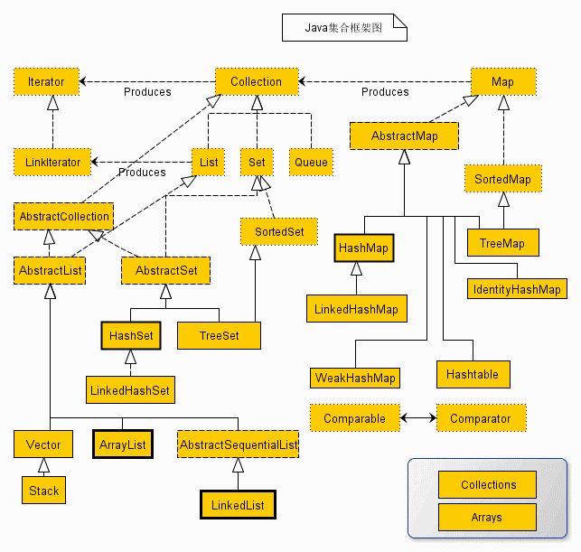
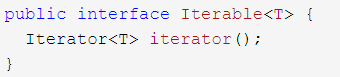

# 集合类-整理总结20210315
- 结构图示
    -  
- Iterable
    - Collection
        - List
            - CopyOnWriteArrayList  支持并发访问写入
            - LinkedList
            - ArrayList
                - initialCapacity参数默认为10
            - Vector
                - Stck 模拟栈-后进先出
        - Set 
            - CopyOnWriteArraySet  支持并发访问写入
                - 底层基于CopyOnWriteArrayList
            - add()   Boolean 通用说明
                - set不允许包含重复元素,如果添加相同元素,add方法返回false
            - HashSet
                - LinkedHashSet
                    - 用链表维护次序,以插入顺序保存
                - 特点描述
                    - 按Hash算法存储集合元素,有很好的存取-查找性能
                    - 不能保证排列顺序与添加顺序相同
                    - 集合元素值可以为NULL
                - 存入元素步骤
                    - 在添加一个元素时，调用该对象的hashCode()方法来得到对象的hashCode值
                    - 通过Hash值决定在HashSet的存储位置并比较hashCode，不相等则直接添加
                    - 如重复则继续用该元素的equals()方法比较(重写后的equals()方法)
                    - 如果返回true则拒绝添加
                    - false就将该对象在当前位置用链式存储
            - SortedSet
                - TreeSet
                    - 是SortedSet接口的实现类
                    - 确保集合处于排序状态,更据元素实际值大小进行排序
                    - 采用红黑树结构来存储集合元素
                    - 注意只能添加同一类的对象，否则ClassCastException异常
            - EnumSet
                - 所有元素必须指定枚举类型的枚举值
                - 不允许加入null值，否则NullPointException异常
        - Queue 模拟队列-先进先出
            - Deque  双端队列
                - ArrayDeque  需要使用栈时推荐使用-也可做队列
                - LinkedList  可以做栈也可以做队列
            - PriorityQueue
                - 按照队列元素大小排序队列
    - Map
        - ConcurrentHashMap
            - 不能存入null值，否则异常
            - JDK7
                - 使用分段锁机制实现线程的同步
                - Segment数默认值是16，可以允许16个线程来同时写，concurrenceLevel在初始化时可以指定大小，一旦初始化后不可扩容
            - JDK8
                - 使用Unsafe类的CAS自旋赋值+synchronized同步+LockSupport阻塞等实现的高效并发
        - HashMap 
            - 可以存null,线程不安全,初识容量16,两倍扩容
            - JDK8中 **链表长度大于8** 且 **数组长度大于64** 的时候就把链表下所有的节点转为红黑树
            - 当链表长度小于6,红黑树转为链
            - 为什么说HashMap线程不安全
                - **resize-扩容**
                - JDK7的情况下，并发扩容时容易形成链表环，此情况在1.8时就好太多太多了。因为在JDK8中当链表长度大于阈值时，链表会被改成树形结构
            - JDK7
                - 底层由数组+链表组成
                - 先扩容后插入新值
                - 采用表头插入法，在扩容时改变链表中元素顺序，在并发场景下导致链表成环问题
            - JDK8
                - 底层由数组+链表/红黑树组成
                - 先插入值再扩容
                - 采用尾部插入法，在扩容时会保持链表元素原本的顺序，不会出现链表成环问题
        - HashTable
            - Properties
        - SortedMap
            - TreeMap
        - WeakHashMap
    - Iterator
        - hasNext()   boolean
            - 如果被迭代的集合元素没有遍历完，则返回true
        - next()   Object
            - 返回集合里的下一个元素
        - remove()   void
            - 删除集合里上一次next方法返回的元素
        - forEachRemaining(Consumer action)   void
            - JDK8新增默认方法
            - 可使用Lambda表达式遍历集合元素
    - 相关说明
        - Iterable 与 iterator
            - Iterable中返回了一个Iterator类型的接口
                -  
            - 为什么不是让集合类直接实现iterator接口
                - **当前迭代的位置**
                - **当前迭代的位置**
                - 但是当集合在不同方法间被传递时，当前迭代位置将会变的不可预知
                - 使用Iterable每次调用都会返回一个从头开始计数的迭代器，多个迭代器互不干扰
        - iterator迭代过程不可修改元素
            - 采用快速失败机制(fail-fast)
            - 一旦迭代过程中检查到集合被修改，立即ConcurrentModificationException异常
            - 可以避免共享资源引发的潜在问题
- Collections
- Arrays